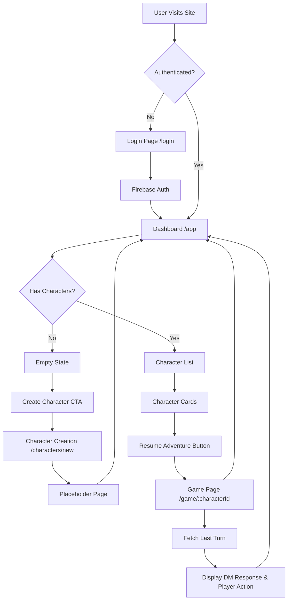

# Adventure Client

A React-based web client for the Adventure Game platform, built with TypeScript and Vite.

## Table of Contents

- [Prerequisites](#prerequisites)
- [Installation](#installation)
- [Configuration](#configuration)
- [Development](#development)
- [Building for Production](#building-for-production)
- [Docker Deployment](#docker-deployment)
- [Cloud Run Deployment](#cloud-run-deployment)
- [Project Structure](#project-structure)
- [Architecture](#architecture)
- [User Journey: Dashboard and Game Flow](#user-journey-dashboard-and-game-flow)

## Prerequisites

- **Node.js**: 24.x (Active LTS 'Krypton') or 25.x (Current) - see `ts_dev_versions.txt`
- **Package Manager**: npm (included with Node.js) or pnpm (preferred)
- **Docker**: Required for containerized deployment (optional for local development)

## Installation

1. **Clone the repository**
   ```bash
   git clone <repository-url>
   cd adventure-client
   ```

2. **Install dependencies**
   ```bash
   npm install
   ```
   
   Or with pnpm (recommended for faster installs):
   ```bash
   pnpm install
   ```

## Configuration

The application uses environment variables for configuration. Different configurations are needed for development and production.

### Development Configuration

For local development, copy the development template:

```bash
cp .env.development .env.local
```

The `.env.development` file includes mock values for local development:
- API endpoints point to localhost (ports 8001, 8002)
- Firebase configuration uses mock/test values

Edit `.env.local` to match your local setup if needed.

### Production Configuration

For production deployments, environment variables should be:
- Built into the application during the Docker build process
- Set via CI/CD pipelines or Cloud Run environment configuration

**Important**: Since Vite bundles environment variables at build time (not runtime), production values must be available during the `npm run build` step.

#### Environment Variables Reference

| Variable | Description | Example (Development) |
|----------|-------------|----------------------|
| `VITE_DUNGEON_MASTER_API_BASE_URL` | Dungeon Master API endpoint | `http://localhost:8001` |
| `VITE_JOURNEY_LOG_API_BASE_URL` | Journey Log API endpoint | `http://localhost:8002` |
| `VITE_FIREBASE_API_KEY` | Firebase API key | `mock-api-key-dev` |
| `VITE_FIREBASE_AUTH_DOMAIN` | Firebase auth domain | `mock-project-dev.firebaseapp.com` |
| `VITE_FIREBASE_PROJECT_ID` | Firebase project ID | `mock-project-dev` |
| `VITE_FIREBASE_STORAGE_BUCKET` | Firebase storage bucket | `mock-project-dev.appspot.com` |
| `VITE_FIREBASE_MESSAGING_SENDER_ID` | Firebase sender ID | `000000000000` |
| `VITE_FIREBASE_APP_ID` | Firebase app ID | `1:000000000000:web:mockappiddev` |
| `VITE_FIREBASE_MEASUREMENT_ID` | Firebase measurement ID | `G-MOCKIDDEV` |

**Security Note**: Never commit real Firebase credentials or production API keys to version control. Use `.env.local` for local secrets (already in `.gitignore`).

#### Firebase Setup

The application uses Firebase SDK v12+ (modular API) for authentication and other Firebase services. Firebase is initialized via `src/lib/firebase.ts`, which reads configuration from environment variables.

**📖 For detailed setup instructions, see [docs/firebase-setup.md](docs/firebase-setup.md)**

**Quick Setup Summary:**

1. **Create a Firebase Project**:
   - Go to [Firebase Console](https://console.firebase.google.com/)
   - Create a new project or use an existing one
   - Enable Authentication (Email/Password and optionally Google Sign-In)
   - Add authorized domains (localhost for dev, your Cloud Run URL for production)

2. **Get Your Configuration**:
   - In Firebase Console, go to Project Settings > General
   - Under "Your apps", add a Web app or select an existing one
   - Copy the Firebase configuration values (apiKey, authDomain, etc.)

3. **Configure Environment Variables**:
   - For development: Copy `.env.development` to `.env.local` and update with your Firebase config
   - For production: Pass as Docker build arguments via CI/CD
   - See `.env.example` for all required variables with detailed comments

4. **Initialization Details**:
   - Firebase is initialized automatically when the app loads via `src/lib/firebase.ts`
   - The initialization is singleton-safe (handles hot reloads gracefully)
   - Both `firebaseApp` and `auth` instances are exported for use throughout the app
   - Missing or invalid configuration will fail fast at startup with descriptive errors

**Example usage in your components:**
```typescript
import { auth } from '@/lib/firebase';
import { signInWithEmailAndPassword } from 'firebase/auth';

// Use the auth instance for Firebase operations
await signInWithEmailAndPassword(auth, email, password);
```

**Important**: All Firebase environment variables must be set at build time (not runtime) because Vite bundles them into the static assets. This means:
- Production builds require Firebase config during the Docker build step
- Environment variables are visible in the client-side bundle (don't store sensitive backend secrets here)
- Use separate Firebase projects for development, staging, and production

**Authentication Components**: The app includes `AuthProvider`, `ProtectedRoute`, `LoginPage`, and `AccountMenu` components. See [docs/firebase-setup.md#authentication-flow-components](docs/firebase-setup.md#authentication-flow-components) for detailed documentation on how these components interact.


## Development

### Starting the Development Server

Run the Vite development server with hot module replacement (HMR):

```bash
npm run dev
```

The application will be available at `http://localhost:5173` by default.

### Available Scripts

| Command | Description |
|---------|-------------|
| `npm run dev` | Start development server with HMR |
| `npm run build` | Build optimized production bundle |
| `npm run preview` | Preview production build locally |
| `npm run lint` | Run ESLint on all source files |
| `npm run format` | Format code with Prettier |
| `npm run test` | Run tests with Vitest (single run, CI mode) |
| `npm run test:watch` | Run tests in watch mode for development |
| `npm run generate:api` | Generate TypeScript API clients from OpenAPI specs |
| `npm run generate:api:dungeon-master` | Generate only dungeon-master API client |
| `npm run generate:api:journey-log` | Generate only journey-log API client |

### API Client Generation

The project uses [openapi-typescript-codegen](https://github.com/ferdikoomen/openapi-typescript-codegen) to generate TypeScript API clients from OpenAPI specifications. This provides type-safe interfaces for communicating with backend services.

#### Why openapi-typescript-codegen?

We chose `openapi-typescript-codegen` for the following reasons:

- **Zero Runtime Dependencies**: Uses native Fetch API (no axios or other HTTP libraries required)
- **Type Safety**: Generates full TypeScript types from OpenAPI schemas
- **Modern JavaScript**: Produces clean, ES6+ compatible code
- **Maintainability**: Auto-generation ensures API clients stay in sync with backend specs
- **Flexibility**: Supports multiple configuration options for different project needs
- **Active Maintenance**: Well-maintained with regular updates

**Alternatives Considered**: Other tools like `openapi-generator` (requires Java) and `swagger-codegen` were evaluated but required additional runtime dependencies or JVM installation.

#### Generated Clients

Two API clients are generated from OpenAPI specs:

1. **Dungeon Master API** (`src/api/dungeonMaster/`)
   - Source: `dungeon-master.openapi.json`
   - Services: Game orchestration, turn processing, character creation
   
2. **Journey Log API** (`src/api/journeyLog/`)
   - Source: `journey-log.openapi.json`
   - Services: Character management, narrative tracking, quest/combat state

#### Regenerating Clients

To regenerate API clients after spec changes:

```bash
# Regenerate all clients
npm run generate:api

# Or regenerate individually
npm run generate:api:dungeon-master
npm run generate:api:journey-log
```

**Workflow for Updating Clients**:

1. **Update OpenAPI Specs**: Obtain updated `dungeon-master.openapi.json` or `journey-log.openapi.json` files from backend teams
2. **Place Specs in Root**: Replace existing spec files in the project root directory
3. **Run Generation**: Execute `npm run generate:api` to regenerate clients
4. **Review Changes**: Check `git diff` to see what changed in the generated code
5. **Test Integration**: Run the application and verify API calls work correctly
6. **Commit Changes**: Commit both the updated spec files and generated client code

**Important Notes:**
- Generated files are committed to the repository for immediate use
- Re-running generation scripts will **completely remove and regenerate** the output directories, cleaning up any stale or orphaned files
- The generation process uses `rimraf` for cross-platform directory cleanup (works on Windows, macOS, Linux)
- Never manually edit files in `src/api/dungeonMaster/` or `src/api/journeyLog/` as changes will be lost (files are auto-generated)
- If generation fails, ensure OpenAPI spec files are valid JSON
- The generated code includes error handling and HTTP client logic from the generator; customizations should be done via the OpenAPI configuration objects

#### Troubleshooting Generation Issues

**Issue: Generation command fails with syntax error**
- **Cause**: Invalid JSON in OpenAPI spec file
- **Solution**: Validate spec files using a JSON validator or `npx openapi-generator-cli validate -i <spec-file>`

**Issue: Generated code has TypeScript errors**
- **Cause**: OpenAPI spec contains unsupported types or circular references
- **Solution**: Review spec file for issues, ensure schemas are properly defined, avoid deep circular references

**Issue: `rimraf` command not found (Windows)**
- **Cause**: npm dependencies not installed
- **Solution**: Run `npm install` to install all dependencies including `rimraf`

**Issue: Permission denied when writing generated files**
- **Cause**: File permissions or directory doesn't exist
- **Solution**: Ensure you have write permissions to `src/api/` directories, or delete the directories manually and re-run

**Platform-Specific Notes**:
- **Windows**: The generator works on PowerShell, CMD, and Git Bash. Use PowerShell or Git Bash for best compatibility.
- **macOS/Linux**: No special requirements, all scripts work out of the box.
- **CI/CD**: Generation is not run automatically in CI; commit generated files to avoid build-time dependencies.

#### Using Generated Clients

Import services and types from the generated clients:

```typescript
import { GameService } from '@/api/dungeonMaster';
import { CharactersService } from '@/api/journeyLog';
import type { TurnRequest, TurnResponse } from '@/api/dungeonMaster';
import type { CreateCharacterRequest } from '@/api/journeyLog';

// Example: Process a turn
const response = await GameService.processTurnTurnPost({
  requestBody: {
    character_id: 'uuid',
    action: 'explore the cave',
  },
});

// Example: Create a character
const character = await CharactersService.createCharacterCharactersPost({
  requestBody: {
    name: 'Aria',
    character_class: 'Wizard',
  },
});
```

#### Configuring API Base URLs

Generated clients use a configurable base URL. The application configures these during initialization by calling the `configureApiClients()` function in `src/api/index.ts`:

```typescript
import { OpenAPI as DungeonMasterAPI } from '@/api/dungeonMaster';
import { OpenAPI as JourneyLogAPI } from '@/api/journeyLog';
import { config } from '@/config/env';

// This function is called during app initialization
export function configureApiClients(authProvider: AuthProvider) {
  DungeonMasterAPI.BASE = config.dungeonMasterApiUrl;  // from VITE_DUNGEON_MASTER_API_BASE_URL
  JourneyLogAPI.BASE = config.journeyLogApiUrl;        // from VITE_JOURNEY_LOG_API_BASE_URL
  
  // Configure authentication (see Authentication and Headers section)
}
```

**Environment-Specific Base URLs**:

| Environment | Dungeon Master URL | Journey Log URL |
|-------------|-------------------|-----------------|
| **Local Development** | `http://localhost:8001` | `http://localhost:8002` |
| **Staging** | `https://dungeon-master-staging-xxx.run.app` | `https://journey-log-staging-xxx.run.app` |
| **Production** | `https://dungeon-master-xxx.run.app` | `https://journey-log-xxx.run.app` |

Set these URLs in your environment files (`.env.local` for dev, or Docker `--build-arg` for production).

#### Authentication and Headers

API requests are automatically authenticated using Firebase Authentication tokens. The application configures authentication providers for both APIs:

**Dungeon Master API**:
```typescript
// Configured in src/api/index.ts
DungeonMasterAPI.TOKEN = async () => {
  const token = await authProvider.getIdToken();
  return token || '';
};

// Resulting headers:
// Authorization: Bearer <firebase-id-token>
```

**Journey Log API**:
```typescript
// Configured in src/api/index.ts
JourneyLogAPI.TOKEN = async () => {
  const token = await authProvider.getIdToken();
  return token || '';
};

JourneyLogAPI.HEADERS = async () => ({
  'X-User-Id': authProvider.uid || '',
});

// Resulting headers:
// Authorization: Bearer <firebase-id-token>
// X-User-Id: <firebase-user-uid>
```

**How It Works**:

1. **Authentication Provider**: The `AuthProvider` context (`src/context/AuthContext.tsx`) provides `getIdToken()` and `uid` methods
2. **Automatic Configuration**: On app initialization, `configureApiClients(authProvider)` sets up token and header resolvers
3. **Token Refresh**: Firebase SDK automatically refreshes expired tokens; the application requests a fresh token on 401 responses
4. **401 Retry Logic**: The HTTP client (`src/lib/http/client.ts`) implements single-attempt token refresh on 401 errors:
   - Receives 401 response
   - Calls `getIdToken(forceRefresh: true)` to refresh token
   - Retries request once with new token
   - Returns error if retry also fails

**Important**: 
- Users must be authenticated (logged in) for API calls to succeed
- Tokens are short-lived JWT tokens issued by Firebase Authentication
- The `X-User-Id` header is required by Journey Log API for user-specific operations
- Both backends validate tokens against Firebase Authentication

#### Generator Configuration

The generator is configured with the following options:
- `--client fetch`: Uses native Fetch API (no external HTTP dependencies)
- `--useOptions`: Groups parameters into options objects for cleaner APIs
- `--useUnionTypes`: Generates union types instead of enums for better type safety

For more configuration options, see the [openapi-typescript-codegen documentation](https://github.com/ferdikoomen/openapi-typescript-codegen#options).

### Code Quality

#### Linting

ESLint is configured with React, TypeScript, and Prettier integration. Run the linter to check for code issues:

```bash
npm run lint
```

ESLint will check for:
- TypeScript type errors
- React best practices
- Code style consistency

#### Formatting

Prettier is configured for consistent code formatting across the project:

```bash
npm run format
```

This will automatically format all TypeScript/TSX files in the `src/` directory and configuration files in the root.

#### Testing

Vitest is configured with jsdom and React Testing Library for component testing:

```bash
# Run all tests once (CI mode)
npm run test

# Run tests in watch mode (re-runs on file changes)
npm run test:watch
```

Tests are located in `src/components/__tests__/` and follow the pattern `*.test.tsx`.

### API Diagnostics and Debugging

The application includes a diagnostic page for testing API connectivity and authentication in development environments.

#### Accessing the Debug Page

The debug/diagnostic page is available at `/debug` when running the development server:

```bash
npm run dev
# Navigate to http://localhost:5173/debug
```

**Security Note**: This page is intended for development and debugging only. 

**Production Considerations**:
- Remove the `/debug` route from production builds
- Or restrict access using authentication checks and environment-based routing
- Never expose sensitive debugging information in production environments
- Example protection:
  ```typescript
  // In router configuration
  {
    path: '/debug',
    element: import.meta.env.MODE === 'production' ? <NotFound /> : <DebugPage />
  }
  ```

#### What the Diagnostic Page Tests

The debug page performs the following health checks:

1. **Dungeon Master API**:
   - Tests `/health` endpoint
   - Displays response status and data
   - Shows headers sent with the request (including Authorization token)

2. **Journey Log API**:
   - Tests `/health` endpoint  
   - Tests `/info` endpoint
   - Displays response status and data for each
   - Shows headers sent (Authorization + X-User-Id)

3. **Authentication Status**:
   - Displays current user authentication state
   - Shows user ID if authenticated
   - Indicates if user needs to log in

#### Using the Diagnostic Page

1. **Start Backend Services**: Ensure both backend APIs are running:
   ```bash
   # Terminal 1: Start Dungeon Master API on port 8001
   # Terminal 2: Start Journey Log API on port 8002
   ```

2. **Navigate to Debug Page**: Open `http://localhost:5173/debug` in your browser

3. **Authenticate**: If not logged in, click the login link and authenticate with Firebase

4. **Run Health Checks**: Click the test buttons to check each API endpoint:
   - "Test Dungeon Master Health"
   - "Test Journey Log Health"  
   - "Test Journey Log Info"

5. **Review Results**: The page displays:
   - ✅ Success: Green success message with response data
   - ❌ Error: Red error message with error details
   - Headers: Shows Authorization token (masked for security) and X-User-Id

**Features**:
- **Token Masking**: Authorization tokens are displayed as `abcd...wxyz` (first 4 and last 4 characters) for security
- **Response Display**: Full JSON responses are shown for successful requests
- **Error Details**: Failed requests show error messages and status codes
- **Persistent Results**: Last 10 test results are kept in the UI
- **Verbose Logging**: Toggle console logging for detailed request/response debugging

**Secure Logging Practices**:
- Never log full authentication tokens in production code
- Use token masking (showing only first/last few characters) when logging is necessary for debugging
- Avoid logging sensitive user data (passwords, personal information, full tokens)
- Disable verbose debugging logs in production builds
- Review console output before sharing logs publicly

#### Troubleshooting Common API Issues

Use the diagnostic page to identify and resolve common integration issues:

**Issue: "Missing UID" or "User not authenticated"**
- **Symptom**: API calls fail with authentication errors
- **Cause**: User is not logged in or token is expired
- **Solution**: 
  1. Click the login link on the debug page
  2. Sign in with valid credentials
  3. Retry the API test
  4. If still failing, sign out and sign in again to refresh token

**Issue: "Network Error" or "Failed to fetch"**
- **Symptom**: All API calls fail immediately
- **Cause**: Backend service is not running or URL is incorrect
- **Solution**:
  1. Verify backend services are running on expected ports
  2. Check `.env.local` has correct API URLs:
     - `VITE_DUNGEON_MASTER_API_BASE_URL=http://localhost:8001`
     - `VITE_JOURNEY_LOG_API_BASE_URL=http://localhost:8002`
  3. Ensure no firewall is blocking localhost connections
  4. Try accessing API URLs directly in browser (e.g., `http://localhost:8001/health`)

**Issue: "401 Unauthorized" after initial success**
- **Symptom**: API calls work initially, then start failing with 401 errors
- **Cause**: Firebase token expired (tokens expire after 1 hour)
- **Solution**:
  1. The application should automatically refresh tokens
  2. If auto-refresh fails, sign out and sign in again
  3. Check browser console for token refresh errors

**Issue: "404 Not Found" on specific endpoints**
- **Symptom**: Health checks work but specific endpoints fail
- **Cause**: Endpoint doesn't exist or backend version mismatch
- **Solution**:
  1. Verify backend is running the expected version
  2. Check if OpenAPI specs match backend implementation
  3. Regenerate API clients: `npm run generate:api`
  4. Review backend logs for endpoint errors

**Issue: "CORS Error" in browser console**
- **Symptom**: Requests blocked by browser CORS policy
- **Cause**: Backend doesn't allow requests from frontend origin
- **Solution**:
  1. Ensure backend CORS configuration allows `http://localhost:5173`
  2. Check backend logs for CORS-related errors
  3. Verify backend allows credentials (needed for Authorization headers)

**Issue: Backend temporarily unavailable**
- **Symptom**: One backend is down but development must continue
- **Solution**:
  1. Comment out or skip tests for unavailable API on debug page
  2. Mock API responses in development if needed
  3. Use `try-catch` blocks in code to handle unavailable services gracefully
  4. Consider using a backend stub or mock server

**Deployment-Specific Considerations**:

| Issue | Development | Staging | Production |
|-------|------------|---------|------------|
| **API URLs** | `localhost:800X` | Cloud Run URLs | Cloud Run URLs |
| **Authentication** | Test Firebase project | Staging Firebase project | Production Firebase project |
| **CORS** | Usually not an issue | Must configure Cloud Run CORS | Must configure Cloud Run CORS |
| **Tokens** | Short-lived OK | Monitor expiration | Implement token refresh |
| **Diagnostics** | Use debug page freely | Limit access | Remove or protect endpoint |

**Debug Logging**:

Enable verbose HTTP client logging in `.env.local` for detailed request/response debugging:
```bash
# Add to .env.local
VITE_DEBUG_HTTP=true
```

This will log all API requests and responses to the browser console, including:
- Request URL and method
- Request headers (with token masking)
- Request body
- Response status and data
- Errors and retry attempts

**Best Practices**:
- Always test API integration using the debug page before deploying
- Keep backend services running during frontend development
- Use separate Firebase projects for dev/staging/production
- Monitor token expiration and refresh behavior
- Document any API changes that require frontend updates

## Building for Production

### Local Production Build

Create an optimized production bundle:

```bash
npm run build
```

This command:
1. Runs TypeScript compilation (`tsc -b`) to check types
2. Builds optimized assets with Vite
3. Outputs to the `dist/` directory

The build includes:
- Minified JavaScript bundles
- Optimized CSS with vendor prefixes
- Hashed filenames for cache busting (e.g., `index-DjVD9LGM.css`)
- Tree-shaken dependencies

### Preview Production Build

Test the production build locally before deployment:

```bash
npm run preview
```

This starts a local static file server serving the `dist/` directory, allowing you to verify the production build works correctly.

## Docker Deployment

The application includes a multi-stage Dockerfile optimized for production deployment.

### Building the Docker Image

Build the Docker image locally:

```bash
docker build -t adventure-client:latest .
```

**With production environment variables:**

```bash
docker build \
  --build-arg VITE_DUNGEON_MASTER_API_BASE_URL=https://your-api.run.app \
  --build-arg VITE_JOURNEY_LOG_API_BASE_URL=https://your-log-api.run.app \
  --build-arg VITE_FIREBASE_API_KEY=your-key \
  --build-arg VITE_FIREBASE_AUTH_DOMAIN=your-domain \
  --build-arg VITE_FIREBASE_PROJECT_ID=your-project \
  --build-arg VITE_FIREBASE_STORAGE_BUCKET=your-bucket \
  --build-arg VITE_FIREBASE_MESSAGING_SENDER_ID=your-sender-id \
  --build-arg VITE_FIREBASE_APP_ID=your-app-id \
  --build-arg VITE_FIREBASE_MEASUREMENT_ID=your-measurement-id \
  -t adventure-client:prod .
```

**Important Notes**:
- Environment variables must be provided at build time since Vite bundles them into the static assets
- The Dockerfile declares these as `ARG` directives, making them available during the build process
- ⚠️ **Security Warning**: Build arguments and bundled environment variables are visible in:
  - Docker image layers (via `docker history`)
  - Client-side JavaScript bundle (anyone can inspect the frontend code)
  - Never pass sensitive secrets (API keys, tokens) via build args for frontend applications
  - Use backend services or secure runtime configuration for sensitive data

### Running the Docker Container Locally

Run the container on port 8080:

```bash
docker run -p 8080:8080 adventure-client:latest
```

Access the application at `http://localhost:8080`.

### Docker Image Details

The Dockerfile uses a two-stage build process:

1. **Build Stage** (`node:24-alpine`):
   - Installs dependencies
   - Builds the production bundle
   - Result: `dist/` directory with optimized assets

2. **Serve Stage** (`nginx:alpine`):
   - Copies only the `dist/` files (excludes `node_modules`)
   - Configures nginx with `nginx.conf` for SPA routing
   - Final image size: ~30MB (lightweight and secure)

**Key Features**:
- **SPA Routing**: nginx rewrites all non-file requests to `/index.html` (enables client-side routing)
- **Cache Optimization**: Static assets cached for 1 year, index.html never cached
- **Security Headers**: X-Content-Type-Options, X-Frame-Options, X-XSS-Protection
- **Gzip Compression**: Enabled for text-based assets
- **Port 8080**: Required by Cloud Run (configurable via `$PORT` environment variable)

## Cloud Run Deployment

Google Cloud Run provides serverless container hosting with automatic scaling.

### Prerequisites

1. **Google Cloud Project** with billing enabled
2. **Artifact Registry** repository created:
   ```bash
   gcloud artifacts repositories create frontend-repo \
     --repository-format=docker \
     --location=us-central1 \
     --description="Adventure client frontend"
   ```
3. **Docker** and **gcloud CLI** installed locally

### Deployment Steps

#### 1. Build and Tag Image

Build the Docker image with production environment variables:

```bash
# Set your project ID
export PROJECT_ID=your-gcp-project-id
export GITHUB_SHA=$(git rev-parse HEAD)

# Build with production config
docker build \
  --build-arg VITE_DUNGEON_MASTER_API_BASE_URL=https://dungeon-master-api.run.app \
  --build-arg VITE_JOURNEY_LOG_API_BASE_URL=https://journey-log-api.run.app \
  --build-arg VITE_FIREBASE_API_KEY=$FIREBASE_API_KEY \
  --build-arg VITE_FIREBASE_AUTH_DOMAIN=$FIREBASE_AUTH_DOMAIN \
  --build-arg VITE_FIREBASE_PROJECT_ID=$FIREBASE_PROJECT_ID \
  --build-arg VITE_FIREBASE_STORAGE_BUCKET=$FIREBASE_STORAGE_BUCKET \
  --build-arg VITE_FIREBASE_MESSAGING_SENDER_ID=$FIREBASE_SENDER_ID \
  --build-arg VITE_FIREBASE_APP_ID=$FIREBASE_APP_ID \
  --build-arg VITE_FIREBASE_MEASUREMENT_ID=$FIREBASE_MEASUREMENT_ID \
  -t us-central1-docker.pkg.dev/$PROJECT_ID/frontend-repo/adventure-client:$GITHUB_SHA .
```

**Important**: Use commit SHA for immutable tags. Avoid using `:latest` in production.

#### 2. Push to Artifact Registry

Authenticate and push the image:

```bash
# Configure Docker to use gcloud as credential helper
gcloud auth configure-docker us-central1-docker.pkg.dev

# Push image
docker push us-central1-docker.pkg.dev/$PROJECT_ID/frontend-repo/adventure-client:$GITHUB_SHA
```

#### 3. Deploy to Cloud Run

Deploy the container:

```bash
gcloud run deploy adventure-client \
  --image us-central1-docker.pkg.dev/$PROJECT_ID/frontend-repo/adventure-client:$GITHUB_SHA \
  --region us-central1 \
  --allow-unauthenticated \
  --memory 256Mi \
  --cpu 1 \
  --min-instances 0 \
  --max-instances 10 \
  --port 8080 \
  --platform managed
```

**Deployment Options Explained**:
- `--allow-unauthenticated`: Makes the frontend publicly accessible
- `--memory 256Mi`: Sufficient for nginx serving static files
- `--cpu 1`: One vCPU is adequate for a frontend service
- `--min-instances 0`: Scales to zero when idle (cost optimization)
- `--max-instances 10`: Limits concurrent instances
- `--port 8080`: Must match the EXPOSE directive in Dockerfile

#### 4. Verify Deployment

After deployment, Cloud Run will output a service URL like:
```
https://adventure-client-abc123-uc.a.run.app
```

Test the deployment:
```bash
curl -I https://adventure-client-abc123-uc.a.run.app
```

### CI/CD Integration

For production deployments, integrate with GitHub Actions or Cloud Build:

1. **Use Workload Identity Federation** (recommended) instead of service account keys
2. **Automate on Git tags or main branch pushes**
3. **Use `$GITHUB_SHA` for image tags** to enable atomic rollbacks
4. **Store secrets in GitHub Secrets** or Google Secret Manager

Example GitHub Actions workflow structure:
```yaml
- Checkout code
- Authenticate to Google Cloud (Workload Identity)
- Build Docker image with build args from secrets
- Push to Artifact Registry
- Deploy to Cloud Run
```

**Security Best Practices**:
- Never commit Firebase credentials or API keys to the repository
- Use environment-specific configurations (staging vs production)
- Rotate credentials regularly
- Monitor Cloud Run logs for unauthorized access attempts


### Environment Differences

| Aspect | Development | Production (Cloud Run) |
|--------|-------------|------------------------|
| **API URLs** | `localhost:8001`, `localhost:8002` | `https://your-api.run.app` |
| **Firebase Config** | Mock/test project | Production Firebase project |
| **Port** | 5173 (Vite dev server) | 8080 (nginx in container) |
| **Build** | Development mode (HMR) | Production bundle (minified) |
| **Environment File** | `.env.local` (not committed) | Build-time `--build-arg` flags |
| **SSL** | Not required | Automatic HTTPS via Cloud Run |

## Project Structure

```
src/
├── config/           # Configuration and environment management
│   └── env.ts       # Typed environment variable access
├── context/         # React Context providers
│   └── AuthContext.tsx  # Authentication state management
├── hooks/           # Custom React hooks
│   └── useAuth.ts   # Auth context consumer hook
├── lib/             # Utility libraries
│   ├── firebase.ts  # Firebase initialization (app & auth)
│   └── http/        # HTTP client utilities
│       └── client.ts # Centralized fetch wrapper
├── types/           # TypeScript type definitions
│   └── auth.ts      # Authentication types
├── pages/           # Page components
├── layouts/         # Layout components
├── router/          # Routing configuration
└── styles/          # Global styles
```

## Architecture

### Environment Configuration

The application uses a type-safe environment configuration system (`src/config/env.ts`) that:

- Validates all required environment variables at startup
- Provides typed access to configuration throughout the app
- Fails fast with descriptive errors if configuration is missing
- Centralizes all env variable access

**Usage:**
```typescript
import { config } from '@/config/env';

// Access typed configuration
const apiUrl = config.dungeonMasterApiUrl;
const isDevMode = config.isDevelopment;
```

### Firebase Integration

The application uses Firebase SDK v12+ (modular API) for authentication and other Firebase services. Firebase is initialized via `src/lib/firebase.ts`.

**Key Features:**
- **Singleton Pattern**: Firebase app is initialized once and reused throughout the application
- **Hot Reload Safe**: Handles Vite's HMR without creating duplicate Firebase instances
- **Environment-Driven**: All configuration comes from environment variables (no hardcoded secrets)
- **Fail-Fast**: Missing or invalid configuration throws descriptive errors at startup
- **Type-Safe**: Exports fully-typed `firebaseApp` and `auth` instances

**Usage:**
```typescript
import { auth, firebaseApp } from '@/lib/firebase';
import { signInWithEmailAndPassword } from 'firebase/auth';

// Use the pre-initialized auth instance
async function login(email: string, password: string) {
  const userCredential = await signInWithEmailAndPassword(auth, email, password);
  return userCredential.user;
}
```

**Implementation Details:**
- Initialized at module load time (top-level)
- Uses `getApps()` to check if Firebase is already initialized
- Logs successful initialization in development mode
- All configuration sourced from `config.firebase` (from env.ts)

### Authentication Context

Authentication state is managed via React Context (`src/context/AuthContext.tsx`):

- **Current Implementation:** Mock authentication for development
- **Firebase Ready:** Firebase Authentication is now available via `src/lib/firebase.ts`
- Provides global auth state accessible from any component
- Exposes `login`, `logout`, and `register` methods

**Usage:**
```typescript
import { useAuth } from '@/hooks/useAuth';

function MyComponent() {
  const { user, isAuthenticated, login, logout } = useAuth();
  
  if (!isAuthenticated) {
    return <button onClick={() => login('email', 'password')}>Login</button>;
  }
  
  return (
    <div>
      <p>Welcome, {user.displayName}!</p>
      <button onClick={logout}>Logout</button>
    </div>
  );
}
```

**Important:** Components using `useAuth` must be wrapped in `<AuthProvider>`:
```typescript
import { AuthProvider } from '@/context/AuthContext';

function App() {
  return (
    <AuthProvider>
      <YourApp />
    </AuthProvider>
  );
}
```

### HTTP Client

A centralized HTTP client (`src/lib/http/client.ts`) provides:

- Automatic JSON parsing and serialization
- Env-based base URL configuration
- Structured error handling (no unhandled promise rejections)
- Request timeout support (default 30s)
- Development logging
- Service-specific client instances

**Basic Usage:**
```typescript
import { httpClient, dungeonMasterClient, journeyLogClient } from '@/lib/http/client';

// Generic client (uses Dungeon Master URL by default)
const data = await httpClient.get('/api/endpoint');

// Service-specific clients
const gameData = await dungeonMasterClient.get('/games');
const logData = await journeyLogClient.post('/logs', { message: 'Started game' });
```

**Error Handling:**
```typescript
import { ApiError } from '@/lib/http/client';

try {
  const data = await httpClient.get('/api/endpoint');
} catch (error) {
  const apiError = error as ApiError;
  console.error(`HTTP ${apiError.status}: ${apiError.message}`);
  // apiError.data contains the error response body
}
```

**Future Enhancements:**
- Auth token injection (TODO in `client.ts`)
- Centralized error logging/tracking
- Request/response interceptors

## Technology Stack

- **React 19** - Latest stable version with modern features
- **TypeScript 5.9** - Type-safe development
- **Vite 7** - Fast build tool and dev server
- **React Router 7** - Client-side routing
- **Vitest** - Fast unit testing with jsdom
- **ESLint + Prettier** - Code quality and formatting
- **nginx (alpine)** - Production web server (in Docker)

### Build Plugins

- [@vitejs/plugin-react](https://github.com/vitejs/vite-plugin-react) - Fast Refresh with Babel

## User Journey: Dashboard and Game Flow

This section documents the authenticated user experience, from login through character management and gameplay. Understanding this flow is essential for contributors working on features like character creation, gameplay enhancements, or API integrations.

### Overview

The application provides a character-based adventure gaming experience with the following primary flows:

1. **Authentication**: User logs in via Firebase (email/password or Google Sign-In)
2. **Dashboard**: User views their character list at `/app`
3. **Resume Adventure**: User selects a character to continue their adventure at `/game/:characterId`
4. **Character Creation**: User creates new characters at `/characters/new` (placeholder)



### Authentication and Protected Routes

All character and gameplay routes require authentication. The application uses Firebase Authentication with the following requirements:

**Authentication Methods:**
- Email/password authentication
- Google Sign-In (if configured in Firebase Console)

**Protected Routes:**
- `/app` - Characters dashboard (requires login)
- `/characters/new` - Character creation (requires login)
- `/game/:characterId` - Game view (requires login)

**How Protection Works:**
1. User attempts to access a protected route
2. `ProtectedRoute` component checks authentication status via `AuthContext`
3. If not authenticated, user is redirected to `/login` with return URL
4. After successful login, user is redirected to originally requested page
5. Auth token is automatically included in all API requests via `Authorization` header

**Token Management:**
- Firebase SDK manages token lifecycle (refresh, expiration)
- Tokens expire after 1 hour but are automatically refreshed
- On 401 response, the app attempts token refresh and retries once
- If refresh fails, user is redirected to login

**Important**: See [docs/firebase-setup.md](docs/firebase-setup.md) for detailed Firebase configuration, including how to set up authentication providers and authorized domains for different environments.

### Dashboard Experience (`/app`)

After successful authentication, users are directed to the characters dashboard, which displays their existing characters and provides access to character creation.

#### URL and Route
- **Path**: `/app`
- **Component**: `CharactersDashboardPage` (aliased as `AppPage` in routing)
- **Protection**: Requires authentication via `<ProtectedRoute>`

#### Loading States

The dashboard implements proper loading, error, and empty state handling:

**1. Loading State**
```
Shown while fetching user's characters from Journey Log API
Displays: Spinner with "Loading your characters..." message
```

**2. Error State**
```
Shown if character fetch fails (network error, 401, 500, etc.)
Displays: 
  - Error heading: "Unable to Load Characters"
  - Error message: Specific error from API or generic fallback
  - Retry button: Allows user to attempt refetch without page reload
```

**3. Empty State**
```
Shown when user has no characters (empty array from API)
Displays:
  - Welcome message: "Welcome to Your Adventure"
  - Guidance: "You don't have any characters yet."
  - Call-to-Action: "Create Your First Character" button
  - Links to: /characters/new (character creation route)
```

**4. Success State with Characters**
```
Shown when characters are successfully loaded
Displays:
  - Header: "Your Characters" with count (e.g., "2 characters")
  - Grid of character cards (responsive layout)
  - Each card shows character metadata (see below)
```

#### Character Card Metadata

Each character card displays the following information, sourced from the `CharacterMetadata` type in the Journey Log API:

| Field | Description | Example |
|-------|-------------|---------|
| **Name** | Character's display name | "Aria Stormwind" |
| **Status** | Current character state | "active", "completed", "inactive" |
| **Race** | Character's race | "Elf", "Human", "Dwarf" |
| **Class** | Character's class | "Wizard", "Rogue", "Fighter" |
| **Created** | Character creation timestamp | "Jan 15, 2026" |
| **Updated** | Last update timestamp | "Jan 22, 2026" |
| **Resume Button** | Link to `/game/:characterId` | Always visible |

**Metadata Source:** All fields come directly from the `CharacterMetadata` schema defined in `journey-log.openapi.json`. No additional derived or computed fields are displayed on the dashboard.

**Visual Styling:**
- Status is displayed as a badge with color coding (via CSS class `status-${character.status}`)
- Dates are formatted using `toLocaleDateString()` with locale-aware formatting
- Cards are displayed in a responsive grid (CSS Grid or Flexbox)

#### Data Fetching Strategy

**What is Fetched:**
- Dashboard fetches only character metadata via `getUserCharacters()` from Journey Log API
- This returns a lightweight list of all characters owned by the authenticated user

**What is NOT Fetched:**
- **Last turn data** is NOT prefetched on the dashboard
- **Game state** is NOT loaded until user clicks "Resume Adventure"
- **Narrative history** is NOT retrieved in bulk

**Why This Strategy:**
This design decision optimizes for performance and user experience:

1. **Faster Dashboard Load**: Fetching only metadata keeps the initial page load fast
2. **Reduced API Load**: Avoids N additional API calls for N characters on every dashboard visit
3. **Bandwidth Efficiency**: Last turn data can be large (narrative text, game state); defer until needed
4. **Cost Optimization**: Reduces backend load and database queries for data users may not view

**Performance Implications:**
- Dashboard loads in <1 second with metadata-only fetch
- Users can browse their character list without waiting for game state
- "Resume Adventure" has a slight delay to fetch last turn on-demand (acceptable UX tradeoff)

**Alternative Considered:** Prefetching last turn for all characters was rejected due to:
- Scalability concerns (users with many characters)
- Most users only resume one character per session
- Unnecessary bandwidth consumption for unused data

### Resume Adventure Flow

When a user clicks "Resume Adventure" on a character card, they navigate to the game page to view their last gameplay turn.

#### URL and Route
- **Path**: `/game/:characterId`
- **Component**: `GamePage`
- **Protection**: Requires authentication via `<ProtectedRoute>`
- **Dynamic Segment**: `characterId` is the character's unique identifier (UUID)

#### Data Fetching on Game Page

**When Last Turn is Fetched:**
- Last turn data is fetched **only when GamePage loads** (not on dashboard)
- The `getCharacterLastTurn(characterId)` function is called in a `useEffect` hook
- This is an **on-demand fetch strategy**, not prefetching

**Why GamePage Owns the Fetch:**
1. **Separation of Concerns**: Dashboard shows character list; GamePage shows game state
2. **Performance**: Avoids fetching unused data (user may not resume every character)
3. **Freshness**: Ensures last turn data is up-to-date when user navigates to game
4. **Error Handling**: Game-specific errors (character not found, no turns) handled in appropriate context

**API Call:**
```typescript
// Called in GamePage.tsx useEffect
const response = await getCharacterLastTurn(characterId);
// Returns: { turns: [NarrativeTurn] } with most recent turn first
```

**Response Structure:**
- `turns`: Array of `NarrativeTurn` objects (newest first)
- GamePage displays `turns[0]` (the most recent turn)
- If `turns` is empty, shows "No Turns Yet" message

#### Loading and Error States

**Loading State:**
```
Shown while fetching last turn data
Displays: Spinner with "Loading last turn..." message
```

**Error State:**
```
Shown if fetch fails
Displays:
  - Error heading: "Unable to Load Last Turn"
  - Error message: 
    - "Character not found" (404)
    - "Unauthorized. Please log in again." (401/403)
    - Generic error message (other failures)
  - Action button:
    - "Go to Login" (if auth error)
    - "Retry" (if network/server error)
```

**Empty State:**
```
Shown when character has no recorded turns (turns array is empty)
Displays:
  - Heading: "No Turns Yet"
  - Message: "This character doesn't have any recorded turns yet."
  - Explanation: "Gameplay will resume once a new turn exists."
  - Action: "Back to Characters" button (returns to /app)
```

**Success State:**
```
Shown when last turn is successfully loaded
Displays:
  - Page header: "Last Turn" with "Back to Characters" button
  - DM Response section:
    - Heading: "Last Dungeon Master Response"
    - Narrative text: GM response from last turn
    - Timestamp: When the turn occurred (formatted)
  - Player Action section:
    - Heading: "Your Last Action"
    - Action text: Player's action from last turn
    - Placeholder: "No player action recorded" (if null)
```

#### Last Turn Display Format

The GamePage displays a `NarrativeTurn` object with the following fields:

| Field | Description | Example |
|-------|-------------|---------|
| `gm_response` | Dungeon Master's narrative response | "You enter a dark cavern. Torchlight flickers on damp walls..." |
| `player_action` | Player's action from this turn | "I search for traps" |
| `timestamp` | ISO 8601 timestamp of turn | "2026-01-22T14:35:00Z" (displayed as "Jan 22, 2026, 2:35 PM") |

**Formatting:**
- Timestamps use `toLocaleString()` for user's locale and timezone
- Text is displayed in readable paragraphs with appropriate styling
- If `player_action` is null/empty, a placeholder message is shown

**Future Enhancements:**
- The GamePage currently displays only the last turn (read-only)
- Future iterations will add turn input, action submission, and full narrative history
- Character creation flow will enable users to create new characters from the empty state

### Authentication Headers and API Integration

All API requests to backend services include authentication headers. The application uses different header strategies for each backend service.

#### Header Configuration by Service

**Dungeon Master API** (port 8001 in dev):
```
Headers sent with every request:
  Authorization: Bearer <firebase-id-token>
```

**Journey Log API** (port 8002 in dev):
```
Headers sent with every request:
  Authorization: Bearer <firebase-id-token>
  X-User-Id: <firebase-user-uid>
```

#### Why X-User-Id is Required

The `X-User-Id` header is **required by the Journey Log API** for all user-specific operations, including:
- Fetching user's character list (`getUserCharacters()`)
- Retrieving last turn data (`getCharacterLastTurn()`)
- Creating new characters
- Fetching narrative history

**Purpose:**
1. **Ownership Validation**: Backend validates that the user owns the requested resources (characters, turns)
2. **Data Isolation**: Ensures users can only access their own game data
3. **Auditing**: Tracks which user performed each operation
4. **Authorization**: Complements Firebase token validation for fine-grained access control

**How It's Sourced:**
- Extracted from Firebase Authentication: `auth.currentUser.uid`
- Provided by `AuthContext` via `authProvider.uid`
- Automatically injected by OpenAPI client configuration (see `src/api/index.ts`)

**Error Handling:**
- **Missing X-User-Id**: Results in 400 Bad Request from Journey Log API
- **Mismatched X-User-Id**: Results in 403 Forbidden if trying to access another user's data
- **Invalid UID format**: May result in 400 or 500 depending on backend validation

#### Automatic Header Injection

Headers are automatically injected by the OpenAPI client configuration (configured in `src/api/index.ts`):

```typescript
// Configured during app initialization
JourneyLogOpenAPI.HEADERS = async () => ({
  'X-User-Id': authProvider.uid || '',
});
```

**Note**: The current implementation returns an empty string when `authProvider.uid` is not available. While this is generally safe due to protected routes, be aware of potential edge cases:

**Why this approach works:**
1. All Journey Log API calls are made from protected routes that require authentication
2. The `ProtectedRoute` component ensures users are authenticated before accessing these pages
3. If a user is not authenticated, they are redirected to login before any API calls are made

**Error handling behavior:**
- If auth state becomes null during an API call (e.g., token expiration during navigation), the backend will return a **400 Bad Request** for missing/empty X-User-Id
- The frontend will display an appropriate error message to the user
- Users will be prompted to log in again if the error indicates authentication issues

**Potential race conditions:**
- Auth state changes during navigation: The `ProtectedRoute` component checks auth state before rendering, but timing issues could theoretically occur
- Future enhancement consideration: Throw an error client-side when `uid` is not available instead of silently sending an empty string, forcing earlier failure detection

This ensures:
- Developers don't need to manually add headers to every API call
- Headers are consistent across all Journey Log API requests
- UID is always current (fetched from auth context on each request)

**Important for Deployment:**
- **All Environments**: X-User-Id header must be sent in dev, staging, and production
- **Different Auth Providers**: Staging and production may use different Firebase projects, but the header requirement remains the same
- **Backend CORS**: Backend services must allow `X-User-Id` in CORS allowed headers
- **Header Validation**: Backend should reject requests without X-User-Id or with invalid UIDs

**Security Note:**
- The `X-User-Id` header is **not sufficient for authentication** on its own.
- The backend must validate the Firebase **ID token** sent in the `Authorization: Bearer <token>` header.
- After validating the ID token, the backend must verify that the `sub` (subject) claim in the token payload matches the value of the `X-User-Id` header.
- Never trust the `X-User-Id` header without first successfully validating the ID token and ensuring the UIDs match.
- This dual validation prevents user impersonation and ensures request authenticity.

### Character Creation (Placeholder)

The character creation flow is currently **not implemented**. The application includes a placeholder route and UI elements to prepare for future development.

#### Current Implementation

**Route:**
- **Path**: `/characters/new`
- **Component**: `CharacterCreationPage`
- **Protection**: Requires authentication via `<ProtectedRoute>`
- **Status**: Placeholder (minimal implementation)

**Page Content:**
```
Heading: "Create New Character"
Message: "Character creation form coming soon..."
Message: "This is a placeholder for the character creation flow."
```

**Call-to-Action Locations:**
1. **Dashboard Empty State**: "Create Your First Character" button (when user has 0 characters)
2. **Future**: Header navigation "New Character" button (not yet implemented)

#### What's Missing

The following functionality needs to be implemented to complete character creation:

1. **Character Creation Form:**
   - Name input field
   - Race selection (dropdown or radio buttons)
   - Class selection (dropdown or radio buttons)
   - Optional: Background, alignment, starting equipment

2. **API Integration:**
   - POST request to Dungeon Master API or Journey Log API
   - Use `CharactersService.createCharacterCharactersPost()` from generated client
   - Request body: `CreateCharacterRequest` type

3. **Form Validation:**
   - Required field validation
   - Character name length limits
   - Race/class selection validation

4. **Success Flow:**
   - Display success message
   - Redirect to dashboard (`/app`) or new character game page (`/game/:newCharacterId`)
   - Optimistically update character list (or refetch)

5. **Error Handling:**
   - Network errors
   - Validation errors from backend
   - Retry mechanism

#### Prerequisites for Implementation

Before implementing character creation, ensure:

1. **Backend API Ready:**
   - Character creation endpoint is implemented and tested
   - OpenAPI spec (`dungeon-master.openapi.json` or `journey-log.openapi.json`) includes creation endpoint
   - API accepts required fields (name, race, class, etc.)

2. **Frontend Clients Generated:**
   - Run `npm run generate:api` to update TypeScript clients
   - Verify `CreateCharacterRequest` and `CreateCharacterResponse` types exist

3. **Authentication Working:**
   - Firebase token and X-User-Id headers are correctly configured
   - Test with debug page (`/debug`) to verify API connectivity

4. **UI Design Decided:**
   - Determine form layout and styling
   - Define available races and classes (match backend constraints)
   - Design error message display

**Next Steps for Contributors:**
- Character creation is a priority feature for the next development iteration
- The placeholder route and CTA buttons are intentional—do not remove them
- When implementing, replace the placeholder component content with the full form
- Ensure the route path (`/characters/new`) remains the same for link consistency

### Route Reference

All routes in the application are defined in `src/router/index.tsx`. The following table provides a complete reference:

| Route | Component | Protected | Description |
|-------|-----------|-----------|-------------|
| `/` | `HomePage` | No | Public landing page |
| `/login` | `LoginPage` | No | Firebase authentication (email/password, Google) |
| `/app` | `CharactersDashboardPage` | Yes | Character list dashboard (main hub) |
| `/characters/new` | `CharacterCreationPage` | Yes | **Placeholder** for character creation form |
| `/game/:characterId` | `GamePage` | Yes | Game view showing last turn for a character |
| `/debug` | `DebugPage` | No (dev only) | API diagnostics (not available in production) |
| `*` (404) | `NotFoundPage` | No | Fallback for invalid routes |

**Notes:**
- All routes use client-side routing via React Router 7 (no page reloads)
- Protected routes redirect to `/login` if user is not authenticated
- After login, user is redirected to originally requested protected route
- The `/debug` route is conditionally included only in development mode (`config.isDevelopment`)

**Important for Contributors:**
- Do not change route paths without updating all internal links and documentation
- Protected routes must remain wrapped in `<ProtectedRoute>` component
- Add new routes to this table when implementing new features
- Verify all links in the application use correct route paths (e.g., Link components, navigate() calls)

### Environment-Specific Considerations

The dashboard and game flow work consistently across environments, but some configuration differs:

#### Authentication Providers

| Environment | Firebase Project | Auth Methods | X-User-Id Header |
|-------------|------------------|--------------|------------------|
| **Development** | Test/mock project | Email/password, Google Sign-In | Required |
| **Staging** | Staging Firebase project | Email/password, Google Sign-In | Required |
| **Production** | Production Firebase project | Email/password, Google Sign-In | Required |

**Important:**
- Different Firebase projects (dev/staging/prod) mean different user databases
- Users must create accounts separately in each environment
- **X-User-Id header is required in ALL environments** (non-negotiable)

#### API Endpoints

| Environment | Dungeon Master API | Journey Log API |
|-------------|--------------------|-----------------|
| **Development** | `http://localhost:8001` | `http://localhost:8002` |
| **Staging** | `https://dungeon-master-staging-xxx.run.app` | `https://journey-log-staging-xxx.run.app` |
| **Production** | `https://dungeon-master-xxx.run.app` | `https://journey-log-xxx.run.app` |

**Configuration:**
- Set via environment variables: `VITE_DUNGEON_MASTER_API_BASE_URL`, `VITE_JOURNEY_LOG_API_BASE_URL`
- Must be configured at build time (Vite bundles them into static assets)
- See [Configuration](#configuration) section for details

#### CORS Configuration

Backend services must allow the following headers in CORS configuration:
```
Access-Control-Allow-Headers: Authorization, X-User-Id, Content-Type
Access-Control-Allow-Credentials: true
```

This is critical for:
- Firebase token transmission (Authorization header)
- User identification (X-User-Id header)
- JSON request bodies (Content-Type header)

**Troubleshooting:**
- If API calls fail with CORS errors, verify backend CORS settings
- Check that `Access-Control-Allow-Origin` includes the frontend domain
- Ensure `Access-Control-Allow-Methods` includes GET, POST, PUT, DELETE as needed

## Additional Resources

- [Vite Documentation](https://vite.dev/)
- [React 19 Documentation](https://react.dev/)
- [Cloud Run Documentation](https://cloud.google.com/run/docs)
- [GCP Deployment Reference](./gcp_deployment_reference.md) - Project deployment guidelines

## License

Licensed under the Apache License, Version 2.0. See LICENSE file for details.
