# Adventure Client

A React-based web client for the Adventure Game platform, built with TypeScript and Vite.

## Table of Contents

- [Prerequisites](#prerequisites)
- [Installation](#installation)
- [Configuration](#configuration)
- [Development](#development)
- [Building for Production](#building-for-production)
- [Docker Deployment](#docker-deployment)
- [Cloud Run Deployment](#cloud-run-deployment)
- [Project Structure](#project-structure)
- [Architecture](#architecture)
- [User Journey: Dashboard and Game Flow](#user-journey-dashboard-and-game-flow)
- [Authentication & Authorization](#authentication--authorization)
- [Error Handling Patterns](#error-handling-patterns)
- [Known Limitations & Assumptions](#known-limitations--assumptions)
- [Documentation](#documentation)

## Prerequisites

- **Node.js**: 24.x (Active LTS 'Krypton') or 25.x (Current) - see `ts_dev_versions.txt`
- **Package Manager**: npm (included with Node.js) or pnpm (preferred)
- **Docker**: Required for containerized deployment (optional for local development)

## Installation

1. **Clone the repository**
   ```bash
   git clone <repository-url>
   cd adventure-client
   ```

2. **Install dependencies**
   ```bash
   npm install
   ```
   
   Or with pnpm (recommended for faster installs):
   ```bash
   pnpm install
   ```

## Configuration

The application uses environment variables for configuration. Understanding how Vite handles environment variables is critical for successful deployment.

### 🔑 Key Concept: Build-Time vs Runtime Environment Variables

**Vite bundles environment variables at BUILD time, not RUNTIME.** This means:

- ✅ Environment variables prefixed with `VITE_` are exposed to the client-side code
- ✅ Variables are baked into the static JavaScript bundle during `npm run build`
- ⚠️ Changing environment variables requires **rebuilding and redeploying** the application
- ⚠️ All `VITE_*` variables are **visible in the client bundle** (never store backend secrets here)
- ⚠️ Runtime environment variable injection (e.g., Cloud Run env vars) **does NOT work** for `VITE_*` variables

### 📁 Environment File Strategy

The project uses different `.env.*` files for different build scenarios:

| File | Purpose | When Used | Committed to Git |
|------|---------|-----------|------------------|
| `.env.example` | Template with all required variables and documentation | Reference for new deployments | ✅ Yes |
| `.env.development` | Default values for local development (mock Firebase config) | Automatically loaded during `npm run dev` | ✅ Yes |
| `.env.production` | Template for production builds (placeholder values only) | Automatically loaded during `npm run build` | ✅ Yes |
| `.env.local` | Personal overrides for local development (real Firebase config) | Overrides `.env.development` when present | ❌ No (in .gitignore) |

**Development Workflow:**
```bash
# Copy development template to create local overrides
cp .env.development .env.local

# Edit .env.local with your actual Firebase project credentials
# This file is in .gitignore and won't be committed
```

**Production Workflow:**
```bash
# Environment variables MUST be passed as Docker build arguments
# See docs/cloud-run-deploy.md for complete deployment instructions
docker build \
  --build-arg VITE_DUNGEON_MASTER_API_BASE_URL="https://your-api.run.app" \
  --build-arg VITE_FIREBASE_API_KEY="your-actual-key" \
  # ... (all other variables)
```

### 📋 Required Environment Variables

All environment variables consumed by the application are defined in `src/config/env.ts`. The application will **fail fast at startup** with descriptive errors if required variables are missing.

**📄 Complete Reference**: See [`.env.example`](.env.example) for a comprehensive template with all 9 variables (8 required + 1 optional) including detailed documentation, security notes, and example values for each environment.

#### API Endpoints (Required)

| Variable | Description | Development Value | Production Value |
|----------|-------------|-------------------|------------------|
| `VITE_DUNGEON_MASTER_API_BASE_URL` | Dungeon Master API endpoint for game logic and turn processing | `http://localhost:8001` | `https://dungeon-master-prod-xxx.run.app` |
| `VITE_JOURNEY_LOG_API_BASE_URL` | Journey Log API endpoint for character management and history | `http://localhost:8002` | `https://journey-log-prod-xxx.run.app` |

#### Firebase Configuration (Required)

| Variable | Description | Development Value | Production Value |
|----------|-------------|-------------------|------------------|
| `VITE_FIREBASE_API_KEY` | Firebase API key (safe to expose publicly) | `mock-api-key-dev` | `AIzaSyXXXXXXXXXXXXXXXXXX` |
| `VITE_FIREBASE_AUTH_DOMAIN` | Firebase auth domain for OAuth redirects | `mock-project-dev.firebaseapp.com` | `your-prod-project.firebaseapp.com` |
| `VITE_FIREBASE_PROJECT_ID` | Firebase project identifier | `mock-project-dev` | `your-prod-project-id` |
| `VITE_FIREBASE_STORAGE_BUCKET` | Firebase storage bucket (if using Cloud Storage) | `mock-project-dev.appspot.com` | `your-prod-project.appspot.com` |
| `VITE_FIREBASE_MESSAGING_SENDER_ID` | Firebase Cloud Messaging sender ID | `000000000000` | `123456789012` |
| `VITE_FIREBASE_APP_ID` | Firebase app registration ID | `1:000000000000:web:mockappiddev` | `1:123456789012:web:abcdef123456` |

#### Firebase Configuration (Optional)

| Variable | Description | When Required |
|----------|-------------|---------------|
| `VITE_FIREBASE_MEASUREMENT_ID` | Google Analytics measurement ID | Only if using Google Analytics with Firebase |

**Security Notes:**
- ✅ Firebase API keys are **safe to expose** in client code (access is controlled by Firebase Security Rules)
- ❌ Never store **backend service account keys** or **database secrets** in these variables
- ⚠️ Use **separate Firebase projects** for dev/staging/production environments
- ⚠️ Ensure `.env.local` is in `.gitignore` to prevent accidental commits of real credentials

### 🔍 Verifying Your Configuration

#### Development: Check Loaded Configuration

To verify which environment variables are loaded in development:

1. **Browser Console Method** (recommended):
   ```javascript
   // Open browser DevTools (F12) and run in console:
   import('/src/config/env.ts').then(m => console.log('Config:', m.config))
   ```

2. **Add Temporary Logging** (for debugging):
   ```typescript
   // In src/config/env.ts (temporarily during development)
   console.log('Loaded environment config:', loadConfig());
   ```

3. **Use the Debug Page** (if available):
   - Navigate to `/debug` in development mode
   - The debug page displays current configuration (sanitized for security)

#### Production: Validate Before Deployment

Before deploying to production, verify:

```bash
# 1. Check that .env.production has placeholder values only
cat .env.production

# 2. Verify build arguments are set in your CI/CD pipeline
# Example: GitHub Actions should reference secrets for all VITE_* variables

# 3. After build, inspect the bundle (optional, advanced)
grep -r "VITE_FIREBASE_PROJECT_ID" dist/assets/*.js
# Should show your production project ID baked into the bundle
```

**⚠️ Production Security Warning:**
- Never log full configuration in production builds
- Never expose Firebase credentials in production UI
- Use development-only checks (conditional on `import.meta.env.DEV`)

### ⚠️ Common Configuration Pitfalls

#### 1. Runtime Environment Variables Don't Work
**Problem:** Setting `VITE_*` variables via Cloud Run environment variables has no effect.  
**Solution:** Pass variables as `--build-arg` flags during Docker build step.

#### 2. Changes Not Reflecting After Update
**Problem:** Updated environment variable but app still shows old value.  
**Solution:** Rebuild and redeploy. Environment variables are baked at build time.

#### 3. Localhost URLs in Production
**Problem:** Production build still pointing to `localhost:8001`.  
**Solution:** Ensure production build uses correct `--build-arg` values, not `.env.production` defaults.

#### 4. Mixed Content Errors (HTTPS/HTTP)
**Problem:** Production frontend (HTTPS) trying to call HTTP backend.  
**Solution:** Ensure production API URLs use `https://` protocol.

#### 5. Firebase Auth Fails in Production
**Problem:** Authentication fails with "unauthorized domain" error.  
**Solution:** Add your Cloud Run domain to Firebase Console > Authentication > Settings > Authorized domains.

### 📚 Additional Resources

- **Complete deployment guide:** [docs/cloud-run-deploy.md](docs/cloud-run-deploy.md)
- **Firebase setup instructions:** [docs/firebase-setup.md](docs/firebase-setup.md)
- **Environment variable template:** [.env.example](.env.example)
- **Configuration contract:** [src/config/env.ts](src/config/env.ts)

#### Firebase Setup

The application uses Firebase SDK v12+ (modular API) for authentication and other Firebase services. Firebase is initialized via `src/lib/firebase.ts`, which reads configuration from environment variables.

**📖 For detailed setup instructions, see [docs/firebase-setup.md](docs/firebase-setup.md)**

**Quick Setup Summary:**

1. **Create a Firebase Project**:
   - Go to [Firebase Console](https://console.firebase.google.com/)
   - Create a new project or use an existing one
   - Enable Authentication (Email/Password and optionally Google Sign-In)
   - Add authorized domains (localhost for dev, your Cloud Run URL for production)

2. **Get Your Configuration**:
   - In Firebase Console, go to Project Settings > General
   - Under "Your apps", add a Web app or select an existing one
   - Copy the Firebase configuration values (apiKey, authDomain, etc.)

3. **Configure Environment Variables**:
   - For development: Copy `.env.development` to `.env.local` and update with your Firebase config
   - For production: Pass as Docker build arguments via CI/CD
   - See `.env.example` for all required variables with detailed comments

4. **Initialization Details**:
   - Firebase is initialized automatically when the app loads via `src/lib/firebase.ts`
   - The initialization is singleton-safe (handles hot reloads gracefully)
   - Both `firebaseApp` and `auth` instances are exported for use throughout the app
   - Missing or invalid configuration will fail fast at startup with descriptive errors

**Example usage in your components:**
```typescript
import { auth } from '@/lib/firebase';
import { signInWithEmailAndPassword } from 'firebase/auth';

// Use the auth instance for Firebase operations
await signInWithEmailAndPassword(auth, email, password);
```

**Important**: All Firebase environment variables must be set at build time (not runtime) because Vite bundles them into the static assets. This means:
- Production builds require Firebase config during the Docker build step
- Environment variables are visible in the client-side bundle (don't store sensitive backend secrets here)
- Use separate Firebase projects for development, staging, and production

**Authentication Components**: The app includes `AuthProvider`, `ProtectedRoute`, `LoginPage`, and `AccountMenu` components. See [docs/firebase-setup.md#authentication-flow-components](docs/firebase-setup.md#authentication-flow-components) for detailed documentation on how these components interact.


## Development

### Starting the Development Server

Run the Vite development server with hot module replacement (HMR):

```bash
npm run dev
```

The application will be available at `http://localhost:5173` by default.

### Available Scripts

| Command | Description |
|---------|-------------|
| `npm run dev` | Start development server with HMR |
| `npm run build` | Build optimized production bundle |
| `npm run preview` | Preview production build locally |
| `npm run lint` | Run ESLint on all source files |
| `npm run format` | Format code with Prettier |
| `npm run test` | Run tests with Vitest (single run, CI mode) |
| `npm run test:watch` | Run tests in watch mode for development |
| `npm run generate:api` | Generate TypeScript API clients from OpenAPI specs |
| `npm run generate:api:dungeon-master` | Generate only dungeon-master API client |
| `npm run generate:api:journey-log` | Generate only journey-log API client |

### API Client Generation

The project uses [openapi-typescript-codegen](https://github.com/ferdikoomen/openapi-typescript-codegen) to generate TypeScript API clients from OpenAPI specifications. This provides type-safe interfaces for communicating with backend services.

#### Why openapi-typescript-codegen?

We chose `openapi-typescript-codegen` for the following reasons:

- **Zero Runtime Dependencies**: Uses native Fetch API (no axios or other HTTP libraries required)
- **Type Safety**: Generates full TypeScript types from OpenAPI schemas
- **Modern JavaScript**: Produces clean, ES6+ compatible code
- **Maintainability**: Auto-generation ensures API clients stay in sync with backend specs
- **Flexibility**: Supports multiple configuration options for different project needs
- **Active Maintenance**: Well-maintained with regular updates

**Alternatives Considered**: Other tools like `openapi-generator` (requires Java) and `swagger-codegen` were evaluated but required additional runtime dependencies or JVM installation.

#### Generated Clients

Two API clients are generated from OpenAPI specs:

1. **Dungeon Master API** (`src/api/dungeonMaster/`)
   - Source: `dungeon-master.openapi.json`
   - Services: Game orchestration, turn processing, character creation
   
2. **Journey Log API** (`src/api/journeyLog/`)
   - Source: `journey-log.openapi.json`
   - Services: Character management, narrative tracking, quest/combat state

#### Regenerating Clients

To regenerate API clients after spec changes:

```bash
# Regenerate all clients
npm run generate:api

# Or regenerate individually
npm run generate:api:dungeon-master
npm run generate:api:journey-log
```

**Workflow for Updating Clients**:

1. **Update OpenAPI Specs**: Obtain updated `dungeon-master.openapi.json` or `journey-log.openapi.json` files from backend teams
2. **Place Specs in Root**: Replace existing spec files in the project root directory
3. **Run Generation**: Execute `npm run generate:api` to regenerate clients
4. **Review Changes**: Check `git diff` to see what changed in the generated code
5. **Test Integration**: Run the application and verify API calls work correctly
6. **Commit Changes**: Commit both the updated spec files and generated client code

**Important Notes:**
- Generated files are committed to the repository for immediate use
- Re-running generation scripts will **completely remove and regenerate** the output directories, cleaning up any stale or orphaned files
- The generation process uses `rimraf` for cross-platform directory cleanup (works on Windows, macOS, Linux)
- Never manually edit files in `src/api/dungeonMaster/` or `src/api/journeyLog/` as changes will be lost (files are auto-generated)
- If generation fails, ensure OpenAPI spec files are valid JSON
- The generated code includes error handling and HTTP client logic from the generator; customizations should be done via the OpenAPI configuration objects

#### Troubleshooting Generation Issues

**Issue: Generation command fails with syntax error**
- **Cause**: Invalid JSON in OpenAPI spec file
- **Solution**: Validate spec files using a JSON validator or `npx openapi-generator-cli validate -i <spec-file>`

**Issue: Generated code has TypeScript errors**
- **Cause**: OpenAPI spec contains unsupported types or circular references
- **Solution**: Review spec file for issues, ensure schemas are properly defined, avoid deep circular references

**Issue: `rimraf` command not found (Windows)**
- **Cause**: npm dependencies not installed
- **Solution**: Run `npm install` to install all dependencies including `rimraf`

**Issue: Permission denied when writing generated files**
- **Cause**: File permissions or directory doesn't exist
- **Solution**: Ensure you have write permissions to `src/api/` directories, or delete the directories manually and re-run

**Platform-Specific Notes**:
- **Windows**: The generator works on PowerShell, CMD, and Git Bash. Use PowerShell or Git Bash for best compatibility.
- **macOS/Linux**: No special requirements, all scripts work out of the box.
- **CI/CD**: Generation is not run automatically in CI; commit generated files to avoid build-time dependencies.

#### Using Generated Clients

Import services and types from the generated clients:

```typescript
import { GameService } from '@/api/dungeonMaster';
import { CharactersService } from '@/api/journeyLog';
import type { TurnRequest, TurnResponse } from '@/api/dungeonMaster';
import type { CreateCharacterRequest } from '@/api/journeyLog';

// Example: Process a turn
const response = await GameService.processTurnTurnPost({
  requestBody: {
    character_id: 'uuid',
    action: 'explore the cave',
  },
});

// Example: Create a character
const character = await CharactersService.createCharacterCharactersPost({
  requestBody: {
    name: 'Aria',
    character_class: 'Wizard',
  },
});
```

#### Configuring API Base URLs

Generated clients use a configurable base URL. The application configures these during initialization by calling the `configureApiClients()` function in `src/api/index.ts`:

```typescript
import { OpenAPI as DungeonMasterAPI } from '@/api/dungeonMaster';
import { OpenAPI as JourneyLogAPI } from '@/api/journeyLog';
import { config } from '@/config/env';

// This function is called during app initialization
export function configureApiClients(authProvider: AuthProvider) {
  DungeonMasterAPI.BASE = config.dungeonMasterApiUrl;  // from VITE_DUNGEON_MASTER_API_BASE_URL
  JourneyLogAPI.BASE = config.journeyLogApiUrl;        // from VITE_JOURNEY_LOG_API_BASE_URL
  
  // Configure authentication (see Authentication and Headers section)
}
```

**Environment-Specific Base URLs**:

| Environment | Dungeon Master URL | Journey Log URL |
|-------------|-------------------|-----------------|
| **Local Development** | `http://localhost:8001` | `http://localhost:8002` |
| **Staging** | `https://dungeon-master-staging-xxx.run.app` | `https://journey-log-staging-xxx.run.app` |
| **Production** | `https://dungeon-master-xxx.run.app` | `https://journey-log-xxx.run.app` |

Set these URLs in your environment files (`.env.local` for dev, or Docker `--build-arg` for production).

#### Authentication and Headers

API requests are automatically authenticated using Firebase Authentication tokens. The application configures authentication providers for both APIs:

**Dungeon Master API**:
```typescript
// Configured in src/api/index.ts
DungeonMasterAPI.TOKEN = async () => {
  const token = await authProvider.getIdToken();
  return token || '';
};

// Resulting headers:
// Authorization: Bearer <firebase-id-token>
```

**Journey Log API**:
```typescript
// Configured in src/api/index.ts
JourneyLogAPI.TOKEN = async () => {
  const token = await authProvider.getIdToken();
  return token || '';
};

JourneyLogAPI.HEADERS = async () => ({
  'X-User-Id': authProvider.uid || '',
});

// Resulting headers:
// Authorization: Bearer <firebase-id-token>
// X-User-Id: <firebase-user-uid>
```

**How It Works**:

1. **Authentication Provider**: The `AuthProvider` context (`src/context/AuthContext.tsx`) provides `getIdToken()` and `uid` methods
2. **Automatic Configuration**: On app initialization, `configureApiClients(authProvider)` sets up token and header resolvers
3. **Token Refresh**: Firebase SDK automatically refreshes expired tokens; the application requests a fresh token on 401 responses
4. **401 Retry Logic**: The HTTP client (`src/lib/http/client.ts`) implements single-attempt token refresh on 401 errors:
   - Receives 401 response
   - Calls `getIdToken(forceRefresh: true)` to refresh token
   - Retries request once with new token
   - Returns error if retry also fails

**Important**: 
- Users must be authenticated (logged in) for API calls to succeed
- Tokens are short-lived JWT tokens issued by Firebase Authentication
- The `X-User-Id` header is required by Journey Log API for user-specific operations
- Both backends validate tokens against Firebase Authentication

#### Generator Configuration

The generator is configured with the following options:
- `--client fetch`: Uses native Fetch API (no external HTTP dependencies)
- `--useOptions`: Groups parameters into options objects for cleaner APIs
- `--useUnionTypes`: Generates union types instead of enums for better type safety

For more configuration options, see the [openapi-typescript-codegen documentation](https://github.com/ferdikoomen/openapi-typescript-codegen#options).

### Code Quality

#### Linting

ESLint is configured with React, TypeScript, and Prettier integration. Run the linter to check for code issues:

```bash
npm run lint
```

ESLint will check for:
- TypeScript type errors
- React best practices
- Code style consistency

#### Formatting

Prettier is configured for consistent code formatting across the project:

```bash
npm run format
```

This will automatically format all TypeScript/TSX files in the `src/` directory and configuration files in the root.

#### Testing

Vitest is configured with jsdom and React Testing Library for component testing:

```bash
# Run all tests once (CI mode)
npm run test

# Run tests in watch mode (re-runs on file changes)
npm run test:watch
```

Tests are located in `src/components/__tests__/` and follow the pattern `*.test.tsx`.

### API Diagnostics and Debugging

The application includes a diagnostic page for testing API connectivity and authentication in development environments.

#### Accessing the Debug Page

The debug/diagnostic page is available at `/debug` when running the development server:

```bash
npm run dev
# Navigate to http://localhost:5173/debug
```

**Security Note**: This page is intended for development and debugging only. 

**Production Considerations**:
- Remove the `/debug` route from production builds
- Or restrict access using authentication checks and environment-based routing
- Never expose sensitive debugging information in production environments
- Example protection:
  ```typescript
  // In router configuration
  {
    path: '/debug',
    element: import.meta.env.MODE === 'production' ? <NotFound /> : <DebugPage />
  }
  ```

#### What the Diagnostic Page Tests

The debug page performs the following health checks:

1. **Dungeon Master API**:
   - Tests `/health` endpoint
   - Displays response status and data
   - Shows headers sent with the request (including Authorization token)

2. **Journey Log API**:
   - Tests `/health` endpoint  
   - Tests `/info` endpoint
   - Displays response status and data for each
   - Shows headers sent (Authorization + X-User-Id)

3. **Authentication Status**:
   - Displays current user authentication state
   - Shows user ID if authenticated
   - Indicates if user needs to log in

#### Using the Diagnostic Page

1. **Start Backend Services**: Ensure both backend APIs are running:
   ```bash
   # Terminal 1: Start Dungeon Master API on port 8001
   # Terminal 2: Start Journey Log API on port 8002
   ```

2. **Navigate to Debug Page**: Open `http://localhost:5173/debug` in your browser

3. **Authenticate**: If not logged in, click the login link and authenticate with Firebase

4. **Run Health Checks**: Click the test buttons to check each API endpoint:
   - "Test Dungeon Master Health"
   - "Test Journey Log Health"  
   - "Test Journey Log Info"

5. **Review Results**: The page displays:
   - ✅ Success: Green success message with response data
   - ❌ Error: Red error message with error details
   - Headers: Shows Authorization token (masked for security) and X-User-Id

**Features**:
- **Token Masking**: Authorization tokens are displayed as `abcd...wxyz` (first 4 and last 4 characters) for security
- **Response Display**: Full JSON responses are shown for successful requests
- **Error Details**: Failed requests show error messages and status codes
- **Persistent Results**: Last 10 test results are kept in the UI
- **Verbose Logging**: Toggle console logging for detailed request/response debugging

**Secure Logging Practices**:
- Never log full authentication tokens in production code
- Use token masking (showing only first/last few characters) when logging is necessary for debugging
- Avoid logging sensitive user data (passwords, personal information, full tokens)
- Disable verbose debugging logs in production builds
- Review console output before sharing logs publicly

#### Troubleshooting Common API Issues

Use the diagnostic page to identify and resolve common integration issues:

**Issue: "Missing UID" or "User not authenticated"**
- **Symptom**: API calls fail with authentication errors
- **Cause**: User is not logged in or token is expired
- **Solution**: 
  1. Click the login link on the debug page
  2. Sign in with valid credentials
  3. Retry the API test
  4. If still failing, sign out and sign in again to refresh token

**Issue: "Network Error" or "Failed to fetch"**
- **Symptom**: All API calls fail immediately
- **Cause**: Backend service is not running or URL is incorrect
- **Solution**:
  1. Verify backend services are running on expected ports
  2. Check `.env.local` has correct API URLs:
     - `VITE_DUNGEON_MASTER_API_BASE_URL=http://localhost:8001`
     - `VITE_JOURNEY_LOG_API_BASE_URL=http://localhost:8002`
  3. Ensure no firewall is blocking localhost connections
  4. Try accessing API URLs directly in browser (e.g., `http://localhost:8001/health`)

**Issue: "401 Unauthorized" after initial success**
- **Symptom**: API calls work initially, then start failing with 401 errors
- **Cause**: Firebase token expired (tokens expire after 1 hour)
- **Solution**:
  1. The application should automatically refresh tokens
  2. If auto-refresh fails, sign out and sign in again
  3. Check browser console for token refresh errors

**Issue: "404 Not Found" on specific endpoints**
- **Symptom**: Health checks work but specific endpoints fail
- **Cause**: Endpoint doesn't exist or backend version mismatch
- **Solution**:
  1. Verify backend is running the expected version
  2. Check if OpenAPI specs match backend implementation
  3. Regenerate API clients: `npm run generate:api`
  4. Review backend logs for endpoint errors

**Issue: "CORS Error" in browser console**
- **Symptom**: Requests blocked by browser CORS policy
- **Cause**: Backend doesn't allow requests from frontend origin
- **Solution**:
  1. Ensure backend CORS configuration allows `http://localhost:5173`
  2. Check backend logs for CORS-related errors
  3. Verify backend allows credentials (needed for Authorization headers)

**Issue: Backend temporarily unavailable**
- **Symptom**: One backend is down but development must continue
- **Solution**:
  1. Comment out or skip tests for unavailable API on debug page
  2. Mock API responses in development if needed
  3. Use `try-catch` blocks in code to handle unavailable services gracefully
  4. Consider using a backend stub or mock server

**Deployment-Specific Considerations**:

| Issue | Development | Staging | Production |
|-------|------------|---------|------------|
| **API URLs** | `localhost:800X` | Cloud Run URLs | Cloud Run URLs |
| **Authentication** | Test Firebase project | Staging Firebase project | Production Firebase project |
| **CORS** | Usually not an issue | Must configure Cloud Run CORS | Must configure Cloud Run CORS |
| **Tokens** | Short-lived OK | Monitor expiration | Implement token refresh |
| **Diagnostics** | Use debug page freely | Limit access | Remove or protect endpoint |

**Debug Logging**:

Enable verbose HTTP client logging in `.env.local` for detailed request/response debugging:
```bash
# Add to .env.local
VITE_DEBUG_HTTP=true
```

This will log all API requests and responses to the browser console, including:
- Request URL and method
- Request headers (with token masking)
- Request body
- Response status and data
- Errors and retry attempts

**Best Practices**:
- Always test API integration using the debug page before deploying
- Keep backend services running during frontend development
- Use separate Firebase projects for dev/staging/production
- Monitor token expiration and refresh behavior
- Document any API changes that require frontend updates

## Building for Production

### Local Production Build

Create an optimized production bundle:

```bash
npm run build
```

This command:
1. Runs TypeScript compilation (`tsc -b`) to check types
2. Builds optimized assets with Vite
3. Outputs to the `dist/` directory

The build includes:
- Minified JavaScript bundles
- Optimized CSS with vendor prefixes
- Hashed filenames for cache busting (e.g., `index-DjVD9LGM.css`)
- Tree-shaken dependencies

### Preview Production Build

Test the production build locally before deployment:

```bash
npm run preview
```

This starts a local static file server serving the `dist/` directory, allowing you to verify the production build works correctly.

## Docker Deployment

The application includes a multi-stage Dockerfile optimized for production deployment.

### Building the Docker Image

Build the Docker image locally:

```bash
docker build -t adventure-client:latest .
```

**With production environment variables:**

```bash
docker build \
  --build-arg VITE_DUNGEON_MASTER_API_BASE_URL=https://your-api.run.app \
  --build-arg VITE_JOURNEY_LOG_API_BASE_URL=https://your-log-api.run.app \
  --build-arg VITE_FIREBASE_API_KEY=your-key \
  --build-arg VITE_FIREBASE_AUTH_DOMAIN=your-domain \
  --build-arg VITE_FIREBASE_PROJECT_ID=your-project \
  --build-arg VITE_FIREBASE_STORAGE_BUCKET=your-bucket \
  --build-arg VITE_FIREBASE_MESSAGING_SENDER_ID=your-sender-id \
  --build-arg VITE_FIREBASE_APP_ID=your-app-id \
  --build-arg VITE_FIREBASE_MEASUREMENT_ID=your-measurement-id \
  -t adventure-client:prod .
```

**Important Notes**:
- Environment variables must be provided at build time since Vite bundles them into the static assets
- The Dockerfile declares these as `ARG` directives, making them available during the build process
- ⚠️ **Security Warning**: Build arguments and bundled environment variables are visible in:
  - Docker image layers (via `docker history`)
  - Client-side JavaScript bundle (anyone can inspect the frontend code)
  - Never pass sensitive secrets (API keys, tokens) via build args for frontend applications
  - Use backend services or secure runtime configuration for sensitive data

### Running the Docker Container Locally

Run the container on port 8080:

```bash
docker run -p 8080:8080 adventure-client:latest
```

Access the application at `http://localhost:8080`.

### Docker Image Details

The Dockerfile uses a two-stage build process:

1. **Build Stage** (`node:24-alpine`):
   - Copies package files and source code
   - Installs dependencies using `npm ci` for deterministic, reproducible builds
   - Builds the production bundle with `npm run build`
   - Result: `dist/` directory with optimized assets

2. **Serve Stage** (`nginx:alpine`):
   - Copies only the `dist/` files from the builder stage (excludes `node_modules`)
   - Configures nginx with `nginx.conf` for SPA routing and proper caching
   - Listens on port 8080 as required by Cloud Run
   - Final image size: ~30MB (lightweight and secure)

**Key Features**:
- **SPA Routing**: nginx rewrites all non-file requests to `/index.html` (enables client-side routing)
- **Cache Optimization**: Static assets cached for 1 year, index.html never cached
- **Security Headers**: X-Content-Type-Options, X-Frame-Options, X-XSS-Protection
- **Gzip Compression**: Enabled for text-based assets
- **Port 8080**: Required by Cloud Run (configurable via `$PORT` environment variable)

## Cloud Run Deployment

Google Cloud Run provides serverless container hosting with automatic scaling.

> **📖 For complete deployment instructions, see [docs/cloud-run-deploy.md](docs/cloud-run-deploy.md)**
>
> The comprehensive guide covers:
> - Prerequisites and GCP setup
> - Step-by-step deployment with copy/paste commands
> - Environment variable configuration
> - Verification checklist
> - Troubleshooting common issues
> - CI/CD integration with GitHub Actions

### Quick Start

1. **Google Cloud Project** with billing enabled
2. **Artifact Registry** repository created:
   ```bash
   gcloud artifacts repositories create frontend-repo \
     --repository-format=docker \
     --location=us-central1 \
     --description="Adventure client frontend"
   ```
3. **Docker** and **gcloud CLI** installed locally

### Deployment Steps

#### 1. Build and Tag Image

Build the Docker image with production environment variables:

```bash
# Set your project ID
export PROJECT_ID=your-gcp-project-id
export GITHUB_SHA=$(git rev-parse HEAD)

# Build with production config
docker build \
  --build-arg VITE_DUNGEON_MASTER_API_BASE_URL=https://dungeon-master-api.run.app \
  --build-arg VITE_JOURNEY_LOG_API_BASE_URL=https://journey-log-api.run.app \
  --build-arg VITE_FIREBASE_API_KEY=$FIREBASE_API_KEY \
  --build-arg VITE_FIREBASE_AUTH_DOMAIN=$FIREBASE_AUTH_DOMAIN \
  --build-arg VITE_FIREBASE_PROJECT_ID=$FIREBASE_PROJECT_ID \
  --build-arg VITE_FIREBASE_STORAGE_BUCKET=$FIREBASE_STORAGE_BUCKET \
  --build-arg VITE_FIREBASE_MESSAGING_SENDER_ID=$FIREBASE_SENDER_ID \
  --build-arg VITE_FIREBASE_APP_ID=$FIREBASE_APP_ID \
  --build-arg VITE_FIREBASE_MEASUREMENT_ID=$FIREBASE_MEASUREMENT_ID \
  -t us-central1-docker.pkg.dev/$PROJECT_ID/frontend-repo/adventure-client:$GITHUB_SHA .
```

**Important**: Use commit SHA for immutable tags. Avoid using `:latest` in production.

#### 2. Push to Artifact Registry

Authenticate and push the image:

```bash
# Configure Docker to use gcloud as credential helper
gcloud auth configure-docker us-central1-docker.pkg.dev

# Push image
docker push us-central1-docker.pkg.dev/$PROJECT_ID/frontend-repo/adventure-client:$GITHUB_SHA
```

#### 3. Deploy to Cloud Run

Deploy the container:

```bash
gcloud run deploy adventure-client \
  --image us-central1-docker.pkg.dev/$PROJECT_ID/frontend-repo/adventure-client:$GITHUB_SHA \
  --region us-central1 \
  --allow-unauthenticated \
  --memory 256Mi \
  --cpu 1 \
  --min-instances 0 \
  --max-instances 10 \
  --port 8080 \
  --platform managed
```

**Deployment Options Explained**:
- `--allow-unauthenticated`: Makes the frontend publicly accessible
- `--memory 256Mi`: Sufficient for nginx serving static files
- `--cpu 1`: One vCPU is adequate for a frontend service
- `--min-instances 0`: Scales to zero when idle (cost optimization)
- `--max-instances 10`: Limits concurrent instances
- `--port 8080`: Must match the EXPOSE directive in Dockerfile

#### 4. Verify Deployment

After deployment, Cloud Run will output a service URL like:
```
https://adventure-client-abc123-uc.a.run.app
```

Test the deployment:
```bash
curl -I https://adventure-client-abc123-uc.a.run.app
```

### CI/CD Integration

#### Automated GitHub Actions Workflow (Optional)

This repository includes an **optional reference workflow** at `.github/workflows/cloud-run.yml` that automates the build, test, and deployment process to Cloud Run.

**Workflow Features**:
- ✅ Triggers on pushes to `main` branch
- ✅ Installs dependencies, runs linter and tests with verification
- ✅ Builds frontend and verifies successful compilation
- ✅ Builds Docker image locally (keeps secrets in GitHub Actions, not Cloud Build logs)
- ✅ Pushes image to Artifact Registry (tagged with commit SHA)
- ✅ Deploys to Cloud Run with appropriate resource limits
- ✅ Uses Workload Identity Federation for secure authentication
- ✅ Fails fast on test/lint errors before deploying

**Required GitHub Secrets**: The workflow requires 13 GitHub secrets to be configured in your repository settings (12 required + 1 optional). See the workflow file header for the complete list, or refer to [docs/cloud-run-deploy.md#cicd-integration](docs/cloud-run-deploy.md#cicd-integration) for detailed setup instructions.

**⚠️ Important Notes**:
- This workflow is a **sample/reference implementation only**
- Teams must adapt secrets, permissions, and configuration to their environment
- Service account must have appropriate GCP roles (`roles/run.admin`, `roles/artifactregistry.writer`)
- Workload Identity Federation setup is required (see deployment guide)
- Never commit service account keys—use encrypted GitHub secrets or Workload Identity Federation

#### Manual Deployment

For production deployments without automated CI/CD, or for initial setup:

1. **Use Workload Identity Federation** (recommended) instead of service account keys
2. **Use `$GITHUB_SHA` for image tags** to enable atomic rollbacks
3. **Store secrets in a separate configuration file** (not committed to Git)

**Security Best Practices**:
- Never commit Firebase credentials or API keys to the repository
- Use environment-specific configurations (staging vs production)
- Rotate service account keys regularly if not using Workload Identity Federation
- Monitor Cloud Run logs for unauthorized access attempts
- Review [docs/cloud-run-deploy.md#security-best-practices](docs/cloud-run-deploy.md#security-best-practices) for comprehensive security guidance


### Environment Differences

| Aspect | Development | Production (Cloud Run) |
|--------|-------------|------------------------|
| **API URLs** | `localhost:8001`, `localhost:8002` | `https://your-api.run.app` |
| **Firebase Config** | Mock/test project | Production Firebase project |
| **Port** | 5173 (Vite dev server) | 8080 (nginx in container) |
| **Build** | Development mode (HMR) | Production bundle (minified) |
| **Environment File** | `.env.local` (not committed) | Build-time `--build-arg` flags |
| **SSL** | Not required | Automatic HTTPS via Cloud Run |

## Project Structure

```
src/
├── config/           # Configuration and environment management
│   └── env.ts       # Typed environment variable access
├── context/         # React Context providers
│   └── AuthContext.tsx  # Authentication state management
├── hooks/           # Custom React hooks
│   └── useAuth.ts   # Auth context consumer hook
├── lib/             # Utility libraries
│   ├── firebase.ts  # Firebase initialization (app & auth)
│   └── http/        # HTTP client utilities
│       └── client.ts # Centralized fetch wrapper
├── types/           # TypeScript type definitions
│   └── auth.ts      # Authentication types
├── pages/           # Page components
├── components/      # Reusable UI components
│   ├── common/      # Common/shared components
│   │   ├── LoadingSpinner.tsx  # Loading spinner component
│   │   ├── Skeleton.tsx        # Skeleton loading component
│   │   └── ErrorNotice.tsx     # Error/warning/info notification component
│   └── index.ts     # Component exports
├── layouts/         # Layout components
├── router/          # Routing configuration
└── styles/          # Global styles
```

### Common Components

The application provides reusable UI components for consistent loading states, error handling, and user feedback:

#### LoadingSpinner

A configurable loading spinner with accessibility support.

**Usage:**
```tsx
import { LoadingSpinner } from '@/components';

// Inline spinner (small)
<LoadingSpinner size="small" label="Loading..." />

// Default spinner (medium)
<LoadingSpinner />

// Full-screen overlay
<LoadingSpinner size="large" fullscreen={true} label="Loading application..." />
```

**Props:**
- `size`: `'small' | 'medium' | 'large'` - Size variant (default: 'medium')
- `label`: `string` - Optional visible label
- `fullscreen`: `boolean` - Whether to display as full-screen overlay (default: false)
- `ariaLabel`: `string` - Accessible label for screen readers (default: 'Loading')

#### Skeleton

A skeleton loading component for placeholder UI while content loads.

**Usage:**
```tsx
import { Skeleton } from '@/components';

// Text line skeleton
<Skeleton variant="text" width="80%" />

// Avatar skeleton
<Skeleton variant="avatar" width={40} height={40} />

// Card placeholder
<Skeleton variant="rounded" width="100%" height={200} />

// Multiple lines
<div>
  <Skeleton variant="title" />
  <Skeleton variant="text" />
  <Skeleton variant="text" width="60%" />
</div>
```

**Props:**
- `variant`: `'text' | 'title' | 'avatar' | 'rectangle' | 'rounded'` - Visual variant (default: 'text')
- `width`: `number | string` - Width (number in px or string with unit)
- `height`: `number | string` - Height (number in px or string with unit)

#### ErrorNotice

A notification component for errors, warnings, and informational messages.

**Usage:**
```tsx
import { ErrorNotice } from '@/components';

// Inline error with retry
<ErrorNotice
  title="Failed to load data"
  message="Unable to fetch characters from the server."
  severity="error"
  variant="inline"
  onRetry={() => refetch()}
/>

// Toast warning with auto-dismiss
<ErrorNotice
  title="Session expiring soon"
  message="Your session will expire in 5 minutes."
  severity="warning"
  variant="toast"
  onDismiss={() => setShowWarning(false)}
  autoDismissMs={5000}
/>

// Info message
<ErrorNotice
  title="Maintenance scheduled"
  message="The service will be unavailable tomorrow from 2-4 AM."
  severity="info"
/>
```

**Props:**
- `title`: `string` - Title/heading of the notice (required)
- `message`: `string` - Detailed message or description (required)
- `severity`: `'error' | 'warning' | 'info'` - Severity level affecting color scheme (default: 'error')
- `variant`: `'inline' | 'toast'` - Display variant (default: 'inline')
- `onRetry`: `() => void` - Callback when retry button is clicked
- `onDismiss`: `() => void` - Callback when dismiss button is clicked
- `autoDismissMs`: `number` - Auto-dismiss after milliseconds (only for toast variant)

**When to use:**
- Use **LoadingSpinner** when the structure of the loading content is unknown or for action-level loading
- Use **Skeleton** when the layout structure is known and you want to show placeholders that match the final content
- Use **ErrorNotice** inline for contextual errors within forms or sections
- Use **ErrorNotice** toast for non-blocking notifications that appear at the top-right


## Architecture

### Environment Configuration

The application uses a type-safe environment configuration system (`src/config/env.ts`) that:

- Validates all required environment variables at startup
- Provides typed access to configuration throughout the app
- Fails fast with descriptive errors if configuration is missing
- Centralizes all env variable access

**Usage:**
```typescript
import { config } from '@/config/env';

// Access typed configuration
const apiUrl = config.dungeonMasterApiUrl;
const isDevMode = config.isDevelopment;
```

### Firebase Integration

The application uses Firebase SDK v12+ (modular API) for authentication and other Firebase services. Firebase is initialized via `src/lib/firebase.ts`.

**Key Features:**
- **Singleton Pattern**: Firebase app is initialized once and reused throughout the application
- **Hot Reload Safe**: Handles Vite's HMR without creating duplicate Firebase instances
- **Environment-Driven**: All configuration comes from environment variables (no hardcoded secrets)
- **Fail-Fast**: Missing or invalid configuration throws descriptive errors at startup
- **Type-Safe**: Exports fully-typed `firebaseApp` and `auth` instances

**Usage:**
```typescript
import { auth, firebaseApp } from '@/lib/firebase';
import { signInWithEmailAndPassword } from 'firebase/auth';

// Use the pre-initialized auth instance
async function login(email: string, password: string) {
  const userCredential = await signInWithEmailAndPassword(auth, email, password);
  return userCredential.user;
}
```

**Implementation Details:**
- Initialized at module load time (top-level)
- Uses `getApps()` to check if Firebase is already initialized
- Logs successful initialization in development mode
- All configuration sourced from `config.firebase` (from env.ts)

### Authentication Context

Authentication state is managed via React Context (`src/context/AuthContext.tsx`):

- **Current Implementation:** Mock authentication for development
- **Firebase Ready:** Firebase Authentication is now available via `src/lib/firebase.ts`
- Provides global auth state accessible from any component
- Exposes `login`, `logout`, and `register` methods

**Usage:**
```typescript
import { useAuth } from '@/hooks/useAuth';

function MyComponent() {
  const { user, isAuthenticated, login, logout } = useAuth();
  
  if (!isAuthenticated) {
    return <button onClick={() => login('email', 'password')}>Login</button>;
  }
  
  return (
    <div>
      <p>Welcome, {user.displayName}!</p>
      <button onClick={logout}>Logout</button>
    </div>
  );
}
```

**Important:** Components using `useAuth` must be wrapped in `<AuthProvider>`:
```typescript
import { AuthProvider } from '@/context/AuthContext';

function App() {
  return (
    <AuthProvider>
      <YourApp />
    </AuthProvider>
  );
}
```

### HTTP Client

A centralized HTTP client (`src/lib/http/client.ts`) provides:

- Automatic JSON parsing and serialization
- Env-based base URL configuration
- Structured error handling (no unhandled promise rejections)
- Request timeout support (default 30s)
- Development logging
- Service-specific client instances

**Basic Usage:**
```typescript
import { httpClient, dungeonMasterClient, journeyLogClient } from '@/lib/http/client';

// Generic client (uses Dungeon Master URL by default)
const data = await httpClient.get('/api/endpoint');

// Service-specific clients
const gameData = await dungeonMasterClient.get('/games');
const logData = await journeyLogClient.post('/logs', { message: 'Started game' });
```

**Error Handling:**
```typescript
import { ApiError } from '@/lib/http/client';

try {
  const data = await httpClient.get('/api/endpoint');
} catch (error) {
  const apiError = error as ApiError;
  console.error(`HTTP ${apiError.status}: ${apiError.message}`);
  // apiError.data contains the error response body
}
```

**Future Enhancements:**
- Auth token injection (TODO in `client.ts`)
- Centralized error logging/tracking
- Request/response interceptors

## Technology Stack

- **React 19** - Latest stable version with modern features
- **TypeScript 5.9** - Type-safe development
- **Vite 7** - Fast build tool and dev server
- **React Router 7** - Client-side routing
- **Vitest** - Fast unit testing with jsdom
- **ESLint + Prettier** - Code quality and formatting
- **nginx (alpine)** - Production web server (in Docker)

### Build Plugins

- [@vitejs/plugin-react](https://github.com/vitejs/vite-plugin-react) - Fast Refresh with Babel

## User Journey: Dashboard and Game Flow

This section documents the authenticated user experience, from login through character management and gameplay. Understanding this flow is essential for contributors working on features like character creation, gameplay enhancements, or API integrations.

### Overview

The application provides a character-based adventure gaming experience with the following primary flows:

1. **Authentication**: User logs in via Firebase (email/password or Google Sign-In)
2. **Dashboard**: User views their character list at `/app`
3. **Resume Adventure**: User selects a character to continue their adventure at `/game/:characterId`
4. **Character Creation**: User creates new characters at `/characters/new` (placeholder)


### Authentication and Protected Routes

All character and gameplay routes require authentication. The application uses Firebase Authentication with the following requirements:

**Authentication Methods:**
- Email/password authentication
- Google Sign-In (if configured in Firebase Console)

**Protected Routes:**
- `/app` - Characters dashboard (requires login)
- `/characters/new` - Character creation (requires login)
- `/game/:characterId` - Game view (requires login)

**How Protection Works:**
1. User attempts to access a protected route
2. `ProtectedRoute` component checks authentication status via `AuthContext`
3. If not authenticated, user is redirected to `/login` with return URL
4. After successful login, user is redirected to originally requested page
5. Auth token is automatically included in all API requests via `Authorization` header

**Token Management:**
- Firebase SDK manages token lifecycle (refresh, expiration)
- Tokens expire after 1 hour but are automatically refreshed
- On 401 response, the app attempts token refresh and retries once
- If refresh fails, user is redirected to login

**Important**: See [docs/firebase-setup.md](docs/firebase-setup.md) for detailed Firebase configuration, including how to set up authentication providers and authorized domains for different environments.

### Dashboard Experience (`/app`)

After successful authentication, users are directed to the characters dashboard, which displays their existing characters and provides access to character creation.

#### URL and Route
- **Path**: `/app`
- **Component**: `CharactersDashboardPage` (aliased as `AppPage` in routing)
- **Protection**: Requires authentication via `<ProtectedRoute>`

#### Loading States

The dashboard implements proper loading, error, and empty state handling:

**1. Loading State**
```
Shown while fetching user's characters from Journey Log API
Displays: Spinner with "Loading your characters..." message
```

**2. Error State**
```
Shown if character fetch fails (network error, 401, 500, etc.)
Displays: 
  - Error heading: "Unable to Load Characters"
  - Error message: Specific error from API or generic fallback
  - Retry button: Allows user to attempt refetch without page reload
```

**3. Empty State**
```
Shown when user has no characters (empty array from API)
Displays:
  - Welcome message: "Welcome to Your Adventure"
  - Guidance: "You don't have any characters yet."
  - Call-to-Action: "Create Your First Character" button
  - Links to: /characters/new (character creation route)
```

**4. Success State with Characters**
```
Shown when characters are successfully loaded
Displays:
  - Header: "Your Characters" with count (e.g., "2 characters")
  - Grid of character cards (responsive layout)
  - Each card shows character metadata (see below)
```

#### Character Card Metadata

Each character card displays the following information, sourced from the `CharacterMetadata` type in the Journey Log API:

| Field | Description | Example |
|-------|-------------|---------|
| **Name** | Character's display name | "Aria Stormwind" |
| **Status** | Current character state | "active", "completed", "inactive" |
| **Race** | Character's race | "Elf", "Human", "Dwarf" |
| **Class** | Character's class | "Wizard", "Rogue", "Fighter" |
| **Created** | Character creation timestamp | "Jan 15, 2026" |
| **Updated** | Last update timestamp | "Jan 22, 2026" |
| **Resume Button** | Link to `/game/:characterId` | Always visible |

**Metadata Source:** All fields come directly from the `CharacterMetadata` schema defined in `journey-log.openapi.json`. No additional derived or computed fields are displayed on the dashboard.

**Visual Styling:**
- Status is displayed as a badge with color coding (via CSS class `status-${character.status}`)
- Dates are formatted using `toLocaleDateString()` with locale-aware formatting
- Cards are displayed in a responsive grid (CSS Grid or Flexbox)

#### Data Fetching Strategy

**What is Fetched:**
- Dashboard fetches only character metadata via `getUserCharacters()` from Journey Log API
- This returns a lightweight list of all characters owned by the authenticated user

**What is NOT Fetched:**
- **Last turn data** is NOT prefetched on the dashboard
- **Game state** is NOT loaded until user clicks "Resume Adventure"
- **Narrative history** is NOT retrieved in bulk

**Why This Strategy:**
This design decision optimizes for performance and user experience:

1. **Faster Dashboard Load**: Fetching only metadata keeps the initial page load fast
2. **Reduced API Load**: Avoids N additional API calls for N characters on every dashboard visit
3. **Bandwidth Efficiency**: Last turn data can be large (narrative text, game state); defer until needed
4. **Cost Optimization**: Reduces backend load and database queries for data users may not view

**Performance Implications:**
- Dashboard loads in <1 second with metadata-only fetch
- Users can browse their character list without waiting for game state
- "Resume Adventure" has a slight delay to fetch last turn on-demand (acceptable UX tradeoff)

**Alternative Considered:** Prefetching last turn for all characters was rejected due to:
- Scalability concerns (users with many characters)
- Most users only resume one character per session
- Unnecessary bandwidth consumption for unused data

### Resume Adventure Flow

When a user clicks "Resume Adventure" on a character card, they navigate to the game page to view their last gameplay turn.

#### URL and Route
- **Path**: `/game/:characterId`
- **Component**: `GamePage`
- **Protection**: Requires authentication via `<ProtectedRoute>`
- **Dynamic Segment**: `characterId` is the character's unique identifier (UUID)

#### Data Fetching on Game Page

**When Last Turn is Fetched:**
- Last turn data is fetched **only when GamePage loads** (not on dashboard)
- The `getCharacterLastTurn(characterId)` function is called in a `useEffect` hook
- This is an **on-demand fetch strategy**, not prefetching

**Why GamePage Owns the Fetch:**
1. **Separation of Concerns**: Dashboard shows character list; GamePage shows game state
2. **Performance**: Avoids fetching unused data (user may not resume every character)
3. **Freshness**: Ensures last turn data is up-to-date when user navigates to game
4. **Error Handling**: Game-specific errors (character not found, no turns) handled in appropriate context

**API Call:**
```typescript
// Called in GamePage.tsx useEffect
const response = await getCharacterLastTurn(characterId);
// Returns: { turns: [NarrativeTurn] } with most recent turn first
```

**Response Structure:**
- `turns`: Array of `NarrativeTurn` objects (newest first)
- GamePage displays `turns[0]` (the most recent turn)
- If `turns` is empty, shows "No Turns Yet" message

#### Loading and Error States

**Loading State:**
```
Shown while fetching last turn data
Displays: Spinner with "Loading last turn..." message
```

**Error State:**
```
Shown if fetch fails
Displays:
  - Error heading: "Unable to Load Last Turn"
  - Error message: 
    - "Character not found" (404)
    - "Unauthorized. Please log in again." (401/403)
    - Generic error message (other failures)
  - Action button:
    - "Go to Login" (if auth error)
    - "Retry" (if network/server error)
```

**Empty State:**
```
Shown when character has no recorded turns (turns array is empty)
Displays:
  - Heading: "No Turns Yet"
  - Message: "This character doesn't have any recorded turns yet."
  - Explanation: "Gameplay will resume once a new turn exists."
  - Action: "Back to Characters" button (returns to /app)
```

**Success State:**
```
Shown when last turn is successfully loaded
Displays:
  - Page header: "Last Turn" with "Back to Characters" button
  - DM Response section:
    - Heading: "Last Dungeon Master Response"
    - Narrative text: GM response from last turn
    - Timestamp: When the turn occurred (formatted)
  - Player Action section:
    - Heading: "Your Last Action"
    - Action text: Player's action from last turn
    - Placeholder: "No player action recorded" (if null)
```

#### Last Turn Display Format

The GamePage displays a `NarrativeTurn` object with the following fields:

| Field | Description | Example |
|-------|-------------|---------|
| `gm_response` | Dungeon Master's narrative response | "You enter a dark cavern. Torchlight flickers on damp walls..." |
| `player_action` | Player's action from this turn | "I search for traps" |
| `timestamp` | ISO 8601 timestamp of turn | "2026-01-22T14:35:00Z" (displayed as "Jan 22, 2026, 2:35 PM") |

**Formatting:**
- Timestamps use `toLocaleString()` for user's locale and timezone
- Text is displayed in readable paragraphs with appropriate styling
- If `player_action` is null/empty, a placeholder message is shown

**Future Enhancements:**
- The GamePage currently displays only the last turn (read-only)
- Future iterations will add turn input, action submission, and full narrative history
- Character creation flow will enable users to create new characters from the empty state

### Authentication Headers and API Integration

All API requests to backend services include authentication headers. The application uses different header strategies for each backend service.

#### Header Configuration by Service

**Dungeon Master API** (port 8001 in dev):
```
Headers sent with every request:
  Authorization: Bearer <firebase-id-token>
```

**Journey Log API** (port 8002 in dev):
```
Headers sent with every request:
  Authorization: Bearer <firebase-id-token>
  X-User-Id: <firebase-user-uid>
```

#### Why X-User-Id is Required

The `X-User-Id` header is **required by the Journey Log API** for all user-specific operations, including:
- Fetching user's character list (`getUserCharacters()`)
- Retrieving last turn data (`getCharacterLastTurn()`)
- Creating new characters
- Fetching narrative history

**Purpose:**
1. **Ownership Validation**: Backend validates that the user owns the requested resources (characters, turns)
2. **Data Isolation**: Ensures users can only access their own game data
3. **Auditing**: Tracks which user performed each operation
4. **Authorization**: Complements Firebase token validation for fine-grained access control

**How It's Sourced:**
- Extracted from Firebase Authentication: `auth.currentUser.uid`
- Provided by `AuthContext` via `authProvider.uid`
- Automatically injected by OpenAPI client configuration (see `src/api/index.ts`)

**Error Handling:**
- **Missing X-User-Id**: Results in 400 Bad Request from Journey Log API
- **Mismatched X-User-Id**: Results in 403 Forbidden if trying to access another user's data
- **Invalid UID format**: May result in 400 or 500 depending on backend validation

#### Automatic Header Injection

Headers are automatically injected by the OpenAPI client configuration (configured in `src/api/index.ts`):

```typescript
// Configured during app initialization
JourneyLogOpenAPI.HEADERS = async () => ({
  'X-User-Id': authProvider.uid || '',
});
```

**Note**: The current implementation returns an empty string when `authProvider.uid` is not available. While this is generally safe due to protected routes, be aware of potential edge cases:

**Why this approach works:**
1. All Journey Log API calls are made from protected routes that require authentication
2. The `ProtectedRoute` component ensures users are authenticated before accessing these pages
3. If a user is not authenticated, they are redirected to login before any API calls are made

**Error handling behavior:**
- If auth state becomes null during an API call (e.g., token expiration during navigation), the backend will return a **400 Bad Request** for missing/empty X-User-Id
- The frontend will display an appropriate error message to the user
- Users will be prompted to log in again if the error indicates authentication issues

**Potential race conditions:**
- Auth state changes during navigation: The `ProtectedRoute` component checks auth state before rendering, but timing issues could theoretically occur
- Future enhancement consideration: Throw an error client-side when `uid` is not available instead of silently sending an empty string, forcing earlier failure detection

This ensures:
- Developers don't need to manually add headers to every API call
- Headers are consistent across all Journey Log API requests
- UID is always current (fetched from auth context on each request)

**Important for Deployment:**
- **All Environments**: X-User-Id header must be sent in dev, staging, and production
- **Different Auth Providers**: Staging and production may use different Firebase projects, but the header requirement remains the same
- **Backend CORS**: Backend services must allow `X-User-Id` in CORS allowed headers
- **Header Validation**: Backend should reject requests without X-User-Id or with invalid UIDs

**Security Note:**
- The `X-User-Id` header is **not sufficient for authentication** on its own.
- The backend must validate the Firebase **ID token** sent in the `Authorization: Bearer <token>` header.
- After validating the ID token, the backend must verify that the `sub` (subject) claim in the token payload matches the value of the `X-User-Id` header.
- Never trust the `X-User-Id` header without first successfully validating the ID token and ensuring the UIDs match.
- This dual validation prevents user impersonation and ensures request authenticity.

### Character Creation (Placeholder)

The character creation flow is currently **not implemented**. The application includes a placeholder route and UI elements to prepare for future development.

#### Current Implementation

**Route:**
- **Path**: `/characters/new`
- **Component**: `CharacterCreationPage`
- **Protection**: Requires authentication via `<ProtectedRoute>`
- **Status**: Placeholder (minimal implementation)

**Page Content:**
```
Heading: "Create New Character"
Message: "Character creation form coming soon..."
Message: "This is a placeholder for the character creation flow."
```

**Call-to-Action Locations:**
1. **Dashboard Empty State**: "Create Your First Character" button (when user has 0 characters)
2. **Future**: Header navigation "New Character" button (not yet implemented)

#### What's Missing

The following functionality needs to be implemented to complete character creation:

1. **Character Creation Form:**
   - Name input field
   - Race selection (dropdown or radio buttons)
   - Class selection (dropdown or radio buttons)
   - Optional: Background, alignment, starting equipment

2. **API Integration:**
   - POST request to Dungeon Master API or Journey Log API
   - Use `CharactersService.createCharacterCharactersPost()` from generated client
   - Request body: `CreateCharacterRequest` type

3. **Form Validation:**
   - Required field validation
   - Character name length limits
   - Race/class selection validation

4. **Success Flow:**
   - Display success message
   - Redirect to dashboard (`/app`) or new character game page (`/game/:newCharacterId`)
   - Optimistically update character list (or refetch)

5. **Error Handling:**
   - Network errors
   - Validation errors from backend
   - Retry mechanism

#### Prerequisites for Implementation

Before implementing character creation, ensure:

1. **Backend API Ready:**
   - Character creation endpoint is implemented and tested
   - OpenAPI spec (`dungeon-master.openapi.json` or `journey-log.openapi.json`) includes creation endpoint
   - API accepts required fields (name, race, class, etc.)

2. **Frontend Clients Generated:**
   - Run `npm run generate:api` to update TypeScript clients
   - Verify `CreateCharacterRequest` and `CreateCharacterResponse` types exist

3. **Authentication Working:**
   - Firebase token and X-User-Id headers are correctly configured
   - Test with debug page (`/debug`) to verify API connectivity

4. **UI Design Decided:**
   - Determine form layout and styling
   - Define available races and classes (match backend constraints)
   - Design error message display

**Next Steps for Contributors:**
- Character creation is a priority feature for the next development iteration
- The placeholder route and CTA buttons are intentional—do not remove them
- When implementing, replace the placeholder component content with the full form
- Ensure the route path (`/characters/new`) remains the same for link consistency

### Route Reference

All routes in the application are defined in `src/router/index.tsx`. The following table provides a complete reference:

| Route | Component | Protected | Description |
|-------|-----------|-----------|-------------|
| `/` | `HomePage` | No | Public landing page |
| `/login` | `LoginPage` | No | Firebase authentication (email/password, Google) |
| `/app` | `CharactersDashboardPage` | Yes | Character list dashboard (main hub) |
| `/characters/new` | `CharacterCreationPage` | Yes | **Placeholder** for character creation form |
| `/game/:characterId` | `GamePage` | Yes | Game view showing last turn for a character |
| `/debug` | `DebugPage` | No (dev only) | API diagnostics (not available in production) |
| `*` (404) | `NotFoundPage` | No | Fallback for invalid routes |

**Notes:**
- All routes use client-side routing via React Router 7 (no page reloads)
- Protected routes redirect to `/login` if user is not authenticated
- After login, user is redirected to originally requested protected route
- The `/debug` route is conditionally included only in development mode (`config.isDevelopment`)

**Important for Contributors:**
- Do not change route paths without updating all internal links and documentation
- Protected routes must remain wrapped in `<ProtectedRoute>` component
- Add new routes to this table when implementing new features
- Verify all links in the application use correct route paths (e.g., Link components, navigate() calls)

### Environment-Specific Considerations

The dashboard and game flow work consistently across environments, but some configuration differs:

#### Authentication Providers

| Environment | Firebase Project | Auth Methods | X-User-Id Header |
|-------------|------------------|--------------|------------------|
| **Development** | Test/mock project | Email/password, Google Sign-In | Required |
| **Staging** | Staging Firebase project | Email/password, Google Sign-In | Required |
| **Production** | Production Firebase project | Email/password, Google Sign-In | Required |

**Important:**
- Different Firebase projects (dev/staging/prod) mean different user databases
- Users must create accounts separately in each environment
- **X-User-Id header is required in ALL environments** (non-negotiable)

#### API Endpoints

| Environment | Dungeon Master API | Journey Log API |
|-------------|--------------------|-----------------|
| **Development** | `http://localhost:8001` | `http://localhost:8002` |
| **Staging** | `https://dungeon-master-staging-xxx.run.app` | `https://journey-log-staging-xxx.run.app` |
| **Production** | `https://dungeon-master-xxx.run.app` | `https://journey-log-xxx.run.app` |

**Configuration:**
- Set via environment variables: `VITE_DUNGEON_MASTER_API_BASE_URL`, `VITE_JOURNEY_LOG_API_BASE_URL`
- Must be configured at build time (Vite bundles them into static assets)
- See [Configuration](#configuration) section for details

#### CORS Configuration

Backend services must allow the following headers in CORS configuration:
```
Access-Control-Allow-Headers: Authorization, X-User-Id, Content-Type
Access-Control-Allow-Credentials: true
```

This is critical for:
- Firebase token transmission (Authorization header)
- User identification (X-User-Id header)
- JSON request bodies (Content-Type header)

**Troubleshooting:**
- If API calls fail with CORS errors, verify backend CORS settings
- Check that `Access-Control-Allow-Origin` includes the frontend domain
- Ensure `Access-Control-Allow-Methods` includes GET, POST, PUT, DELETE as needed

## Authentication & Authorization

This section provides a high-level overview of authentication flows, token management, and security patterns in the Adventure Client. For detailed setup instructions, see [docs/firebase-setup.md](docs/firebase-setup.md).

### Login Flow


**Key Steps:**
1. User enters email/password or uses Google Sign-In
2. Firebase SDK handles authentication with Firebase Auth servers
3. `AuthContext` receives auth state change via `onAuthStateChanged` listener
4. User object and uid are stored in React context
5. `ProtectedRoute` allows access to `/app` dashboard
6. User is redirected to originally requested page (or `/app` by default)

### Token Lifecycle & Refresh

Firebase ID tokens are used for authenticating API requests and expire after **1 hour**.

**Automatic Refresh Process:**


**Token Refresh Strategy:**
- Tokens are refreshed automatically by Firebase SDK via `getIdToken()`
- Called immediately before each API request to ensure token freshness
- If token is <5 minutes from expiry, Firebase refreshes it transparently
- **Deduplication**: Concurrent refresh requests share the same promise via `tokenRefreshPromiseRef`
  - First request initiates refresh and stores promise
  - Subsequent concurrent requests reuse the stored promise
  - Promise cleared after completion to allow future refreshes

**Handling Token Expiry:**

1. **Scenario**: API returns 401 Unauthorized
2. **Action**: HTTP client attempts ONE retry with forced token refresh
3. **Success**: Request succeeds with fresh token
4. **Failure**: User is logged out and redirected to `/login` with "session expired" message

**Implementation Details:**
- `AuthContext` uses `tokenRefreshPromiseRef` to deduplicate concurrent refresh requests
- Only one refresh operation runs at a time; subsequent requests reuse the pending promise
- Forced refresh uses `getIdToken(forceRefresh: true)` to bypass cache
- Token comparison prevents infinite retry loops (old token vs new token)

### Forced Logout Scenarios

The application automatically logs out users in the following situations:

| Scenario | Detection | User Experience |
|----------|-----------|-----------------|
| **Token Refresh Failure** | `getIdToken()` throws error after retry | Redirect to `/login` with "Your session has expired" message |
| **Firebase Session Lost** | `onAuthStateChanged(null)` during active session | Redirect to `/login` with "Session expired" message |
| **Explicit Logout** | User clicks "Sign Out" in AccountMenu | `signOut()` called, redirect to `/login` with "Logged out successfully" |
| **Auth Error** | Firebase SDK error (network, config, etc.) | Redirect to `/login` with specific error message |

**Session Monitoring:**
- `AuthContext` listens to `onAuthStateChanged` continuously
- Detects when user becomes `null` mid-session (not on initial load)
- Clears pending token refresh promises before redirect
- Preserves "from" pathname in location state for post-login redirect

### Error Handling & Retry Logic

The application distinguishes between transient and permanent errors to provide appropriate retry behavior.

**HTTP Client Retry Strategy:**

| Error Type | Status Codes | Retry Behavior | User Experience |
|------------|-------------|----------------|-----------------|
| **Authentication Failure** | 401 | ONE retry with token refresh | Automatic; logout if retry fails |
| **Forbidden** | 403 | NO retry | Redirect to dashboard with "Access denied" message |
| **Not Found** | 404 | NO retry | Error notice: "Resource not found" |
| **Too Many Requests** | 429 | NO retry (client-side) | Error notice: "Please wait before trying again" |
| **Server Error** | 500, 502, 503 | NO automatic retry | Error notice: "Server error"; user can manually retry |
| **Network Error** | timeout, offline | NO automatic retry | Error notice: "Network error"; user can manually retry |

**Transient Error Detection:**
- Function: `isTransientError()` in `src/lib/http/errors.ts`
- Identifies errors that are likely temporary and may succeed on retry
- Currently marks network errors and certain server errors as transient
- Used by UI to determine whether to show a "Retry" button

**Error Message Mapping:**
- All HTTP errors are converted to user-friendly messages via `getHttpErrorMessage()`
- Context-aware error messages (e.g., "Failed to load characters" vs "Failed to save turn")
- Development mode logs full error details to console
- Production mode shows sanitized messages to users

### API-Specific Error Handling

**Dungeon Master API Errors:**
- **500 Internal Server Error**: Usually indicates LLM (OpenAI) service failure
- **422 Validation Error**: Invalid input data (character creation, turn submission)
- Errors are displayed inline in the UI with specific error messages
- Users can retry operations manually

**Journey Log API Errors:**
- **403 Forbidden**: User attempting to access another user's character
  - **Action**: Redirect to `/app` with "Access denied" error notice
  - **No session logout**: This is a permission issue, not an auth failure
- **400 Bad Request**: Missing or invalid `X-User-Id` header
- **404 Not Found**: Character or resource doesn't exist

**Split Persistence Handling:**
When submitting a turn, the client makes two sequential requests:
1. `POST /turn` to dungeon-master (generates narrative)
2. `POST /characters/{id}/narrative` to journey-log (persists turn)

**Edge Case**: If step 1 succeeds but step 2 fails:
- Turn is saved to dungeon-master but NOT in journey-log
- UI shows the generated narrative with a warning badge
- User sees: "Turn saved to dungeon-master, but failed to persist to history"
- User can manually retry persistence or continue playing
- Next turn submission will include the missing turn in context

### Access Control & Permissions

**Character Ownership:**
- All characters have an `owner_user_id` field (set on creation)
- Journey Log API validates `X-User-Id` header matches character owner
- Mismatched user IDs result in 403 Forbidden

**403 Forbidden Handling:**
- Detected in `GamePage` component during character load or turn submission
- User is redirected to `/app` dashboard
- Error message: "Access denied. You do not have permission to view this character."
- History is replaced (not pushed) to prevent back-button access
- No session logout occurs (user remains authenticated)

**Character Sharing:**
- Currently NOT supported (all characters are private to owner)
- Future feature: Shareable character links or party system
- Would require backend changes to support multi-user access

## Error Handling Patterns

This section describes how the application surfaces errors to users and handles different failure modes.

### Error Display Components

**ErrorNotice Component:**
- Centralized error display component used throughout the app
- Shows error messages with appropriate severity levels
- Supports manual dismissal and automatic timeout
- Located in navigation bar for visibility

**Severity Levels:**
- `error`: Red background, critical issues (auth failures, API errors)
- `warning`: Yellow background, non-blocking issues (save failures)
- `info`: Blue background, informational messages (rate limits)

**Usage Patterns:**
```typescript
// Display error from API response
setError({
  message: 'Failed to load character data',
  severity: 'error'
});

// Display warning for partial failure
setError({
  message: 'Turn saved, but failed to persist to history',
  severity: 'warning'
});
```

### Dungeon Master vs Journey Log Error Surfacing

The application handles errors differently depending on which service fails:

**Dungeon Master Errors (Narrative Generation):**
- **When**: During character creation or turn submission
- **Impact**: Blocks gameplay progression (no narrative = can't continue)
- **Display**: Inline error message in the form or game interface
- **Recovery**: User must retry the operation
- **Examples**:
  - "Failed to generate narrative. Please try again."
  - "AI service unavailable. Please wait and retry."

**Journey Log Errors (State Persistence):**
- **When**: During character fetch, turn save, or context retrieval
- **Impact**: May allow partial functionality (e.g., narrative exists but not saved)
- **Display**: Error notice in navigation bar
- **Recovery**: Some operations continue; user can retry persistence later
- **Examples**:
  - "Failed to load character list. Retry?"
  - "Turn generated but not saved to history. Retry save?"

**Split Error Scenario (Most Complex):**

```mermaid
sequenceDiagram
    participant User
    participant GamePage
    participant DungeonMaster
    participant JourneyLog
    
    User->>GamePage: Submit action
    GamePage->>DungeonMaster: POST /turn
    DungeonMaster-->>GamePage: ✅ Narrative generated
    GamePage->>JourneyLog: POST /narrative
    JourneyLog-->>GamePage: ❌ 500 Server Error
    GamePage->>GamePage: Display narrative + warning
    GamePage-->>User: "Turn saved, persistence failed"
    User->>GamePage: Retry persistence
    GamePage->>JourneyLog: POST /narrative (retry)
    JourneyLog-->>GamePage: ✅ Turn saved
```



**User Experience:**
- User sees the generated narrative immediately
- Warning badge appears: "Not saved to history"
- User can continue playing or manually retry save
- Next turn includes previous context even if persistence failed

### Retry Behavior Guidelines

**When Retries Occur Automatically:**
- 401 Unauthorized: ONE automatic retry with token refresh
- No other HTTP errors trigger automatic retries

**When Retries Are Manual:**
- All other errors require user-initiated retry via:
  - "Retry" button in error state
  - Re-submitting the form
  - Refreshing the page

**Why Limited Auto-Retry:**
- Prevents infinite retry loops
- Gives user control over network/resource usage
- Avoids hammering backend services during outages
- Allows user to correct input errors (e.g., validation failures)

**Retry Button Display:**
- Shown in error states when `isTransientError()` returns true
- Not shown for permanent errors (403, 404, validation errors)
- Retry preserves user input (form data, character ID, etc.)

## Known Limitations & Assumptions

This section documents current system constraints, unsupported features, and assumptions that developers and QA should be aware of.

### Character Limits

The application enforces the following character and data limits:

| Field | Maximum Length | Enforced By | Notes |
|-------|----------------|-------------|-------|
| **Character Name** | 100 characters | Backend validation | User sees 422 error if exceeded |
| **Character Race** | 50 characters | Backend validation | Predefined list recommended in UI |
| **Character Class** | 50 characters | Backend validation | Predefined list recommended in UI |
| **Initial Adventure Prompt** | 2,000 characters | Backend validation | Custom world-building text |
| **User Action** | 8,000 characters | Backend validation | Player input during gameplay |
| **AI Response** | 32,000 characters | Backend limit | Dungeon Master narrative output |
| **Combined Turn** | 40,000 characters | Backend limit | User action + AI response |
| **Turn History (UI)** | 20 turns | UI limit | Only last 20 turns displayed |
| **POI Tags** | 20 max, 50 chars each | Backend validation | Points of Interest in character state |
| **Combat Enemies** | 5 maximum | Backend validation | Active enemies in combat |
| **Archived Quests** | 50 maximum | Backend validation | Completed quest limit |

**Recommendations:**
- UI should provide character counters for user-facing input fields
- Long AI responses may cause performance issues in UI rendering
- Consider pagination for turn history if users accumulate >100 turns

### Browser Support

**Supported Browsers:**
- Chrome/Edge 90+
- Firefox 88+
- Safari 14+

**Unsupported:**
- Internet Explorer (all versions)
- Legacy Edge (pre-Chromium)
- Mobile browsers older than 2 years

**Known Issues:**
- Safari <14 has issues with Firebase SDK (use polyfills)
- Firefox requires CORS headers configured correctly on backend
- Chrome DevTools may show false-positive CORS errors in local development

### Network & Performance Assumptions

**API Response Times:**
- **Expected**: <2 seconds for most requests
- **Acceptable**: <5 seconds for AI generation (dungeon-master /turn)
- **Timeout**: 30 seconds (configured in HTTP client)

**Offline Behavior:**
- No offline support (requires network connection)
- Network errors are detected and displayed to user
- No local caching of game state or narrative

**Concurrent Request Limits:**
- Token refresh deduplication prevents concurrent auth requests
- No rate limiting enforced on client-side (relies on backend)
- Backend may return 429 Too Many Requests if user spams actions

### Access & Security Constraints

**Single-User Characters:**
- Each character is owned by exactly one Firebase user
- No character sharing or multiplayer support
- 403 Forbidden if attempting to access another user's character

**Session Management:**
- Single session per user (no multi-device sync)
- Logging in on a new device doesn't invalidate old sessions
- Token refresh is device-independent (managed by Firebase)

**Development Mode Security:**
- `X-Dev-User-Id` header MUST be disabled in production
- Development builds may log sensitive information to console
- Never deploy development builds to production

### API Integration Limitations

**Service Dependencies:**
- Requires both dungeon-master AND journey-log services to be available
- Dungeon-master outage prevents turn submission and character creation
- Journey-log outage prevents character list, state persistence, history retrieval

**Data Consistency:**
- Character creation is eventually consistent (dungeon-master writes to journey-log)
- Split persistence failures can result in missing turns in history
- No transaction support across services

**LLM Constraints:**
- Narrative generation depends on OpenAI API availability
- OpenAI outages result in 500 errors from dungeon-master
- No fallback or cached responses for AI failures

### Future Work (Not Yet Implemented)

The following features are planned but not currently available:

- ❌ Character editing (name, race, class changes)
- ❌ Character deletion
- ❌ Character sharing or party system
- ❌ Offline mode or local caching
- ❌ Push notifications for long-running AI generation
- ❌ Undo/redo for turn submissions
- ❌ Save points or checkpointing
- ❌ Export character history as PDF/JSON

**When these features are implemented**, this section should be updated to reflect new capabilities and limitations.

### Mitigation Guidance

**For Developers:**
- Always test with realistic data volumes (100+ turns, long narratives)
- Mock backend failures to verify error handling paths
- Test token expiry scenarios using Firebase emulator
- Verify 403 handling by attempting cross-user character access

**For QA:**
- See [docs/firebase-setup.md](docs/firebase-setup.md) for simulating expired tokens
- Test rate limiting by submitting multiple turns rapidly
- Verify browser compatibility with BrowserStack or similar tools
- Test network interruptions using Chrome DevTools throttling

**For Users:**
- Keep browser updated to latest version
- Use stable internet connection for best experience
- Refresh page if encountering stale data issues
- Contact support if receiving persistent 403 errors on own characters

## Documentation

Comprehensive guides for development and implementation:

- **[Cloud Run Deployment Guide](docs/cloud-run-deploy.md)** - Complete Cloud Run deployment manual with prerequisites, build commands, environment configuration, and troubleshooting
- **[Firebase Setup Guide](docs/firebase-setup.md)** - Complete Firebase configuration, authentication setup, and token lifecycle management
- **[Character Creation Guide](docs/character-creation.md)** - Character creation flow documentation with limits and constraints
- **[Gameplay API Contracts](docs/gameplay.md)** - Dungeon-master and journey-log API contracts, error handling, and edge cases

### Key Documentation Topics

**Authentication & Token Management:**
- Token refresh lifecycle and expiry handling (see [Authentication & Authorization](#authentication--authorization) above)
- Forced logout scenarios and session management
- Detailed setup and testing instructions in [docs/firebase-setup.md](docs/firebase-setup.md)

**Error Handling & Retries:**
- Distinction between dungeon-master and journey-log errors (see [Error Handling Patterns](#error-handling-patterns) above)
- Automatic retry behavior (401 only) vs manual retries
- Split persistence handling and recovery strategies
- Comprehensive error scenarios in [docs/gameplay.md](docs/gameplay.md)

**Edge Cases & Limitations:**
- Character limits, browser support, and network assumptions (see [Known Limitations & Assumptions](#known-limitations--assumptions) above)
- 403 Forbidden handling (access denied without session logout)
- Concurrent request handling and token refresh deduplication
- QA testing guidance for simulating token expiry and errors

### Gameplay API Documentation

The [Gameplay API Contracts](docs/gameplay.md) document provides detailed specifications for implementing the game's turn-based gameplay loop, including:

- **Dungeon Master API**: The `POST /turn` endpoint for processing player actions and generating AI narrative responses
- **Journey Log API**: Endpoints for fetching narrative history (`GET /characters/{character_id}/narrative`) and persisting turns (`POST /characters/{character_id}/narrative`)
- **Context Retrieval**: The `GET /characters/{character_id}/context` endpoint for aggregated character state
- **Authentication**: Firebase Bearer token usage and X-User-Id header requirements
- **Complete Flow**: Step-by-step implementation guide for the `/game/:characterId` sequence
- **Error Handling**: Comprehensive error scenarios and retry strategies
- **Edge Cases**: Handling empty history, rate limits, persistence failures, and more

This documentation is essential for implementing or understanding the gameplay flow in the Adventure Client.

## Additional Resources

- [Vite Documentation](https://vite.dev/)
- [React 19 Documentation](https://react.dev/)
- [Cloud Run Documentation](https://cloud.google.com/run/docs)
- [GCP Deployment Reference](./gcp_deployment_reference.md) - Project deployment guidelines

## License

Licensed under the Apache License, Version 2.0. See LICENSE file for details.
