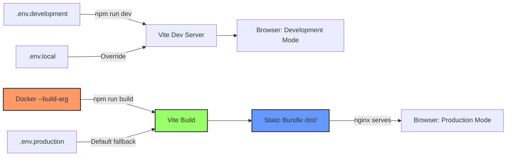

# Cloud Run Deployment Guide

This guide provides complete, reproducible steps to deploy the Adventure Client frontend to Google Cloud Run.

## Table of Contents

- [Prerequisites](#prerequisites)
- [Quick Start](#quick-start)
- [Detailed Deployment Steps](#detailed-deployment-steps)
- [Environment Variables Configuration](#environment-variables-configuration)
- [Verification Checklist](#verification-checklist)
- [Troubleshooting](#troubleshooting)
- [Edge Cases and Advanced Topics](#edge-cases-and-advanced-topics)
- [CI/CD Integration](#cicd-integration)
- [Security Best Practices](#security-best-practices)
- [Additional Resources](#additional-resources)

---

## Prerequisites

Before deploying, ensure you have:

### 1. Google Cloud Platform Setup
- **Active GCP Project**: Create or use an existing project at [console.cloud.google.com](https://console.cloud.google.com)
- **Billing Enabled**: Cloud Run requires an active billing account
- **Project ID**: Note your project ID (e.g., `my-adventure-client-prod`)
- **Region**: Choose a deployment region (recommended: `us-central1` for lowest latency)

### 2. Required Tools
- **gcloud CLI** (latest version)
  ```bash
  # Install gcloud CLI
  # See: https://cloud.google.com/sdk/docs/install
  
  # Initialize and authenticate
  gcloud init
  gcloud auth login
  gcloud auth application-default login
  
  # Set default project and region
  gcloud config set project YOUR_PROJECT_ID
  gcloud config set run/region us-central1
  ```

### 3. Enable Required GCP APIs
```bash
# Enable necessary APIs (one-time setup)
gcloud services enable \
  cloudbuild.googleapis.com \
  run.googleapis.com \
  artifactregistry.googleapis.com \
  containerregistry.googleapis.com
```

### 4. Create Artifact Registry Repository
```bash
# Create a Docker repository in Artifact Registry
gcloud artifacts repositories create adventure-client \
  --repository-format=docker \
  --location=us-central1 \
  --description="Adventure Client container images"

# Configure Docker authentication
gcloud auth configure-docker us-central1-docker.pkg.dev
```

### 5. Prepare Environment Variables
You'll need values for **9 environment variables** (8 required + 1 optional, see [Environment Variables Configuration](#environment-variables-configuration)):
- Firebase configuration (8 variables from Firebase Console)
- Backend API endpoints (2 URLs for Dungeon Master and Journey Log APIs)

> **⚠️ Important**: These values are **baked into the Docker image at build time** (not runtime). Changing env vars requires rebuilding and redeploying.

---

## Quick Start

For experienced users, here's the TL;DR deployment:

```bash
# 1. Set variables
export PROJECT_ID="your-gcp-project-id"
export REGION="us-central1"
export SERVICE_NAME="adventure-client"
export IMAGE_NAME="${REGION}-docker.pkg.dev/${PROJECT_ID}/adventure-client/${SERVICE_NAME}"

# 2. Build and push Docker image (with all env vars: 8 required + 1 optional)
gcloud builds submit \
  --tag="${IMAGE_NAME}:${GITHUB_SHA:-latest}" \
  --build-arg VITE_DUNGEON_MASTER_API_BASE_URL="https://your-dungeon-master-api.run.app" \
  --build-arg VITE_JOURNEY_LOG_API_BASE_URL="https://your-journey-log-api.run.app" \
  --build-arg VITE_FIREBASE_API_KEY="your-firebase-api-key" \
  --build-arg VITE_FIREBASE_AUTH_DOMAIN="your-project.firebaseapp.com" \
  --build-arg VITE_FIREBASE_PROJECT_ID="your-firebase-project" \
  --build-arg VITE_FIREBASE_STORAGE_BUCKET="your-project.appspot.com" \
  --build-arg VITE_FIREBASE_MESSAGING_SENDER_ID="123456789012" \
  --build-arg VITE_FIREBASE_APP_ID="1:123456789012:web:abcdef" \
  --build-arg VITE_FIREBASE_MEASUREMENT_ID="G-XXXXXXXXXX"

# 3. Deploy to Cloud Run (unauthenticated public access)
gcloud run deploy ${SERVICE_NAME} \
  --image="${IMAGE_NAME}:${GITHUB_SHA:-latest}" \
  --platform=managed \
  --region=${REGION} \
  --allow-unauthenticated \
  --port=8080 \
  --cpu=1 \
  --memory=512Mi \
  --min-instances=0 \
  --max-instances=10 \
  --timeout=300s \
  --concurrency=80

# 4. Get service URL
gcloud run services describe ${SERVICE_NAME} \
  --region=${REGION} \
  --format='value(status.url)'
```

---

## Detailed Deployment Steps

### Step 1: Prepare Your Environment

Create a deployment configuration file to avoid typing long commands:

```bash
# Create deployment-config.sh
cat > deployment-config.sh << 'EOF'
#!/bin/bash

# GCP Configuration
export PROJECT_ID="your-gcp-project-id"
export REGION="us-central1"
export SERVICE_NAME="adventure-client"
export ARTIFACT_REGISTRY="adventure-client"

# Image configuration
export IMAGE_NAME="${REGION}-docker.pkg.dev/${PROJECT_ID}/${ARTIFACT_REGISTRY}/${SERVICE_NAME}"
export IMAGE_TAG="${GITHUB_SHA:-$(git rev-parse --short HEAD)}"

# Backend API endpoints (REPLACE WITH YOUR ACTUAL URLS)
export VITE_DUNGEON_MASTER_API_BASE_URL="https://dungeon-master-api-xxxxxxxxxx-uc.a.run.app"
export VITE_JOURNEY_LOG_API_BASE_URL="https://journey-log-api-xxxxxxxxxx-uc.a.run.app"

# Firebase configuration (REPLACE WITH YOUR ACTUAL VALUES)
export VITE_FIREBASE_API_KEY="AIzaSyXXXXXXXXXXXXXXXXXXXXXXXXXXXXXXXX"
export VITE_FIREBASE_AUTH_DOMAIN="your-project.firebaseapp.com"
export VITE_FIREBASE_PROJECT_ID="your-firebase-project"
export VITE_FIREBASE_STORAGE_BUCKET="your-project.appspot.com"
export VITE_FIREBASE_MESSAGING_SENDER_ID="123456789012"
export VITE_FIREBASE_APP_ID="1:123456789012:web:abcdef1234567890"
export VITE_FIREBASE_MEASUREMENT_ID="G-XXXXXXXXXX"

# Cloud Run configuration
export CLOUD_RUN_CPU="1"
export CLOUD_RUN_MEMORY="512Mi"
export CLOUD_RUN_MIN_INSTANCES="0"
export CLOUD_RUN_MAX_INSTANCES="10"
export CLOUD_RUN_TIMEOUT="300s"
export CLOUD_RUN_CONCURRENCY="80"

echo "✅ Environment configured for project: ${PROJECT_ID}"
echo "📦 Image will be: ${IMAGE_NAME}:${IMAGE_TAG}"
EOF

chmod +x deployment-config.sh
source ./deployment-config.sh
```

> **🔒 Security Note**: Keep `deployment-config.sh` in `.gitignore`. Firebase API keys are safe to expose in client-side code, but avoid committing your specific configuration to public repositories.

> **⚠️ Security Warning - Credentials in Command History**: 
> - Build args passed via command line are visible in shell history and process listings
> - On shared systems, other users may see your Firebase credentials via `ps aux`
> - Consider using a config file approach or CI/CD secrets instead of manual command-line deployment
> - For production, **always** use GitHub Actions or Cloud Build triggers with secrets management
> - Alternative: Use `set +o history` before running commands, then `set -o history` after
> 
> **Recommendation**: For local deployments, use the deployment script approach below to centralize credential handling.

#### Centralized Deployment Script (Recommended)

To avoid credential exposure in command history and centralize deployment logic, create a reusable script:

```bash
# Create deploy.sh
cat > deploy.sh << 'EOF'
#!/bin/bash
set -euo pipefail

# Load configuration
if [ ! -f deployment-config.sh ]; then
  echo "❌ Error: deployment-config.sh not found"
  echo "Create it first with your environment variables"
  exit 1
fi

source ./deployment-config.sh

# Validate required variables
REQUIRED_VARS=(
  "PROJECT_ID" "REGION" "SERVICE_NAME" "IMAGE_NAME"
  "VITE_DUNGEON_MASTER_API_BASE_URL" "VITE_JOURNEY_LOG_API_BASE_URL"
  "VITE_FIREBASE_API_KEY" "VITE_FIREBASE_AUTH_DOMAIN"
  "VITE_FIREBASE_PROJECT_ID" "VITE_FIREBASE_STORAGE_BUCKET"
  "VITE_FIREBASE_MESSAGING_SENDER_ID" "VITE_FIREBASE_APP_ID"
  "VITE_FIREBASE_MEASUREMENT_ID"
)

for var in "${REQUIRED_VARS[@]}"; do
  if [ -z "${!var:-}" ]; then
    echo "❌ Error: $var is not set"
    exit 1
  fi
done

echo "🚀 Starting deployment..."
echo "📦 Image: ${IMAGE_NAME}:${IMAGE_TAG}"
echo "🌐 Region: ${REGION}"

# Build and push image
echo ""
echo "🔨 Building Docker image..."
gcloud builds submit \
  --tag="${IMAGE_NAME}:${IMAGE_TAG}" \
  --timeout=20m \
  --machine-type=e2-highcpu-8 \
  --build-arg VITE_DUNGEON_MASTER_API_BASE_URL="${VITE_DUNGEON_MASTER_API_BASE_URL}" \
  --build-arg VITE_JOURNEY_LOG_API_BASE_URL="${VITE_JOURNEY_LOG_API_BASE_URL}" \
  --build-arg VITE_FIREBASE_API_KEY="${VITE_FIREBASE_API_KEY}" \
  --build-arg VITE_FIREBASE_AUTH_DOMAIN="${VITE_FIREBASE_AUTH_DOMAIN}" \
  --build-arg VITE_FIREBASE_PROJECT_ID="${VITE_FIREBASE_PROJECT_ID}" \
  --build-arg VITE_FIREBASE_STORAGE_BUCKET="${VITE_FIREBASE_STORAGE_BUCKET}" \
  --build-arg VITE_FIREBASE_MESSAGING_SENDER_ID="${VITE_FIREBASE_MESSAGING_SENDER_ID}" \
  --build-arg VITE_FIREBASE_APP_ID="${VITE_FIREBASE_APP_ID}" \
  --build-arg VITE_FIREBASE_MEASUREMENT_ID="${VITE_FIREBASE_MEASUREMENT_ID}"

if [ $? -ne 0 ]; then
  echo "❌ Build failed"
  exit 1
fi

# Deploy to Cloud Run
echo ""
echo "☁️  Deploying to Cloud Run..."
gcloud run deploy ${SERVICE_NAME} \
  --image="${IMAGE_NAME}:${IMAGE_TAG}" \
  --platform=managed \
  --region=${REGION} \
  --allow-unauthenticated \
  --port=8080 \
  --cpu=${CLOUD_RUN_CPU} \
  --memory=${CLOUD_RUN_MEMORY} \
  --min-instances=${CLOUD_RUN_MIN_INSTANCES} \
  --max-instances=${CLOUD_RUN_MAX_INSTANCES} \
  --timeout=${CLOUD_RUN_TIMEOUT} \
  --concurrency=${CLOUD_RUN_CONCURRENCY}

if [ $? -ne 0 ]; then
  echo "❌ Deployment failed"
  exit 1
fi

# Get service URL
SERVICE_URL=$(gcloud run services describe ${SERVICE_NAME} \
  --region=${REGION} \
  --format='value(status.url)')

echo ""
echo "✅ Deployment successful!"
echo "🌐 Service URL: ${SERVICE_URL}"
echo ""
echo "Next steps:"
echo "1. Add ${SERVICE_URL#https://} to Firebase Authorized Domains"
echo "2. Run verification checklist from the deployment guide"
EOF

chmod +x deploy.sh
```

**Usage**:
```bash
# Run the deployment script
./deploy.sh
```

**Benefits**:
- ✅ Credentials never appear in shell history
- ✅ Single source of truth for deployment logic
- ✅ Validates all required variables before deployment
- ✅ Consistent error handling
- ✅ Clear deployment progress and success messages

> **🔒 Security Best Practice**: This approach keeps credentials in `deployment-config.sh` (gitignored) and references them from the script, avoiding exposure in command history or process listings.

### Step 2: Build the Docker Image

The Adventure Client uses a **multi-stage Dockerfile** that:
1. Builds the React app with Vite (Node 24-alpine)
2. Serves static files with nginx (alpine)
3. Includes SPA routing, security headers, and gzip compression

#### Option A: Build with Cloud Build (Recommended)

Cloud Build handles the build in GCP infrastructure:

```bash
# Build and push in one command
gcloud builds submit \
  --tag="${IMAGE_NAME}:${IMAGE_TAG}" \
  --timeout=20m \
  --machine-type=e2-highcpu-8 \
  --build-arg VITE_DUNGEON_MASTER_API_BASE_URL="${VITE_DUNGEON_MASTER_API_BASE_URL}" \
  --build-arg VITE_JOURNEY_LOG_API_BASE_URL="${VITE_JOURNEY_LOG_API_BASE_URL}" \
  --build-arg VITE_FIREBASE_API_KEY="${VITE_FIREBASE_API_KEY}" \
  --build-arg VITE_FIREBASE_AUTH_DOMAIN="${VITE_FIREBASE_AUTH_DOMAIN}" \
  --build-arg VITE_FIREBASE_PROJECT_ID="${VITE_FIREBASE_PROJECT_ID}" \
  --build-arg VITE_FIREBASE_STORAGE_BUCKET="${VITE_FIREBASE_STORAGE_BUCKET}" \
  --build-arg VITE_FIREBASE_MESSAGING_SENDER_ID="${VITE_FIREBASE_MESSAGING_SENDER_ID}" \
  --build-arg VITE_FIREBASE_APP_ID="${VITE_FIREBASE_APP_ID}" \
  --build-arg VITE_FIREBASE_MEASUREMENT_ID="${VITE_FIREBASE_MEASUREMENT_ID}"
```

**Pros**: 
- No local Docker daemon required
- Consistent build environment
- Faster on slow local machines
- Automatically pushes to Artifact Registry

**Cons**:
- Costs ~$0.01-0.03 per build
- Requires Cloud Build API enabled

#### Option B: Build Locally and Push

For local development or when Cloud Build is unavailable:

```bash
# Build the image locally
docker build \
  --tag="${IMAGE_NAME}:${IMAGE_TAG}" \
  --platform=linux/amd64 \
  --build-arg VITE_DUNGEON_MASTER_API_BASE_URL="${VITE_DUNGEON_MASTER_API_BASE_URL}" \
  --build-arg VITE_JOURNEY_LOG_API_BASE_URL="${VITE_JOURNEY_LOG_API_BASE_URL}" \
  --build-arg VITE_FIREBASE_API_KEY="${VITE_FIREBASE_API_KEY}" \
  --build-arg VITE_FIREBASE_AUTH_DOMAIN="${VITE_FIREBASE_AUTH_DOMAIN}" \
  --build-arg VITE_FIREBASE_PROJECT_ID="${VITE_FIREBASE_PROJECT_ID}" \
  --build-arg VITE_FIREBASE_STORAGE_BUCKET="${VITE_FIREBASE_STORAGE_BUCKET}" \
  --build-arg VITE_FIREBASE_MESSAGING_SENDER_ID="${VITE_FIREBASE_MESSAGING_SENDER_ID}" \
  --build-arg VITE_FIREBASE_APP_ID="${VITE_FIREBASE_APP_ID}" \
  --build-arg VITE_FIREBASE_MEASUREMENT_ID="${VITE_FIREBASE_MEASUREMENT_ID}" \
  .

# Push to Artifact Registry
docker push "${IMAGE_NAME}:${IMAGE_TAG}"
```

**⚠️ Important**: Use `--platform=linux/amd64` on Apple Silicon (M1/M2/M3) Macs to ensure Cloud Run compatibility.

### Step 3: Deploy to Cloud Run

Deploy the container with public unauthenticated access:

```bash
gcloud run deploy ${SERVICE_NAME} \
  --image="${IMAGE_NAME}:${IMAGE_TAG}" \
  --platform=managed \
  --region=${REGION} \
  --allow-unauthenticated \
  --port=8080 \
  --cpu=${CLOUD_RUN_CPU} \
  --memory=${CLOUD_RUN_MEMORY} \
  --min-instances=${CLOUD_RUN_MIN_INSTANCES} \
  --max-instances=${CLOUD_RUN_MAX_INSTANCES} \
  --timeout=${CLOUD_RUN_TIMEOUT} \
  --concurrency=${CLOUD_RUN_CONCURRENCY} \
  --execution-environment=gen2 \
  --service-account="${SERVICE_NAME}-sa@${PROJECT_ID}.iam.gserviceaccount.com"
```

**Configuration Breakdown**:
- `--allow-unauthenticated`: Public access (no Google Sign-In required)
- `--port=8080`: nginx listens on port 8080 (Cloud Run default)
- `--cpu=1`: 1 vCPU (sufficient for static serving)
- `--memory=512Mi`: 512MB RAM (nginx is lightweight)
- `--min-instances=0`: Scale to zero to minimize costs
- `--max-instances=10`: Limit for budget control
- `--timeout=300s`: 5-minute request timeout (max allowed)
- `--concurrency=80`: Handle 80 concurrent requests per instance
- `--execution-environment=gen2`: Use second-generation execution environment (faster cold starts)

### Step 4: Get Service URL

After deployment, retrieve the public URL:

```bash
# Get URL
export SERVICE_URL=$(gcloud run services describe ${SERVICE_NAME} \
  --region=${REGION} \
  --format='value(status.url)')

echo "🚀 Adventure Client deployed at: ${SERVICE_URL}"

# Open in browser
open "${SERVICE_URL}" || xdg-open "${SERVICE_URL}"
```

### Step 5: Configure Firebase for Production

**Critical**: After deployment, you must configure Firebase Authentication to work with your Cloud Run URL to prevent auth errors and API call failures.

#### Required Firebase Configuration Steps

1. **Add Cloud Run URL to Firebase Authorized Domains**
   - Prevents `auth/unauthorized-domain` errors during sign-in
   - Required for both popup and redirect authentication flows

2. **Configure Backend CORS for Cloud Run Origin**
   - Allows dungeon-master and journey-log APIs to accept authenticated requests
   - Prevents CORS errors and 403 Forbidden responses

3. **Verify HTTPS Requirements**
   - Ensures Firebase auth flows work correctly over HTTPS
   - Validates redirect URIs and token cookies

> **📖 Complete Production Firebase Setup**: For detailed instructions on:
> - Adding your Cloud Run URL to Firebase authorized domains
> - Configuring backend CORS for dungeon-master and journey-log APIs
> - Troubleshooting production auth issues (403s, CORS errors, origin mismatches)
> - Testing production deployments
> - Managing multiple environments (staging vs production)
> 
> See **[docs/firebase-setup.md - Production Deployment with Cloud Run](./firebase-setup.md#production-deployment-with-cloud-run)**

#### Quick Firebase Setup (Minimal Steps)

If you need immediate functionality, perform these minimal steps:

1. **Get your Cloud Run service URL** (from Step 4 output above)
2. **Add to Firebase Console**:
   - Navigate to [Firebase Console](https://console.firebase.google.com)
   - Select your project → **Authentication** → **Settings** → **Authorized domains**
   - Click **Add domain**
   - Enter your Cloud Run hostname only (e.g., `adventure-client-xyz123-uc.a.run.app`)
   - **Important**: Do NOT include `https://` protocol
   - Save and wait 2-5 minutes for propagation

3. **Update Backend CORS** (if you control backend services):
   - Add Cloud Run URL to `allow_origins` in both dungeon-master and journey-log APIs
   - Include required headers: `Authorization`, `X-User-Id`, `Content-Type`
   - Redeploy backend services

> **⚠️ Warning**: Skipping these steps will cause sign-in failures and 403 errors on API calls. See the [complete Firebase setup guide](./firebase-setup.md#production-deployment-with-cloud-run) for comprehensive instructions and troubleshooting.

---

## Environment Variables Configuration

The Adventure Client requires **9 environment variables** at **build time** (not runtime). These are injected via Docker `--build-arg` flags.

### Required Variables

| Variable | Description | Example | Where to Find |
|----------|-------------|---------|---------------|
| `VITE_DUNGEON_MASTER_API_BASE_URL` | Game logic API endpoint | `https://dungeon-master-xxxxx-uc.a.run.app` | Deploy dungeon-master backend first |
| `VITE_JOURNEY_LOG_API_BASE_URL` | Character/narrative API endpoint | `https://journey-log-xxxxx-uc.a.run.app` | Deploy journey-log backend first |
| `VITE_FIREBASE_API_KEY` | Firebase client API key (safe to expose) | `AIzaSyXXXXXXXXXXXXXXXXXXXXXXXXXX` | Firebase Console → Project Settings → General |
| `VITE_FIREBASE_AUTH_DOMAIN` | OAuth redirect domain | `your-project.firebaseapp.com` | Firebase Console → Project Settings → General |
| `VITE_FIREBASE_PROJECT_ID` | Firebase project identifier | `your-firebase-project` | Firebase Console → Project Settings → General |
| `VITE_FIREBASE_STORAGE_BUCKET` | Cloud Storage bucket | `your-project.appspot.com` | Firebase Console → Project Settings → General |
| `VITE_FIREBASE_MESSAGING_SENDER_ID` | FCM sender ID | `123456789012` | Firebase Console → Project Settings → Cloud Messaging |
| `VITE_FIREBASE_APP_ID` | Firebase app identifier | `1:123456789012:web:abcdef` | Firebase Console → Project Settings → General |
| `VITE_FIREBASE_MEASUREMENT_ID` | Google Analytics ID (optional) | `G-XXXXXXXXXX` | Firebase Console → Project Settings → General (if Analytics enabled) |

### How to Get Firebase Configuration

1. Go to [Firebase Console](https://console.firebase.google.com)
2. Select your project (or create a new one)
3. Click the **Settings** gear icon → **Project settings**
4. Scroll to **Your apps** section
5. If no web app exists, click **Add app** → **Web** (</>) icon
6. Register the app and copy the `firebaseConfig` object:

```javascript
// Firebase SDK configuration (convert to env vars)
const firebaseConfig = {
  apiKey: "AIzaSyXXXXXXXXXXXXXXXXXXXXXXXXXX",           // → VITE_FIREBASE_API_KEY
  authDomain: "your-project.firebaseapp.com",          // → VITE_FIREBASE_AUTH_DOMAIN
  projectId: "your-firebase-project",                   // → VITE_FIREBASE_PROJECT_ID
  storageBucket: "your-project.appspot.com",           // → VITE_FIREBASE_STORAGE_BUCKET
  messagingSenderId: "123456789012",                   // → VITE_FIREBASE_MESSAGING_SENDER_ID
  appId: "1:123456789012:web:abcdef1234567890",       // → VITE_FIREBASE_APP_ID
  measurementId: "G-XXXXXXXXXX"                         // → VITE_FIREBASE_MEASUREMENT_ID
};
```

### Setting Variables: Cloud Build

When using `gcloud builds submit`, pass all variables as `--build-arg`:

```bash
gcloud builds submit \
  --tag="${IMAGE_NAME}:${IMAGE_TAG}" \
  --build-arg VITE_DUNGEON_MASTER_API_BASE_URL="https://dungeon-master-api.run.app" \
  --build-arg VITE_JOURNEY_LOG_API_BASE_URL="https://journey-log-api.run.app" \
  --build-arg VITE_FIREBASE_API_KEY="AIzaSyXXXXXXXXXXXXXXXXXXXXXXXXXX" \
  --build-arg VITE_FIREBASE_AUTH_DOMAIN="your-project.firebaseapp.com" \
  --build-arg VITE_FIREBASE_PROJECT_ID="your-firebase-project" \
  --build-arg VITE_FIREBASE_STORAGE_BUCKET="your-project.appspot.com" \
  --build-arg VITE_FIREBASE_MESSAGING_SENDER_ID="123456789012" \
  --build-arg VITE_FIREBASE_APP_ID="1:123456789012:web:abcdef" \
  --build-arg VITE_FIREBASE_MEASUREMENT_ID="G-XXXXXXXXXX"
```

### Setting Variables: GCP Console

**Environment variables cannot be set in the Cloud Run console** because they're build-time variables, not runtime variables. All configuration happens during the Docker build.

To update env vars:
1. Rebuild the Docker image with new `--build-arg` values
2. Redeploy the Cloud Run service with the new image

### Managing Multiple Environments

Use separate images for staging and production:

```bash
# Staging deployment
export IMAGE_TAG="staging-${GITHUB_SHA}"
export VITE_DUNGEON_MASTER_API_BASE_URL="https://dungeon-master-staging.run.app"
# ... (build and deploy)

# Production deployment
export IMAGE_TAG="production-${GITHUB_SHA}"
export VITE_DUNGEON_MASTER_API_BASE_URL="https://dungeon-master-production.run.app"
# ... (build and deploy)
```

---

## Understanding Environment Configuration Parity

This section explains how local development and production deployments differ, how configuration flows through the system, and how to verify your setup.

### 🔑 Core Concept: Build-Time vs Runtime Variables

**Critical Understanding:** Vite bundles environment variables **at build time**, not runtime.



**Key Implications:**

1. **Development:** 
   - Vite dev server (`npm run dev`) reads `.env.development` and `.env.local`
   - Hot reload works, but env changes require dev server restart
   - Environment variables are evaluated on every module load

2. **Production:**
   - Docker build step (`npm run build`) reads `.env.production` and `--build-arg` flags
   - `--build-arg` values **override** `.env.production` defaults
   - Variables are **baked into JavaScript bundles** in `dist/assets/*.js`
   - Cloud Run environment variables (set via `gcloud run deploy --set-env-vars`) **DO NOT work** for `VITE_*` variables

3. **Configuration Changes:**
   - ❌ Updating Cloud Run env vars has no effect
   - ✅ Must rebuild Docker image with new `--build-arg` values
   - ✅ Must redeploy Cloud Run service with new image

### 📂 Environment File Precedence

Vite loads environment files in this order (later files override earlier):

#### Development Mode (`npm run dev`)
```
1. .env                      # Base defaults (usually not used)
2. .env.local                # Local overrides (gitignored)
3. .env.development          # Development defaults (committed)
4. .env.development.local    # Dev local overrides (gitignored)
```

**Practical workflow:**
```bash
# Copy development template
cp .env.development .env.local

# Edit .env.local with real Firebase credentials
# This file overrides .env.development and is in .gitignore
```

#### Production Mode (`npm run build`)
```
1. .env                      # Base defaults (usually not used)
2. .env.local                # Local overrides (gitignored)
3. .env.production           # Production defaults (committed)
4. .env.production.local     # Prod local overrides (gitignored)
5. Docker --build-arg flags  # HIGHEST PRIORITY (overrides all files)
```

**Dockerfile workflow:**
```dockerfile
# Dockerfile declares ARGs (must match variable names)
ARG VITE_FIREBASE_API_KEY
ARG VITE_FIREBASE_PROJECT_ID
# ... (all other variables)

# ARGs become build-time environment variables
ENV VITE_FIREBASE_API_KEY=$VITE_FIREBASE_API_KEY
ENV VITE_FIREBASE_PROJECT_ID=$VITE_FIREBASE_PROJECT_ID
# ... (set all as ENV)

# npm run build uses these ENV values
RUN npm run build
```

### 🔍 Verifying Environment Configuration

#### During Development

**Method 1: Browser Console**
```javascript
// Open DevTools (F12) and run:
console.log('Mode:', import.meta.env.MODE)
console.log('API URLs:', {
  dungeonMaster: import.meta.env.VITE_DUNGEON_MASTER_API_BASE_URL,
  journeyLog: import.meta.env.VITE_JOURNEY_LOG_API_BASE_URL
})
console.log('Firebase Project:', import.meta.env.VITE_FIREBASE_PROJECT_ID)
```

**Method 2: Check Config Module**
```javascript
// In DevTools console:
import('/src/config/env.ts').then(m => {
  console.log('Loaded config:', m.config)
})
```

**Method 3: Temporary Logging**
```typescript
// Add to src/main.tsx (remove after verification)
import { config } from './config/env'
console.log('🔧 Environment Configuration:', {
  mode: import.meta.env.MODE,
  apiEndpoints: {
    dungeonMaster: config.dungeonMasterApiUrl,
    journeyLog: config.journeyLogApiUrl
  },
  firebase: {
    projectId: config.firebase.projectId,
    authDomain: config.firebase.authDomain
  }
})
```

**Method 4: Development Debug Page**
```typescript
// Create src/pages/ConfigDebugPage.tsx (development only)
import { config } from '@/config/env'

export default function ConfigDebugPage() {
  if (import.meta.env.PROD) {
    return <div>Not available in production</div>
  }
  
  return (
    <div>
      <h1>Configuration Debug</h1>
      <pre>{JSON.stringify(config, null, 2)}</pre>
    </div>
  )
}
```

**Security Note**: The `import.meta.env.PROD` check prevents config display in production builds. For additional security:
- Add route-level authentication guard (e.g., require admin role)
- Use conditional routing in development only: `{import.meta.env.DEV && <Route path="/debug" element={<ConfigDebugPage />} />}`
- Consider tree-shaking: Dead code elimination will remove the debug page from production bundles if conditionally imported

#### After Production Build

**Verify Docker Build Arguments Were Applied:**
```bash
# After running: docker build --build-arg VITE_FIREBASE_PROJECT_ID=my-prod-project ...

# Method 1: Search built bundle for your production values
docker run --rm --entrypoint cat your-image:tag /usr/share/nginx/html/assets/index-*.js \
  | grep -o "VITE_FIREBASE_PROJECT_ID.*" | head -1

# Expected: Should show your production project ID, NOT the .env.production placeholder

# Method 2: Inspect environment during build
docker build \
  --build-arg VITE_FIREBASE_PROJECT_ID=my-prod-project \
  --progress=plain \
  --no-cache \
  -t test-image . 2>&1 | grep VITE_FIREBASE_PROJECT_ID
```

**Verify Deployed Application:**
```bash
# 1. Deploy and get URL
export SERVICE_URL=$(gcloud run services describe adventure-client \
  --region=us-central1 \
  --format='value(status.url)')

# 2. Download and inspect main bundle
curl -s "${SERVICE_URL}" \
  | grep -oP 'src="([^"]*index[^"]*.js)"' \
  | head -1 \
  | sed 's/src="//;s/"//' \
  | xargs -I {} curl -s "${SERVICE_URL}{}" \
  | grep -o "projectId:\"[^\"]*\"" \
  | head -1

# Expected: projectId:"your-production-firebase-project"
```

### ⚠️ Configuration Validation Checklist

Before deploying to production, verify these critical configuration points:

#### Pre-Deployment Checks

- [ ] **Separate Firebase Projects:** Development and production use different Firebase project IDs
  ```bash
  # Verify .env.development has test/mock project
  grep VITE_FIREBASE_PROJECT_ID .env.development
  # Output: VITE_FIREBASE_PROJECT_ID=mock-project-dev
  
  # Verify production build args have real project
  echo $VITE_FIREBASE_PROJECT_ID
  # Output: your-production-firebase-project
  ```

- [ ] **HTTPS API Endpoints:** Production API URLs use `https://`, not `http://`
  ```bash
  # Check that production build args use HTTPS
  echo $VITE_DUNGEON_MASTER_API_BASE_URL | grep -q "^https://" && echo "✅ HTTPS" || echo "❌ HTTP"
  ```

- [ ] **No Localhost in Production:** Production API URLs don't contain `localhost`
  ```bash
  # Verify no localhost URLs in production config
  echo $VITE_DUNGEON_MASTER_API_BASE_URL | grep -q "localhost" && echo "❌ Localhost detected!" || echo "✅ No localhost"
  ```

- [ ] **All Required Variables Set:** All 8 required variables have non-empty values (MEASUREMENT_ID is optional)
  ```bash
  # Check all required env vars are set (8 required variables)
  for var in VITE_DUNGEON_MASTER_API_BASE_URL VITE_JOURNEY_LOG_API_BASE_URL \
             VITE_FIREBASE_API_KEY VITE_FIREBASE_AUTH_DOMAIN VITE_FIREBASE_PROJECT_ID \
             VITE_FIREBASE_STORAGE_BUCKET VITE_FIREBASE_MESSAGING_SENDER_ID \
             VITE_FIREBASE_APP_ID; do
    if [ -z "${!var}" ]; then
      echo "❌ Missing: $var"
    else
      echo "✅ Set: $var"
    fi
  done
  
  # Optional: Check MEASUREMENT_ID (only needed for Google Analytics)
  if [ -z "${VITE_FIREBASE_MEASUREMENT_ID}" ]; then
    echo "⚠️  Optional: VITE_FIREBASE_MEASUREMENT_ID not set (only needed for Analytics)"
  else
    echo "✅ Set: VITE_FIREBASE_MEASUREMENT_ID"
  fi
  ```

- [ ] **Dockerfile ARG Declarations:** Dockerfile declares all variables as ARGs
  ```bash
  # Verify Dockerfile has ARG declarations for all VITE_* variables
  grep "^ARG VITE_" Dockerfile | wc -l
  # Expected: 9 (one for each required variable)
  ```

#### Post-Deployment Verification

- [ ] **Firebase Auth Domain Authorized:** Cloud Run domain added to Firebase authorized domains
  ```
  1. Get Cloud Run URL: gcloud run services describe adventure-client --format='value(status.url)'
  2. Extract domain: adventure-client-xxx-uc.a.run.app
  3. Check Firebase Console > Authentication > Settings > Authorized domains
  4. Verify domain is in the list
  ```

- [ ] **API Connectivity:** Frontend can reach both backend APIs
  ```bash
  # Test from Cloud Run service (if you have shell access)
  curl -I https://dungeon-master-api.run.app/health
  curl -I https://journey-log-api.run.app/health
  ```

- [ ] **Environment Values in Bundle:** Production values are baked into deployed bundle
  ```bash
  # View source of deployed app and search for your project ID
  curl -s $SERVICE_URL | grep "your-production-firebase-project"
  # If found in HTML or linked JS, configuration is correct
  ```

### 🚨 Common Configuration Mistakes

#### Mistake 1: Setting Cloud Run Environment Variables
**Problem:** Setting `VITE_*` variables via `gcloud run deploy --set-env-vars` has no effect.

**Why:** Vite bundles variables at **build time** (during `npm run build`), not at **runtime** (when Cloud Run serves requests).

**Solution:** Pass variables as Docker `--build-arg` flags during `gcloud builds submit` or `docker build`.

**Correct:**
```bash
gcloud builds submit \
  --build-arg VITE_FIREBASE_PROJECT_ID="prod-project" \
  --tag=image:tag
```

**Incorrect:**
```bash
gcloud run deploy service \
  --set-env-vars VITE_FIREBASE_PROJECT_ID="prod-project"  # ❌ Won't work
```

#### Mistake 2: Using .env.production Values Directly
**Problem:** `.env.production` contains placeholder/example values, and deployment uses them.

**Why:** `.env.production` is a **committed template**. Real values should come from `--build-arg` in CI/CD.

**Solution:** Always override `.env.production` with `--build-arg` flags during production builds.

**Correct Dockerfile + Build:**
```dockerfile
# Dockerfile declares ARGs (no defaults)
ARG VITE_FIREBASE_PROJECT_ID

# Set as ENV for npm run build
ENV VITE_FIREBASE_PROJECT_ID=$VITE_FIREBASE_PROJECT_ID
```

```bash
# Build with actual value
docker build --build-arg VITE_FIREBASE_PROJECT_ID="real-prod-project" .
```

#### Mistake 3: Forgetting to Redeploy After Config Change
**Problem:** Changed an API URL but app still uses old value.

**Why:** Environment variables are baked into the bundle during build. Changing Cloud Run config doesn't update the bundle.

**Solution:** Rebuild and redeploy whenever any `VITE_*` variable changes.

```bash
# 1. Rebuild with new values
gcloud builds submit \
  --build-arg VITE_DUNGEON_MASTER_API_BASE_URL="https://new-api-url.run.app" \
  --tag="${IMAGE_NAME}:${NEW_TAG}"

# 2. Redeploy with new image
gcloud run deploy adventure-client \
  --image="${IMAGE_NAME}:${NEW_TAG}"
```

#### Mistake 4: Mixed Content (HTTP Backend, HTTPS Frontend)
**Problem:** Production frontend (HTTPS) tries to call backend API with `http://` URL.

**Why:** Browsers block mixed content (HTTPS page loading HTTP resources).

**Solution:** Ensure all production API URLs use `https://` protocol.

```bash
# Check for http:// in production build args
echo $VITE_DUNGEON_MASTER_API_BASE_URL | grep -q "^http://" && echo "⚠️ HTTP detected!" || echo "✅ HTTPS"
```

#### Mistake 5: Exposing Backend Secrets in VITE_* Variables
**Problem:** Storing backend service account keys or database passwords in `VITE_*` variables.

**Why:** All `VITE_*` variables are **visible in the client-side JavaScript bundle** (anyone can inspect them).

**Solution:** 
- ✅ Store backend secrets in **backend services** only (Secret Manager, Cloud Run env vars on backend)
- ✅ Use Firebase API keys in `VITE_*` variables (they're meant to be public, protected by Security Rules)
- ❌ Never store service account JSON keys, database passwords, or API secret keys in `VITE_*` variables

**Example of Safe vs Unsafe Variables:**
```bash
# ✅ SAFE to expose in VITE_* (client-side)
VITE_FIREBASE_API_KEY="AIzaSyXXXXXXXXXXXXXXXXXXXXXXXXXX"  # Public by design
VITE_FIREBASE_PROJECT_ID="my-project"                    # Public identifier
VITE_DUNGEON_MASTER_API_BASE_URL="https://api.run.app"   # Public endpoint

# ❌ UNSAFE for VITE_* (backend-only secrets)
VITE_SERVICE_ACCOUNT_KEY="{...json...}"                  # ❌ Private key - goes in backend
VITE_DATABASE_PASSWORD="secret123"                       # ❌ DB credential - goes in backend
VITE_JWT_SECRET="mysecret"                               # ❌ Signing key - goes in backend
```

### 📋 Environment Variable Configuration Matrix

| Variable | Dev (.env.development) | Prod (--build-arg) | Required | Notes |
|----------|------------------------|-------------------|----------|-------|
| `VITE_DUNGEON_MASTER_API_BASE_URL` | `http://localhost:8001` | `https://dm-api.run.app` | ✅ Yes | Must be HTTPS in prod |
| `VITE_JOURNEY_LOG_API_BASE_URL` | `http://localhost:8002` | `https://jl-api.run.app` | ✅ Yes | Must be HTTPS in prod |
| `VITE_FIREBASE_API_KEY` | `mock-api-key-dev` | `AIzaSyXXXX...` | ✅ Yes | Get from Firebase Console |
| `VITE_FIREBASE_AUTH_DOMAIN` | `mock-project-dev.firebaseapp.com` | `prod-project.firebaseapp.com` | ✅ Yes | Add Cloud Run domain to authorized list |
| `VITE_FIREBASE_PROJECT_ID` | `mock-project-dev` | `prod-project-id` | ✅ Yes | Use separate projects for dev/prod |
| `VITE_FIREBASE_STORAGE_BUCKET` | `mock-project-dev.appspot.com` | `prod-project.appspot.com` | ✅ Yes | Optional if not using Storage |
| `VITE_FIREBASE_MESSAGING_SENDER_ID` | `000000000000` | `123456789012` | ✅ Yes | From Firebase Console > Cloud Messaging |
| `VITE_FIREBASE_APP_ID` | `1:000000000000:web:mockappiddev` | `1:123456789012:web:abcdef` | ✅ Yes | From Firebase app registration |
| `VITE_FIREBASE_MEASUREMENT_ID` | `G-MOCKIDDEV` | `G-XXXXXXXXXX` | ⚠️ Optional | Only needed if using Analytics |

### 🔗 Configuration Contract: src/config/env.ts

All environment variables consumed by the application are declared and validated in `src/config/env.ts`. This file serves as the **single source of truth** for configuration requirements.

**Key features:**
- Type-safe configuration via `EnvConfig` interface
- Fail-fast validation with descriptive error messages
- Centralized access via exported `config` singleton
- Optional vs required variable handling

**How variables flow:**

```typescript
// 1. Vite exposes VITE_* as import.meta.env
import.meta.env.VITE_FIREBASE_PROJECT_ID

// 2. env.ts validates and structures them
function getRequiredEnv(key: string): string {
  const value = import.meta.env[key];
  if (!value) throw new Error(`Missing: ${key}`);
  return value;
}

// 3. Application imports structured config
import { config } from '@/config/env';
console.log(config.firebase.projectId);  // Type-safe access
```

**When adding new environment variables:**

1. Update `EnvConfig` interface in `src/config/env.ts`
2. Add to `loadConfig()` function with validation
3. Update `.env.example` with documentation
4. Update `.env.development` with mock/test value
5. Update `.env.production` with placeholder
6. Update `Dockerfile` with new `ARG` declaration
7. Update deployment scripts with new `--build-arg`
8. Update this documentation with new variable

---

## Verification Checklist

After deployment, systematically verify all functionality:

### ✅ 1. Basic Accessibility
- [ ] Cloud Run service URL is reachable (200 OK)
- [ ] Page loads without console errors (check browser DevTools)
- [ ] Static assets load (JS, CSS, images)
- [ ] No 404 errors for bundled files

```bash
# Test HTTP response
curl -I "${SERVICE_URL}"
# Should return: HTTP/2 200
```

### ✅ 2. SPA Routing
- [ ] Navigate to `/characters` directly (not through click)
- [ ] Hard refresh on `/characters` doesn't show 404
- [ ] Browser back/forward buttons work
- [ ] Direct URL access to nested routes works

```bash
# Test SPA routing
curl -I "${SERVICE_URL}/characters"
# Should return: HTTP/2 200 (not 404)
```

### ✅ 3. Firebase Authentication
- [ ] Sign-up flow works (email/password)
- [ ] Login flow works (existing user)
- [ ] JWT token is stored in browser (check DevTools → Application → Local Storage)
- [ ] Protected routes redirect to login when not authenticated
- [ ] Logout clears session

**Test Steps**:
1. Open `${SERVICE_URL}` in incognito window
2. Click "Sign Up" → Create account
3. Verify email verification flow (if enabled)
4. Check browser console for Firebase auth tokens
5. Logout and login again

**Expected Behavior**:
- No `auth/unauthorized-domain` errors
- Firebase SDK connects to correct project
- Auth state persists across page refreshes

### ✅ 4. Backend API Connectivity
- [ ] Check browser Network tab for API calls
- [ ] Dungeon Master API calls succeed (200/201 responses)
- [ ] Journey Log API calls succeed (200/201 responses)
- [ ] CORS headers are present in API responses
- [ ] Authorization headers are sent with requests
- [ ] JWT token format is valid and properly structured

**Test Steps**:
1. Open DevTools → Network tab
2. Create a new character
3. Verify POST to `${VITE_JOURNEY_LOG_API_BASE_URL}/characters`
4. Inspect request headers (should include `Authorization: Bearer <token>`)
5. Copy the JWT token from the Authorization header
6. Decode and inspect the JWT token:
   ```bash
   # Use jwt.io or decode locally
   echo "<token>" | cut -d'.' -f2 | base64 -d | jq .
   # Verify claims include: iss, sub, aud, exp, iat
   # Verify aud matches your Firebase project ID
   ```
7. Inspect response headers (should include `Access-Control-Allow-Origin`)

**Expected Behavior**:
- No CORS errors in console
- API responses return valid JSON
- JWT token contains valid Firebase claims (user_id, email, exp)
- Token expiry (exp) is in the future
- 401 errors if backend requires auth and token is missing

### ✅ 5. Character Lifecycle Flows
- [ ] Create new character → character appears in list
- [ ] Select character → character details load
- [ ] Start game with character → dungeon master API responds
- [ ] Submit action → game state updates
- [ ] View character history → journey log data loads

### ✅ 6. Error Handling
- [ ] Test with invalid JWT token → redirects to login
- [ ] Test with backend API down → shows user-friendly error
- [ ] Test with slow network (DevTools → Network throttling) → loading states work

### ✅ 7. Performance
- [ ] Initial load time < 3 seconds (normal network)
- [ ] Lighthouse score > 90 (Performance)
- [ ] No memory leaks during navigation
- [ ] Gzip compression is active (check Response Headers: `content-encoding: gzip`)

```bash
# Check gzip compression
curl -H "Accept-Encoding: gzip" -I "${SERVICE_URL}"
# Should include: content-encoding: gzip
```

### ✅ 8. Security Headers
- [ ] `X-Content-Type-Options: nosniff` present
- [ ] `X-Frame-Options: DENY` present
- [ ] `Content-Security-Policy` header present
- [ ] No inline scripts (CSP should block them)

```bash
# Check security headers
curl -I "${SERVICE_URL}" | grep -E "X-Content-Type-Options|X-Frame-Options|Content-Security-Policy"
```

---

## Troubleshooting

> **📖 Comprehensive Firebase & Auth Troubleshooting**: For detailed production authentication troubleshooting, including:
> - Firebase authorized domain issues
> - Backend CORS configuration problems
> - 403 Forbidden errors on API calls
> - Token validation failures
> - Production auth testing procedures
> 
> See **[docs/firebase-setup.md - Troubleshooting Production Auth Issues](./firebase-setup.md#step-4-troubleshooting-production-auth-issues)**
>
> This section covers Cloud Run deployment-specific issues. For Firebase Authentication and API integration problems, consult the Firebase setup guide.

### Problem: `auth/unauthorized-domain` Error

**Symptoms**:
- Firebase login popup shows error
- Console error: `This domain is not authorized for OAuth operations`

**Cause**: Cloud Run domain not added to Firebase authorized domains

**Solution**:
1. Get your Cloud Run domain: `gcloud run services describe ${SERVICE_NAME} --region=${REGION} --format='value(status.url)'`
2. Go to Firebase Console → Authentication → Settings → Authorized domains
3. Add domain (e.g., `adventure-client-xxxxxxxxxx-uc.a.run.app`)
4. Wait 1-2 minutes for propagation
5. Clear browser cache and retry

> **📖 Detailed Guide**: See [Firebase Setup - Production Deployment](./firebase-setup.md#step-1-add-cloud-run-url-to-firebase-authorized-domains) for comprehensive instructions including multi-environment setup and custom domains.

---

### Problem: 403 Forbidden (Unauthenticated Access)

**Symptoms**:
- Cannot access Cloud Run URL
- Error: `Your client does not have permission to get URL`

**Cause**: Cloud Run service requires authentication

**Solution**:
```bash
# Grant public access
gcloud run services add-iam-policy-binding ${SERVICE_NAME} \
  --region=${REGION} \
  --member="allUsers" \
  --role="roles/run.invoker"

# Verify permission
gcloud run services get-iam-policy ${SERVICE_NAME} --region=${REGION}
```

---

### Problem: CORS Errors When Calling Backend APIs

**Symptoms**:
- Console error: `Access to fetch at 'https://api.run.app/...' from origin 'https://frontend.run.app' has been blocked by CORS policy`
- Network tab shows preflight OPTIONS request fails

**Cause**: Backend API not configured for CORS or missing frontend origin

**Solution (Backend Fix Required)**:
1. Backend must include CORS headers:
   ```
   Access-Control-Allow-Origin: https://your-frontend-domain.run.app
   Access-Control-Allow-Methods: GET, POST, PUT, DELETE, OPTIONS
   Access-Control-Allow-Headers: Content-Type, Authorization, X-User-Id
   Access-Control-Allow-Credentials: true
   ```
2. Backend must handle OPTIONS preflight requests
3. For FastAPI backend, use `fastapi.middleware.cors.CORSMiddleware`

**Frontend Check**:
- Verify `VITE_DUNGEON_MASTER_API_BASE_URL` and `VITE_JOURNEY_LOG_API_BASE_URL` are correct
- Ensure URLs don't have trailing slashes (unless backend expects them)

> **📖 Complete CORS Configuration Guide**: For detailed backend CORS setup for dungeon-master and journey-log APIs, including required headers, OPTIONS preflight configuration, and common pitfalls, see [Firebase Setup - Backend CORS Configuration](./firebase-setup.md#step-2-configure-backend-cors-for-cloud-run-origin).

---

### Problem: Firebase Config Mismatch

**Symptoms**:
- Console error: `Firebase: No Firebase App '[DEFAULT]' has been created`
- Auth doesn't work despite correct authorized domains

**Cause**: Wrong Firebase project ID or API key

**Solution**:
1. Verify all Firebase env vars match Firebase Console exactly (7 Firebase variables: 6 required + MEASUREMENT_ID if using Analytics)
2. Rebuild Docker image with correct values
3. Check for typos in `VITE_FIREBASE_AUTH_DOMAIN` (common mistake: using project ID instead of `*.firebaseapp.com`)

```bash
# Debug: Print env vars baked into image
docker run --rm "${IMAGE_NAME}:${IMAGE_TAG}" cat /usr/share/nginx/html/assets/index-*.js | grep -o "firebaseConfig"
# This should find Firebase config in bundled JS
```

---

### Problem: Backend Rejects Firebase Token (Project ID Mismatch)

**Symptoms**:
- Frontend auth works correctly (Firebase login succeeds)
- Backend APIs return 401 or 403 errors with valid JWT token
- Backend logs show: `Invalid token` or `Project ID mismatch`

**Cause**: Backend Firebase Admin SDK is configured for a different Firebase project than the frontend, or backend isn't validating Firebase tokens correctly

**Root Causes**:
1. **Project ID Mismatch**: Frontend uses Firebase project A, backend expects project B
2. **Missing Backend Configuration**: Backend Firebase Admin SDK not initialized
3. **Incorrect Service Account**: Backend using wrong service account credentials
4. **Audience Claim Mismatch**: JWT `aud` claim doesn't match backend's expected project ID

**Solution**:

**Frontend Verification**:
```bash
# Decode JWT token from Authorization header
# Get token from browser DevTools → Network → Request Headers
echo "<your-jwt-token>" | cut -d'.' -f2 | base64 -d | jq .

# Verify these claims:
# - "aud": should be your Firebase project ID
# - "iss": should be "https://securetoken.google.com/<project-id>"
# - "sub": user ID
# - "exp": expiry timestamp (future)
```

**Backend Fixes** (requires backend deployment):
1. Verify backend Firebase Admin SDK initialization uses same project ID as frontend
2. Check backend service account has correct permissions
3. Ensure backend validates `aud` claim matches its Firebase project
4. Review backend logs for specific validation errors

**Common Mistakes**:
- Using different Firebase projects for frontend staging vs production
- Deploying frontend production build but backend still in dev mode
- Backend service account from wrong GCP project

**Verification Steps**:
1. Compare `VITE_FIREBASE_PROJECT_ID` (frontend) with backend Firebase Admin config
2. Test with curl to isolate frontend vs backend issue:
   ```bash
   TOKEN="<firebase-jwt-token>"
   curl -H "Authorization: Bearer ${TOKEN}" \
     -H "X-User-Id: <your-uid>" \
     "${VITE_DUNGEON_MASTER_API_BASE_URL}/health"
   ```
3. Check backend deployment logs for Firebase initialization messages
4. Verify backend's GCP project matches frontend's Firebase project

> **Note**: This is a backend configuration issue. The deployment guide focuses on frontend; coordinate with backend team to ensure matching Firebase projects across environments.

> **📖 Comprehensive 403/Auth Troubleshooting**: For detailed troubleshooting of 403 errors, token validation, and API authentication issues, see [Firebase Setup - Issue: 403 Forbidden on API Calls](./firebase-setup.md#issue-403-forbidden-on-api-calls).

---

### Problem: 404 on Page Refresh (SPA Routes)

**Symptoms**:
- Navigating to `/characters` via link works
- Direct URL or refresh on `/characters` shows 404

**Cause**: nginx not configured for SPA routing

**Solution**: This should not happen with the provided `nginx.conf`. Verify:
1. `nginx.conf` includes: `try_files $uri /index.html;`
2. Dockerfile copies `nginx.conf` correctly: `COPY nginx.conf /etc/nginx/conf.d/default.conf`
3. Rebuild image if you made changes

---

### Problem: Slow Image Pulls from Artifact Registry

**Symptoms**:
- Cloud Run deployment takes 5+ minutes
- Logs show: `Pulling image...` for extended time

**Cause**: Artifact Registry region doesn't match Cloud Run region

**Solution**:
```bash
# WRONG: Registry in us-west1, Cloud Run in us-central1
# Image must cross regions → slow

# CORRECT: Both in us-central1
gcloud artifacts repositories create adventure-client \
  --repository-format=docker \
  --location=us-central1  # Match Cloud Run region

gcloud run deploy ${SERVICE_NAME} --region=us-central1
```

---

### Problem: Environment Variable Changes Not Reflected

**Symptoms**:
- Changed `VITE_DUNGEON_MASTER_API_BASE_URL` but app still uses old URL
- Tried `gcloud run services update --set-env-vars` but nothing changed

**Cause**: Env vars are **build-time**, not runtime

**Solution**:
1. You must **rebuild** the Docker image with new `--build-arg` values
2. Then redeploy with the new image
3. `gcloud run services update --set-env-vars` does NOT work for Vite build vars

```bash
# Correct workflow to update env vars
export VITE_DUNGEON_MASTER_API_BASE_URL="https://new-api-url.run.app"
export NEW_TAG="new-$(date +%s)"

# 1. Rebuild with new env var
gcloud builds submit --tag="${IMAGE_NAME}:${NEW_TAG}" \
  --build-arg VITE_DUNGEON_MASTER_API_BASE_URL="${VITE_DUNGEON_MASTER_API_BASE_URL}" \
  # ... (all other build args)

# 2. Deploy new image
gcloud run deploy ${SERVICE_NAME} --image="${IMAGE_NAME}:${NEW_TAG}"
```

---

### Problem: Service Account Permission Errors

**Symptoms**:
- Deployment succeeds but app can't call GCP services
- Logs show: `Permission 'X' denied`

**Cause**: Cloud Run service account lacks permissions

**Solution**:
```bash
# Create service account (if not exists)
gcloud iam service-accounts create ${SERVICE_NAME}-sa \
  --display-name="Adventure Client Service Account"

# Grant minimal permissions (adjust as needed)
# For frontend, usually NO permissions needed (calls public APIs)

# Assign to Cloud Run
gcloud run services update ${SERVICE_NAME} \
  --region=${REGION} \
  --service-account="${SERVICE_NAME}-sa@${PROJECT_ID}.iam.gserviceaccount.com"
```

**Note**: Frontend typically doesn't need GCP service account permissions. Backend APIs should handle GCP service calls.

---

### Problem: Cold Start Latency (First Request Slow)

**Symptoms**:
- First request takes 5-10 seconds
- Subsequent requests are fast (< 1 second)

**Cause**: Cloud Run scales to zero; cold start initializes container

**Solution (Trade-offs)**:
```bash
# Option 1: Keep 1 instance warm (costs ~$10-20/month)
gcloud run services update ${SERVICE_NAME} \
  --region=${REGION} \
  --min-instances=1

# Option 2: Optimize Dockerfile for faster cold starts
# Already optimized: nginx:alpine is ~8MB, starts in ~1 second

# Option 3: Use Cloud Run gen2 (faster cold starts)
gcloud run services update ${SERVICE_NAME} \
  --region=${REGION} \
  --execution-environment=gen2
```

**Recommendation**: For production, set `--min-instances=1` during business hours:
```bash
# Business hours: 1 warm instance
gcloud scheduler jobs create http keep-warm \
  --schedule="*/5 8-18 * * 1-5" \
  --http-method=GET \
  --uri="${SERVICE_URL}"
```

---

### Problem: Build Fails with "Out of Memory"

**Symptoms**:
- Cloud Build fails during `npm run build`
- Error: `JavaScript heap out of memory`

**Cause**: Default Cloud Build machine too small for large React apps

**Solution**:
```bash
# Use larger machine type
gcloud builds submit \
  --tag="${IMAGE_NAME}:${IMAGE_TAG}" \
  --machine-type=e2-highcpu-8 \
  --timeout=20m \
  # ... (build args)
```

Machine types:
- `e2-medium` (default): 2 vCPU, 4GB RAM
- `e2-highcpu-8`: 8 vCPU, 8GB RAM (recommended for large apps)
- `e2-highcpu-32`: 32 vCPU, 32GB RAM (overkill, costs more)

---

## Edge Cases and Advanced Topics

### Artifact Registry Region Mismatches

**Problem**: Registry in `us-west1`, Cloud Run in `us-central1` → slow deployments

**Best Practice**:
- **Always** create Artifact Registry in the same region as Cloud Run
- If using multi-region, create registry in `us` (multi-region) for redundancy

```bash
# Multi-region setup (for global apps)
gcloud artifacts repositories create adventure-client \
  --repository-format=docker \
  --location=us \  # Multi-region
  --description="Adventure Client (multi-region)"

# Deploy to multiple regions
for region in us-central1 us-east1 europe-west1; do
  gcloud run deploy ${SERVICE_NAME} \
    --image="${IMAGE_NAME}:${IMAGE_TAG}" \
    --region=${region} \
    --allow-unauthenticated
done
```

---

### Cloud Run Revisions (Rapid Updates)

**Problem**: Updating env vars or images in quick succession creates many revisions

**Behavior**:
- Each `gcloud run deploy` creates a new revision
- Old revisions remain (for rollback)
- Traffic automatically routes to latest

**Best Practice**:
```bash
# View revisions
gcloud run revisions list --service=${SERVICE_NAME} --region=${REGION}

# Rollback to specific revision
gcloud run services update-traffic ${SERVICE_NAME} \
  --region=${REGION} \
  --to-revisions=adventure-client-00005-abc=100

# Delete old revisions (free up space)
gcloud run revisions delete adventure-client-00001-xyz \
  --region=${REGION} \
  --quiet
```

**Caution**: Don't delete revisions until you've verified the new one works!

---

### Service Accounts: User Credentials vs. CI/CD

**User Credentials** (local development):
- `gcloud auth login` uses your personal Google account
- Fine for manual deployments
- **Do not use in CI/CD** (security risk)

**Service Account** (CI/CD):
- Create dedicated service account for GitHub Actions / Cloud Build
- Use Workload Identity Federation (recommended) or JSON key (legacy)

```bash
# Create CI/CD service account
gcloud iam service-accounts create github-actions-deployer \
  --display-name="GitHub Actions Deployer"

# Grant permissions
gcloud projects add-iam-policy-binding ${PROJECT_ID} \
  --member="serviceAccount:github-actions-deployer@${PROJECT_ID}.iam.gserviceaccount.com" \
  --role="roles/run.admin"

gcloud projects add-iam-policy-binding ${PROJECT_ID} \
  --member="serviceAccount:github-actions-deployer@${PROJECT_ID}.iam.gserviceaccount.com" \
  --role="roles/artifactregistry.writer"

# Set up Workload Identity Federation (GitHub Actions)
# See: https://github.com/google-github-actions/auth#setup
```

---

### Cloud Run Concurrency and Cold Starts

**Understanding Concurrency**:
- `--concurrency=80`: Each instance handles 80 simultaneous requests
- If 81st request arrives and no capacity, Cloud Run spawns new instance

**Cold Start Optimization**:
```bash
# Aggressive autoscaling (more instances, faster response, higher cost)
gcloud run services update ${SERVICE_NAME} \
  --region=${REGION} \
  --concurrency=10 \
  --min-instances=2 \
  --max-instances=100

# Conservative autoscaling (fewer instances, slower response, lower cost)
gcloud run services update ${SERVICE_NAME} \
  --region=${REGION} \
  --concurrency=1000 \
  --min-instances=0 \
  --max-instances=10
```

**For Frontend Static Serving**:
- nginx can handle 1000+ concurrent connections
- Recommended: `--concurrency=80` (balance between responsiveness and cost)
- If high traffic, increase `--max-instances` rather than `--concurrency`

---

### Immutable Image Tags (Production Best Practice)

**Problem**: Using `:latest` tag can cause confusion (which version is deployed?)

**Best Practice**: Use immutable tags based on Git commit SHA

```bash
# In CI/CD (GitHub Actions)
export IMAGE_TAG="${GITHUB_SHA}"  # e.g., a1b2c3d4e5f6...

# Or use semantic versioning
export IMAGE_TAG="v1.2.3"

# Build with immutable tag
gcloud builds submit --tag="${IMAGE_NAME}:${IMAGE_TAG}"

# Deploy specific version
gcloud run deploy ${SERVICE_NAME} --image="${IMAGE_NAME}:${IMAGE_TAG}"

# Tag as "production" (mutable tag for easy reference)
gcloud artifacts docker tags add \
  "${IMAGE_NAME}:${IMAGE_TAG}" \
  "${IMAGE_NAME}:production"
```

---

### Budget and Cost Control

**Cloud Run Costs** (as of 2024):
- **CPU**: $0.00002400 per vCPU-second
- **Memory**: $0.00000250 per GiB-second
- **Requests**: $0.40 per million requests
- **Networking**: $0.12 per GB egress (free for first 1GB)

**Example (1 vCPU, 512MB, 100k requests/month)**:
- Average request time: 100ms
- Total CPU time: 100,000 × 0.1s = 10,000 vCPU-seconds = $0.24
- Total memory time: 100,000 × 0.1s × 0.5GB = 5,000 GiB-seconds = $0.01
- Request cost: 100,000 / 1,000,000 × $0.40 = $0.04
- **Total: ~$0.30/month** (negligible)

**With 1 warm instance**:
- A warm instance is mostly idle. Cloud Run bills idle CPU at a much lower rate than active CPU.
- **Memory Cost**: 1 instance × 0.5GB × 730 hours × 3600s × $0.00000250/GiB-s ≈ $3.29/month
- **Idle CPU Cost**: 1 instance × 1 vCPU × 730 hours × 3600s × $0.00000245/vCPU-s (idle rate) ≈ $6.44/month
- **Total: ≈ $10/month** (plus cost for requests)

**Cost Optimization**:
```bash
# Set budget alert
gcloud billing budgets create \
  --billing-account=XXXXXX-YYYYYY-ZZZZZZ \
  --display-name="Adventure Client Budget" \
  --budget-amount=100 \
  --threshold-rule=percent=50 \
  --threshold-rule=percent=90
```

---

## CI/CD Integration

### GitHub Actions Workflow

Create `.github/workflows/deploy-cloud-run.yml`:

```yaml
name: Deploy to Cloud Run

on:
  push:
    branches: [main]
  workflow_dispatch:

env:
  PROJECT_ID: ${{ secrets.GCP_PROJECT_ID }}
  REGION: us-central1
  SERVICE_NAME: adventure-client
  ARTIFACT_REGISTRY: adventure-client

jobs:
  deploy:
    name: Build and Deploy
    runs-on: ubuntu-latest
    env:
      IMAGE_NAME: ${{ env.REGION }}-docker.pkg.dev/${{ secrets.GCP_PROJECT_ID }}/${{ env.ARTIFACT_REGISTRY }}/${{ env.SERVICE_NAME }}
      IMAGE_TAG: ${{ github.sha }}
    permissions:
      contents: read
      id-token: write  # For Workload Identity Federation

    steps:
      - name: Checkout
        uses: actions/checkout@v4

      - name: Authenticate to Google Cloud
        uses: google-github-actions/auth@v2
        with:
          workload_identity_provider: ${{ secrets.WIF_PROVIDER }}
          service_account: ${{ secrets.WIF_SERVICE_ACCOUNT }}

      - name: Set up Cloud SDK
        uses: google-github-actions/setup-gcloud@v2

      - name: Build and Push Container
        run: |
          gcloud builds submit \
            --tag="${IMAGE_NAME}:${IMAGE_TAG}" \
            --build-arg VITE_DUNGEON_MASTER_API_BASE_URL="${{ secrets.VITE_DUNGEON_MASTER_API_BASE_URL }}" \
            --build-arg VITE_JOURNEY_LOG_API_BASE_URL="${{ secrets.VITE_JOURNEY_LOG_API_BASE_URL }}" \
            --build-arg VITE_FIREBASE_API_KEY="${{ secrets.VITE_FIREBASE_API_KEY }}" \
            --build-arg VITE_FIREBASE_AUTH_DOMAIN="${{ secrets.VITE_FIREBASE_AUTH_DOMAIN }}" \
            --build-arg VITE_FIREBASE_PROJECT_ID="${{ secrets.VITE_FIREBASE_PROJECT_ID }}" \
            --build-arg VITE_FIREBASE_STORAGE_BUCKET="${{ secrets.VITE_FIREBASE_STORAGE_BUCKET }}" \
            --build-arg VITE_FIREBASE_MESSAGING_SENDER_ID="${{ secrets.VITE_FIREBASE_MESSAGING_SENDER_ID }}" \
            --build-arg VITE_FIREBASE_APP_ID="${{ secrets.VITE_FIREBASE_APP_ID }}" \
            --build-arg VITE_FIREBASE_MEASUREMENT_ID="${{ secrets.VITE_FIREBASE_MEASUREMENT_ID }}"

      - name: Deploy to Cloud Run
        run: |
          gcloud run deploy ${SERVICE_NAME} \
            --image="${IMAGE_NAME}:${IMAGE_TAG}" \
            --platform=managed \
            --region=${REGION} \
            --allow-unauthenticated \
            --port=8080 \
            --cpu=1 \
            --memory=512Mi \
            --min-instances=0 \
            --max-instances=10 \
            --timeout=300s \
            --concurrency=80

      - name: Get Service URL
        run: |
          SERVICE_URL=$(gcloud run services describe ${SERVICE_NAME} \
            --region=${REGION} \
            --format='value(status.url)')
          echo "🚀 Deployed to: ${SERVICE_URL}"
```

**Required GitHub Secrets**:
- `GCP_PROJECT_ID`
- `WIF_PROVIDER` (Workload Identity Federation provider)
- `WIF_SERVICE_ACCOUNT`
- `VITE_DUNGEON_MASTER_API_BASE_URL`
- `VITE_JOURNEY_LOG_API_BASE_URL`
- `VITE_FIREBASE_API_KEY`
- `VITE_FIREBASE_AUTH_DOMAIN`
- `VITE_FIREBASE_PROJECT_ID`
- `VITE_FIREBASE_STORAGE_BUCKET`
- `VITE_FIREBASE_MESSAGING_SENDER_ID`
- `VITE_FIREBASE_APP_ID`
- `VITE_FIREBASE_MEASUREMENT_ID`

---

## Security Best Practices

### Secure Logging Practices

When deploying and debugging Cloud Run services, follow these logging guidelines to prevent credential exposure:

**1. Avoid Logging Sensitive Values**:
```bash
# ❌ BAD: Logs credentials
echo "Deploying with API key: ${VITE_FIREBASE_API_KEY}"

# ✅ GOOD: Logs without credentials
echo "Deploying with Firebase configuration (credentials redacted)"
```

**2. Sanitize Cloud Build Logs**:
- Build args are visible in Cloud Build logs
- Use `gcloud builds submit --suppress-logs` for sensitive builds (not recommended for debugging)
- Review logs before sharing with team members

**3. Review Command History**:
```bash
# Clear sensitive commands from history
history -d $(history | grep "VITE_FIREBASE_API_KEY" | awk '{print $1}')

# Or disable history temporarily
set +o history
# ... run sensitive commands ...
set -o history
```

**4. Use Secret Manager for CI/CD**:
```yaml
# GitHub Actions: Use secrets (stored encrypted)
--build-arg VITE_FIREBASE_API_KEY="${{ secrets.VITE_FIREBASE_API_KEY }}"

# Cloud Build: Use Secret Manager
availableSecrets:
  secretManager:
  - versionName: projects/${PROJECT_ID}/secrets/firebase-api-key/versions/latest
    env: 'FIREBASE_API_KEY'
```

**5. Audit Access to Deployment Credentials**:
- Limit who has access to `deployment-config.sh`
- Use Cloud IAM to restrict who can view Cloud Build logs
- Rotate Firebase API keys if accidentally exposed (though they're client-side safe)

**6. Monitor for Credential Exposure**:
```bash
# Check if credentials were committed to git
git log -S "AIzaSy" --source --all

# Scan for exposed credentials in code
grep -r "AIzaSy" . --exclude-dir=.git --exclude-dir=node_modules
```

**7. Production Deployment Security Checklist**:
- [ ] Never commit `deployment-config.sh` to version control
- [ ] Use GitHub Actions or Cloud Build triggers for production deploys
- [ ] Store all credentials in GitHub Secrets or Secret Manager
- [ ] Enable Cloud Audit Logs to track deployment activities
- [ ] Restrict Cloud Run IAM roles to minimum necessary (e.g., `roles/run.developer` not `roles/owner`)
- [ ] Use Workload Identity Federation instead of service account keys
- [ ] Regularly rotate service account credentials
- [ ] Review Cloud Run service IAM bindings (`gcloud run services get-iam-policy`)

> **Important**: While Firebase API keys are safe to expose in client-side code (they're bundled in the frontend JavaScript), other credentials like service account keys or backend API tokens must NEVER be included in frontend builds or logs.

---

## Additional Resources

- [Cloud Run Documentation](https://cloud.google.com/run/docs)
- [Artifact Registry Guide](https://cloud.google.com/artifact-registry/docs)
- [Firebase Setup Guide](./firebase-setup.md)
- [GCP Deployment Reference](../gcp_deployment_reference.md)
- [Cloud Build Best Practices](https://cloud.google.com/build/docs/best-practices)
- [Workload Identity Federation for GitHub Actions](https://github.com/google-github-actions/auth#setup)

---

## Summary

You've now learned how to:
- ✅ Build a production Docker image with all required env vars
- ✅ Deploy to Cloud Run with public access
- ✅ Configure Firebase for authentication
- ✅ Verify all functionality end-to-end
- ✅ Troubleshoot common deployment issues
- ✅ Optimize for cost and performance
- ✅ Set up CI/CD with GitHub Actions

**Next Steps**:
1. Deploy your backend APIs (Dungeon Master and Journey Log) to Cloud Run
2. Configure Firebase Authentication in the Firebase Console
3. Run through the verification checklist
4. Set up monitoring and alerting (Cloud Logging, Cloud Monitoring)
5. Configure custom domain (optional): [Cloud Run Custom Domains](https://cloud.google.com/run/docs/mapping-custom-domains)

**Need Help?**
- Check [Troubleshooting](#troubleshooting) section
- Review Cloud Run logs: `gcloud run logs read ${SERVICE_NAME} --region=${REGION}`
- Open an issue in the repository

Happy deploying! 🚀
