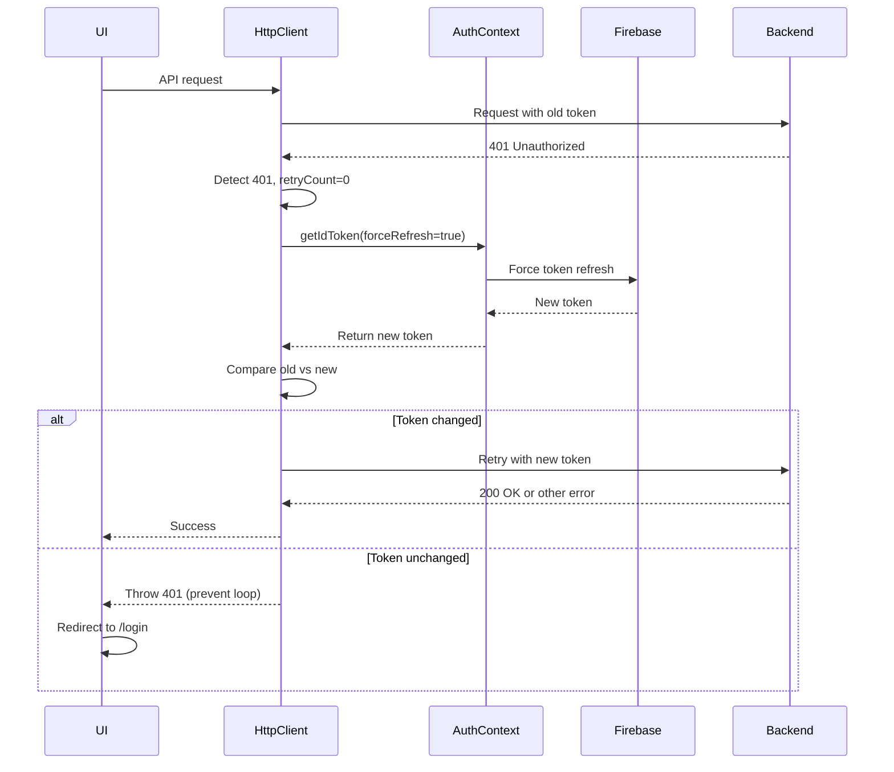
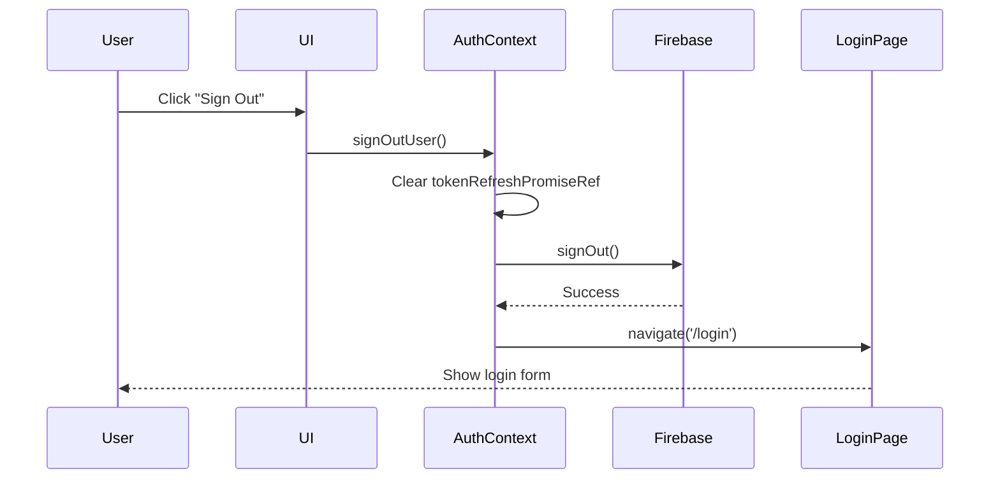

# Firebase Setup Guide

This guide walks you through setting up Firebase Authentication for the Adventure Client application, including project creation, provider configuration, and environment setup for both development and production environments.

## Table of Contents

- [Overview](#overview)
- [Creating a Firebase Project](#creating-a-firebase-project)
- [Registering Your Web App](#registering-your-web-app)
- [Enabling Authentication Providers](#enabling-authentication-providers)
- [Configuring Authorized Domains](#configuring-authorized-domains)
- [Environment Configuration](#environment-configuration)
- [Production Deployment with Cloud Run](#production-deployment-with-cloud-run)
- [Authentication Flow Components](#authentication-flow-components)
- [Testing Authentication](#testing-authentication)
- [Troubleshooting](#troubleshooting)

## Overview

The Adventure Client uses Firebase Authentication to provide secure user authentication with support for:
- **Email/Password authentication** (required)
- **Google Sign-In** (optional)
- Secure token management and session handling
- Protected routes and user state management

Firebase configuration is provided via environment variables and bundled at build time by Vite.

## Creating a Firebase Project

### Step 1: Access Firebase Console

1. Navigate to the [Firebase Console](https://console.firebase.google.com/)
2. Sign in with your Google account
3. Click **Add project** (or **Create a project** if this is your first project)

### Step 2: Project Setup

1. **Project Name**: Enter a descriptive name (e.g., `adventure-game-dev`, `adventure-game-prod`)
   - **Best Practice**: Create separate projects for development, staging, and production
   
2. **Google Analytics**: Choose whether to enable Google Analytics
   - For development projects: Optional (can disable)
   - For production projects: Recommended for monitoring

3. Click **Create project** and wait for provisioning (usually 30-60 seconds)

### Step 3: Project Settings

1. Once created, you'll be redirected to the project dashboard
2. Note your **Project ID** (visible in the project settings) - you'll need this later

## Registering Your Web App

### Step 1: Add a Web App

1. From the Firebase Console project dashboard, click the **Web** icon (`</>`)
2. **App nickname**: Enter a descriptive name (e.g., `Adventure Client Web`)
3. **Firebase Hosting**: Leave unchecked (we use Cloud Run for hosting)
4. Click **Register app**

### Step 2: Gather Configuration Values

After registration, Firebase will display your app configuration. It looks like this:

```javascript
const firebaseConfig = {
  apiKey: "AIzaSyXXXXXXXXXXXXXXXXXXXXXXXXXXXXX",
  authDomain: "your-project.firebaseapp.com",
  projectId: "your-project",
  storageBucket: "your-project.appspot.com",
  messagingSenderId: "123456789012",
  appId: "1:123456789012:web:abcdef1234567890",
  measurementId: "G-XXXXXXXXXX"
};
```

**Important**: Copy these values - you'll need them for environment configuration.

### Step 3: Locate Configuration Later

If you need to find these values again:
1. Go to **Project Settings** (gear icon near "Project Overview")
2. Scroll down to **Your apps** section
3. Select your web app
4. Click **Config** to view the configuration object

## Enabling Authentication Providers

### Email/Password Provider (Required)

1. In Firebase Console, navigate to **Build > Authentication**
2. Click **Get started** (if this is your first time)
3. Click the **Sign-in method** tab
4. Click **Email/Password** from the provider list
5. Toggle **Enable** to ON
6. **Email link (passwordless sign-in)**: Leave OFF (not currently used)
7. Click **Save**

#### Password Reset Configuration

Email/Password authentication includes built-in password reset functionality:
- Firebase sends password reset emails automatically
- Email templates can be customized in **Authentication > Templates**
- No additional code changes required in the application

**To customize reset emails**:
1. Go to **Authentication > Templates** tab
2. Click on **Password reset**
3. Customize the email subject and body
4. Update the sender name if desired
5. Click **Save**

### Google Sign-In Provider (Optional)

Google Sign-In provides a convenient OAuth authentication flow for users with Google accounts.

1. In **Authentication > Sign-in method**, click **Google**
2. Toggle **Enable** to ON
3. **Project public-facing name**: Enter your app name (e.g., "Adventure Game")
4. **Project support email**: Select your email from the dropdown
5. Click **Save**

**Prerequisites for Google Sign-In**:
- A Google Cloud Project (automatically created with Firebase)
- Valid authorized domains configured (see next section)
- OAuth consent screen configured (Firebase handles basic setup)

**Note**: The `signInWithGoogle()` method in `AuthContext.tsx` uses popup-based authentication. Ensure popup blockers are disabled during testing.

## Configuring Authorized Domains

Firebase requires you to whitelist all domains that can use authentication. By default, only `localhost` is authorized.

### Step 1: Add Authorized Domains

1. Go to **Authentication > Settings** tab
2. Scroll down to **Authorized domains** section
3. You should see `localhost` already listed

### Step 2: Add Development Domain

For local development, `localhost` is already included. If you use a custom local domain:
1. Click **Add domain**
2. Enter your domain (e.g., `dev.local`, `127.0.0.1`)
3. Click **Add**

### Step 3: Add Production Domain (Cloud Run)

When deploying to Cloud Run, you must authorize your Cloud Run service URL:

1. Deploy your application to Cloud Run (see [README.md](../README.md#cloud-run-deployment))
2. Note the service URL (e.g., `adventure-client-xyz123-uc.a.run.app`)
3. In Firebase Console > **Authentication > Settings > Authorized domains**
4. Click **Add domain**
5. Enter your Cloud Run domain: `adventure-client-xyz123-uc.a.run.app`
6. Click **Add**

**Important**: 
- Cloud Run URLs are auto-generated and may change if you recreate the service
- If you have a custom domain, add that as well
- Both HTTP and HTTPS are supported, but Cloud Run uses HTTPS by default
- Subdomains are not automatically whitelisted - add each one explicitly

### Common Domain Patterns

| Environment | Domain Example | When to Add |
|-------------|----------------|-------------|
| Local Dev | `localhost` | Included by default |
| Local Dev (custom) | `dev.local` | If using custom hosts file |
| Cloud Run (auto) | `adventure-client-xyz123-uc.a.run.app` | After first deployment |
| Custom Domain | `app.yourdomain.com` | If using custom domain mapping |
| Staging | `adventure-client-staging-xyz.run.app` | For staging environment |

## Environment Configuration

Firebase configuration is provided via environment variables that are bundled into the application at **build time** by Vite.

### Understanding Environment Files

The application uses three environment files:

| File | Purpose | Committed to Git? |
|------|---------|-------------------|
| `.env.example` | Template showing all required variables | ✅ Yes (no secrets) |
| `.env.development` | Development defaults (mock values) | ✅ Yes (no real secrets) |
| `.env.production` | Production template (empty placeholders) | ✅ Yes (no secrets) |
| `.env.local` | Your local overrides (real Firebase config) | ❌ No (in .gitignore) |

**Environment Variables Overview**:

The application requires two types of environment variables:
1. **API Base URLs**: Backend service endpoints (Dungeon Master API, Journey Log API)
2. **Firebase Configuration**: Authentication and Firebase service settings

All variables are prefixed with `VITE_` so they can be bundled by Vite at build time.

### Step 1: Create Your Local Environment File

For local development:

```bash
cd adventure-client
cp .env.development .env.local
```

### Step 2: Update `.env.local` with Your Firebase Config

Open `.env.local` and replace the mock values with your actual Firebase configuration:

```bash
# API Base URLs (keep these for local development)
VITE_DUNGEON_MASTER_API_BASE_URL=http://localhost:8001
VITE_JOURNEY_LOG_API_BASE_URL=http://localhost:8002

# Firebase Configuration (replace with your actual values from Firebase Console)
VITE_FIREBASE_API_KEY=AIzaSyXXXXXXXXXXXXXXXXXXXXXXXXXXXXX
VITE_FIREBASE_AUTH_DOMAIN=your-project-dev.firebaseapp.com
VITE_FIREBASE_PROJECT_ID=your-project-dev
VITE_FIREBASE_STORAGE_BUCKET=your-project-dev.appspot.com
VITE_FIREBASE_MESSAGING_SENDER_ID=123456789012
VITE_FIREBASE_APP_ID=1:123456789012:web:abcdef1234567890
VITE_FIREBASE_MEASUREMENT_ID=G-XXXXXXXXXX
```

### Step 3: Mapping Firebase Console Values to Environment Variables

| Firebase Console Value | Environment Variable | Required? |
|------------------------|----------------------|-----------|
| `apiKey` | `VITE_FIREBASE_API_KEY` | ✅ Yes |
| `authDomain` | `VITE_FIREBASE_AUTH_DOMAIN` | ✅ Yes |
| `projectId` | `VITE_FIREBASE_PROJECT_ID` | ✅ Yes |
| `storageBucket` | `VITE_FIREBASE_STORAGE_BUCKET` | ⚠️ Optional |
| `messagingSenderId` | `VITE_FIREBASE_MESSAGING_SENDER_ID` | ⚠️ Optional |
| `appId` | `VITE_FIREBASE_APP_ID` | ✅ Yes |
| `measurementId` | `VITE_FIREBASE_MEASUREMENT_ID` | ⚠️ Optional |

**Note**: The application validates required fields at startup. Missing required values will cause an error with a descriptive message.

### Production Environment Configuration

For production deployments to Cloud Run:

#### Option 1: Docker Build Arguments (Recommended)

Pass environment variables as build arguments during Docker build:

```bash
docker build \
  --build-arg VITE_DUNGEON_MASTER_API_BASE_URL=https://dungeon-master-api.run.app \
  --build-arg VITE_JOURNEY_LOG_API_BASE_URL=https://journey-log-api.run.app \
  --build-arg VITE_FIREBASE_API_KEY=AIzaSy... \
  --build-arg VITE_FIREBASE_AUTH_DOMAIN=your-project-prod.firebaseapp.com \
  --build-arg VITE_FIREBASE_PROJECT_ID=your-project-prod \
  --build-arg VITE_FIREBASE_STORAGE_BUCKET=your-project-prod.appspot.com \
  --build-arg VITE_FIREBASE_MESSAGING_SENDER_ID=123456789012 \
  --build-arg VITE_FIREBASE_APP_ID=1:123456789012:web:abc123 \
  --build-arg VITE_FIREBASE_MEASUREMENT_ID=G-XXXXXXXXXX \
  -t adventure-client:prod .
```

#### Option 2: CI/CD Environment Secrets

In GitHub Actions or Cloud Build, store secrets securely:

**GitHub Actions** (recommended):
1. Go to repository **Settings > Secrets and variables > Actions**
2. Add secrets for each Firebase variable
3. Reference in workflow:
   ```yaml
   - name: Build Docker image
     run: |
       docker build \
         --build-arg VITE_FIREBASE_API_KEY=${{ secrets.FIREBASE_API_KEY }} \
         --build-arg VITE_FIREBASE_AUTH_DOMAIN=${{ secrets.FIREBASE_AUTH_DOMAIN }} \
         ...
   ```

**Google Secret Manager** (advanced):
1. Store secrets in Secret Manager
2. Grant Cloud Build service account access
3. Use `--build-arg` with secret values in build steps

### Security Considerations

⚠️ **Important Security Notes**:

1. **API Keys in Frontend**: Firebase API keys are **not secret** and are meant to be public
   - They identify your Firebase project
   - Access is controlled by Firebase Security Rules, not by hiding the API key
   - See [Firebase documentation](https://firebase.google.com/docs/projects/api-keys)

2. **Never Commit Real Secrets**: Even though Firebase API keys are public, never commit:
   - Service account keys
   - Cloud Run service URLs (if they contain sensitive info)
   - Database credentials
   - Third-party API keys

3. **Environment-Specific Projects**: Use separate Firebase projects for:
   - Development (for testing)
   - Staging (for QA)
   - Production (for live users)

4. **Build-Time vs Runtime**: 
   - Vite bundles env vars at **build time**
   - Variables are visible in the client JavaScript bundle
   - This is expected and safe for Firebase configuration
   - Do not store backend secrets in frontend env vars

## Production Deployment with Cloud Run

This section provides comprehensive guidance for configuring Firebase Authentication for production deployments on Google Cloud Run, including authorized domains, backend CORS configuration, and troubleshooting production-specific auth issues.

> **📘 Deployment Prerequisites**: Before configuring production Firebase settings, ensure you have deployed your application to Cloud Run. See [docs/cloud-run-deploy.md](./cloud-run-deploy.md) for complete deployment instructions.

### Overview of Production Configuration

When deploying to Cloud Run, several configuration changes are required to ensure Firebase Authentication and API calls work correctly:

1. **Firebase Authorized Domains**: Add your Cloud Run service URL to Firebase's whitelist
2. **Backend CORS Configuration**: Ensure dungeon-master and journey-log APIs accept requests from Cloud Run
3. **HTTPS Requirements**: Verify all production auth flows use HTTPS
4. **Custom Domains**: Configure additional domains if using custom domain mapping

**Risk**: Skipping authorized domain or CORS updates will block sign-ins and API calls from production, resulting in 403 errors or auth failures.

### Obtaining Your Cloud Run Service URL

After deploying to Cloud Run (see [deployment guide](./cloud-run-deploy.md)), you need to capture the service URL:

```bash
# Get the service URL
gcloud run services describe YOUR_SERVICE_NAME \
  --region=YOUR_REGION \
  --format='value(status.url)'

# Example output:
# https://adventure-client-xyz123-uc.a.run.app
```

**Important Notes**:
- Cloud Run generates unique URLs per service (e.g., `adventure-client-xyz123-uc.a.run.app`)
- The URL includes a hash suffix that is stable unless you delete and recreate the service
- Always use the **hostname only** when adding to Firebase (without `https://` protocol)

### Step 1: Add Cloud Run URL to Firebase Authorized Domains

Firebase Authentication requires all authentication-enabled domains to be explicitly whitelisted.

#### For Single Environment (Production)

1. Navigate to [Firebase Console](https://console.firebase.google.com/)
2. Select your **production** Firebase project
3. Go to **Authentication > Settings** tab
4. Scroll to **Authorized domains** section
5. Click **Add domain**
6. Enter your Cloud Run hostname (e.g., `adventure-client-xyz123-uc.a.run.app`)
7. Click **Add**

#### For Multiple Environments (Staging + Production)

If you have separate staging and production deployments, add **both** Cloud Run URLs:

| Environment | Firebase Project | Cloud Run URL Example | Notes |
|-------------|------------------|----------------------|-------|
| Staging | `adventure-game-staging` | `adventure-client-staging-abc.a.run.app` | For QA testing |
| Production | `adventure-game-prod` | `adventure-client-prod-xyz.a.run.app` | For live users |

**Best Practice**: Use separate Firebase projects for each environment to isolate user databases and prevent accidental data mixing.

#### Adding Custom Domains

If you map a custom domain to your Cloud Run service:

1. Complete the custom domain mapping in Cloud Run (see [Cloud Run custom domains](https://cloud.google.com/run/docs/mapping-custom-domains))
2. Add **both** the Cloud Run auto-generated URL **and** your custom domain to Firebase:
   - `adventure-client-xyz123-uc.a.run.app` (required even with custom domain)
   - `app.yourdomain.com` (your custom domain)

**Why both?**: During deployment and health checks, Cloud Run may serve requests on the auto-generated URL before custom domain routing is active.

#### Verification

After adding domains:

1. Wait 2-5 minutes for Firebase configuration to propagate
2. Visit your Cloud Run URL in a browser
3. Attempt to sign in using Email/Password or Google Sign-In
4. Check browser console for any `auth/unauthorized-domain` errors
5. If errors persist, verify:
   - Domain spelling (case-sensitive)
   - No `https://` prefix in Firebase domain list
   - Firebase Console shows domain as "Verified"

### Step 2: Configure Backend CORS for Cloud Run Origin

The Adventure Client makes authenticated API calls to two backend services: **dungeon-master** and **journey-log**. Both must be configured to accept requests from your Cloud Run origin.

#### Understanding CORS Requirements

CORS (Cross-Origin Resource Sharing) is enforced by browsers when your frontend (running on Cloud Run) makes requests to backend APIs (running on different origins). The backends must explicitly allow:

- **Origin**: The Cloud Run URL making the request
- **Headers**: Authentication and user identification headers
- **Methods**: HTTP methods used (GET, POST, PUT, DELETE, OPTIONS)
- **Credentials**: Cookies and auth tokens

#### Required Headers for API Calls

The Adventure Client sends these headers with every authenticated API request:

| Header | Value Example | Purpose |
|--------|---------------|---------|
| `Authorization` | `Bearer eyJhbGci...` | Firebase ID token for authentication |
| `X-User-Id` | `abc123user456` | User's Firebase UID for authorization |
| `Content-Type` | `application/json` | Request body format |

#### Configuring Dungeon Master API CORS

The Dungeon Master API must allow your Cloud Run origin and required headers.

**Expected Backend CORS Configuration** (Python/FastAPI example):

```python
from fastapi.middleware.cors import CORSMiddleware

app.add_middleware(
    CORSMiddleware,
    allow_origins=[
        "http://localhost:5173",  # Local development
        "https://adventure-client-xyz123-uc.a.run.app",  # Production Cloud Run
        "https://app.yourdomain.com",  # Custom domain (if used)
    ],
    allow_credentials=True,
    allow_methods=["GET", "POST", "PUT", "DELETE", "OPTIONS"],
    allow_headers=[
        "Authorization",
        "X-User-Id",
        "Content-Type",
        "Accept",
    ],
)
```

**Key Points**:
- Add your Cloud Run URL to `allow_origins`
- Include `Authorization` and `X-User-Id` in `allow_headers`
- Enable `allow_credentials=True` for token-based auth
- Allow `OPTIONS` method for preflight requests

**Verification**:
```bash
# Test CORS preflight from Cloud Run origin
curl -X OPTIONS https://your-dungeon-master-api.run.app/characters \
  -H "Origin: https://adventure-client-xyz123-uc.a.run.app" \
  -H "Access-Control-Request-Method: GET" \
  -H "Access-Control-Request-Headers: Authorization,X-User-Id" \
  -v

# Expected response headers:
# Access-Control-Allow-Origin: https://adventure-client-xyz123-uc.a.run.app
# Access-Control-Allow-Methods: GET, POST, PUT, DELETE, OPTIONS
# Access-Control-Allow-Headers: Authorization, X-User-Id, Content-Type, Accept
# Access-Control-Allow-Credentials: true
```

#### Configuring Journey Log API CORS

The Journey Log API has identical CORS requirements to Dungeon Master:

```python
app.add_middleware(
    CORSMiddleware,
    allow_origins=[
        "http://localhost:5173",
        "https://adventure-client-xyz123-uc.a.run.app",  # Add your Cloud Run URL
        "https://app.yourdomain.com",
    ],
    allow_credentials=True,
    allow_methods=["GET", "POST", "PUT", "DELETE", "OPTIONS"],
    allow_headers=[
        "Authorization",
        "X-User-Id",
        "Content-Type",
        "Accept",
    ],
)
```

#### Common CORS Pitfalls

❌ **Mistake**: Using wildcard `*` for `allow_origins` with `allow_credentials=True`
```python
allow_origins=["*"]  # ❌ FAILS with credentials
allow_credentials=True
```

✅ **Correct**: Explicitly list allowed origins
```python
allow_origins=[
    "https://adventure-client-xyz123-uc.a.run.app"
]
allow_credentials=True
```

❌ **Mistake**: Forgetting to allow OPTIONS method for preflight
```python
allow_methods=["GET", "POST"]  # ❌ Preflight fails
```

✅ **Correct**: Include OPTIONS for CORS preflight
```python
allow_methods=["GET", "POST", "PUT", "DELETE", "OPTIONS"]
```

❌ **Mistake**: Missing required auth headers
```python
allow_headers=["Content-Type"]  # ❌ Authorization headers blocked
```

✅ **Correct**: Include all auth headers
```python
allow_headers=["Authorization", "X-User-Id", "Content-Type", "Accept"]
```

#### Testing Backend CORS Configuration

1. **Deploy backends** with updated CORS configuration
2. **Test from Cloud Run** frontend:
   ```javascript
   // In browser console on your Cloud Run URL
   fetch('https://your-dungeon-master-api.run.app/characters', {
     method: 'GET',
     headers: {
       'Authorization': 'Bearer YOUR_TOKEN',
       'X-User-Id': 'YOUR_UID',
     },
     credentials: 'include',
   })
     .then(res => res.json())
     .then(console.log)
     .catch(console.error);
   ```
3. **Check for CORS errors** in browser console:
   - ✅ Success: No errors, response received
   - ❌ Failure: "CORS policy: No 'Access-Control-Allow-Origin' header"

### Step 3: Firebase Auth Considerations for HTTPS Origins

Cloud Run enforces HTTPS for all traffic, which introduces specific requirements for Firebase Authentication.

#### HTTPS-Only Requirements

1. **Authentication Flows**: All Firebase auth methods (popup, redirect) require HTTPS in production
   - ✅ `https://adventure-client-xyz.a.run.app` - Works
   - ❌ `http://adventure-client-xyz.a.run.app` - Blocked by Firebase

2. **Redirect URIs**: Firebase automatically validates redirect URIs match authorized domains
   - Redirect URIs must use HTTPS
   - Domain must exactly match authorized domain in Firebase Console

3. **Token Cookies**: Firebase uses secure cookies for session persistence
   - Cookies are marked `Secure` (HTTPS-only) in production
   - Session state won't persist on HTTP connections

#### Popup vs Redirect Authentication

Cloud Run deployments work with both authentication methods:

**Popup Authentication** (Default):
```typescript
import { signInWithPopup, GoogleAuthProvider } from 'firebase/auth';

const provider = new GoogleAuthProvider();
const result = await signInWithPopup(auth, provider);
```

**Considerations**:
- Requires popup blockers to be disabled
- Works well for desktop browsers
- May be blocked on mobile devices or strict browser settings

**Redirect Authentication** (Alternative):
```typescript
import { signInWithRedirect, getRedirectResult } from 'firebase/auth';

// Initiate redirect
await signInWithRedirect(auth, provider);

// After redirect, check result
const result = await getRedirectResult(auth);
```

**Considerations**:
- No popup blockers to worry about
- Better mobile browser compatibility
- Requires proper redirect URI configuration
- User leaves and returns to your app

#### Custom Authentication Domains

Firebase supports custom authentication domains for branding and multi-tenancy use cases. This allows you to use your own domain (e.g., `auth.yourdomain.com`) instead of the default `*.firebaseapp.com` domain for authentication flows.

**When to Use Custom Auth Domains**:
- Enterprise applications requiring branded authentication URLs
- Multi-tenant applications with tenant-specific auth domains
- Compliance requirements for authentication domain ownership
- Custom OAuth redirect URLs for third-party integrations

##### Complete Configuration Steps

**1. Configure Custom Domain in Firebase Console**:

a. Navigate to Firebase Console > **Authentication** > **Settings** > **Authorized domains**

b. Click **Add custom domain** (requires Firebase Blaze plan)

c. Enter your custom authentication domain:
   - Example: `auth.yourdomain.com`
   - Must be a subdomain (not apex domain)
   - SSL certificate will be provisioned automatically by Firebase

d. Verify domain ownership:
   - Firebase provides a TXT record
   - Add the TXT record to your DNS provider
   - Wait for verification (usually 5-15 minutes)
   - Firebase will display "Verified" status when complete

e. Enable custom domain for authentication:
   - Toggle "Enable" for the custom domain
   - Wait for SSL certificate provisioning (15-30 minutes)
   - Status shows "Active" when ready

**2. Update DNS Records**:

Add a CNAME record pointing to Firebase's auth servers:

```
Type: CNAME
Name: auth (or your chosen subdomain)
Value: your-project-id.firebaseapp.com
TTL: 3600
```

Replace `your-project-id` with your actual Firebase project ID (e.g., `adventure-game-prod.firebaseapp.com`).

Verify DNS propagation:
```bash
# Check CNAME record
dig auth.yourdomain.com CNAME

# Should return: auth.yourdomain.com. 3600 IN CNAME your-project-id.firebaseapp.com.
```

**3. Update Frontend Firebase Configuration**:

Modify your Firebase config to use the custom auth domain:

```typescript
// In your Firebase initialization (src/config/firebase.ts or similar)
import { initializeApp } from 'firebase/app';
import { getAuth } from 'firebase/auth';

const firebaseConfig = {
  apiKey: process.env.VITE_FIREBASE_API_KEY,
  authDomain: "auth.yourdomain.com",  // Custom domain instead of {project-id}.firebaseapp.com
  projectId: process.env.VITE_FIREBASE_PROJECT_ID,
  storageBucket: process.env.VITE_FIREBASE_STORAGE_BUCKET,
  messagingSenderId: process.env.VITE_FIREBASE_MESSAGING_SENDER_ID,
  appId: process.env.VITE_FIREBASE_APP_ID,
};

const app = initializeApp(firebaseConfig);
const auth = getAuth(app);

// For multi-tenancy, also set tenant ID
// auth.tenantId = "your-tenant-id";  // Optional: only if using Firebase multi-tenancy
```

**4. Add Custom Auth Domain to Authorized Domains**:

The custom authentication domain must be separately authorized:

a. In Firebase Console > **Authentication** > **Settings** > **Authorized domains**

b. Click **Add domain**

c. Add your custom auth domain: `auth.yourdomain.com`

d. Also keep your application domains:
   - `adventure-client-xyz123-uc.a.run.app` (Cloud Run)
   - `app.yourdomain.com` (custom app domain, if used)

**5. Update Environment Variables**:

Update your environment configuration to use the custom domain:

```bash
# .env.production or Docker build args
VITE_FIREBASE_AUTH_DOMAIN=auth.yourdomain.com
```

Rebuild and redeploy with the new configuration:
```bash
# Rebuild Docker image with new auth domain
# For complete build args list, see cloud-run-deploy.md Environment Variables section
gcloud builds submit --tag="${IMAGE_NAME}:${TAG}" \
  --build-arg VITE_FIREBASE_AUTH_DOMAIN="auth.yourdomain.com" \
  --build-arg VITE_FIREBASE_API_KEY="${VITE_FIREBASE_API_KEY}" \
  --build-arg VITE_FIREBASE_PROJECT_ID="${VITE_FIREBASE_PROJECT_ID}" \
  --build-arg VITE_FIREBASE_STORAGE_BUCKET="${VITE_FIREBASE_STORAGE_BUCKET}" \
  --build-arg VITE_FIREBASE_MESSAGING_SENDER_ID="${VITE_FIREBASE_MESSAGING_SENDER_ID}" \
  --build-arg VITE_FIREBASE_APP_ID="${VITE_FIREBASE_APP_ID}" \
  --build-arg VITE_FIREBASE_MEASUREMENT_ID="${VITE_FIREBASE_MEASUREMENT_ID}" \
  --build-arg VITE_DUNGEON_MASTER_API_BASE_URL="${VITE_DUNGEON_MASTER_API_BASE_URL}" \
  --build-arg VITE_JOURNEY_LOG_API_BASE_URL="${VITE_JOURNEY_LOG_API_BASE_URL}"
```

**6. Test Custom Auth Domain**:

After configuration:

a. Clear browser cache and cookies

b. Navigate to your Cloud Run URL

c. Initiate authentication (sign in/sign up)

d. Verify in browser DevTools > Network tab:
   - Auth requests go to `auth.yourdomain.com`
   - Redirects use custom domain
   - No `firebaseapp.com` requests appear

e. Check for errors in console:
   - Should see no CORS errors
   - Should see no domain authorization errors

##### Multi-Tenancy Configuration

For applications serving multiple organizations with isolated authentication:

**1. Enable Multi-Tenancy in Firebase Console**:
   - Go to **Authentication** > **Settings** > **Multi-tenancy**
   - Click **Get started**
   - Create tenants for each organization

**2. Assign Custom Domains Per Tenant** (Enterprise feature):
   - Each tenant can have its own auth domain
   - Example: `org1-auth.yourdomain.com`, `org2-auth.yourdomain.com`

**3. Set Tenant ID in Frontend**:
```typescript
import { getAuth } from 'firebase/auth';

const auth = getAuth(app);

// Dynamically set tenant based on user's organization
// Typically determined from URL subdomain or user selection
const tenantId = getTenantIdFromContext(); // Your logic here
auth.tenantId = tenantId;
```

**4. Test Tenant Isolation**:
   - Users in tenant A cannot access tenant B's data
   - Each tenant has separate user database
   - Auth tokens include tenant ID in claims

##### Troubleshooting Custom Auth Domains

**Issue**: "auth/invalid-custom-token" error

**Cause**: Custom domain not fully provisioned or DNS not propagated

**Solution**:
- Verify domain shows "Active" in Firebase Console
- Check DNS CNAME record is correct
- Wait 30 minutes for full propagation
- Clear browser cache and retry

**Issue**: CORS errors on custom auth domain

**Cause**: Custom auth domain not added to authorized domains list

**Solution**:
- Add both `auth.yourdomain.com` and `app.yourdomain.com` to authorized domains
- Ensure both auth and app domains are in the list

**Issue**: Redirects still use firebaseapp.com

**Cause**: Frontend not rebuilt with new `VITE_FIREBASE_AUTH_DOMAIN`

**Solution**:
- Verify `VITE_FIREBASE_AUTH_DOMAIN=auth.yourdomain.com` in build
- Rebuild Docker image with correct env var
- Inspect bundled JavaScript to confirm custom domain is used:
  ```bash
  docker run --rm IMAGE cat /usr/share/nginx/html/assets/index-*.js | grep "authDomain"
  # Should show: authDomain:"auth.yourdomain.com"
  ```

#### Cookie Restrictions on Custom Domains

Modern browsers (Chrome, Safari) have strict cookie policies that affect authentication on custom domains:

**SameSite Cookie Policy**:
- Firebase sets cookies with `SameSite=None; Secure` for cross-site contexts
- Custom domains may require additional cookie configuration
- Third-party cookies may be blocked by browser privacy settings

**Solutions**:
1. **Use first-party domains**: Keep frontend and backend on same apex domain
   - Frontend: `app.yourdomain.com`
   - API: `api.yourdomain.com`
   - Reduces cross-origin cookie issues

2. **Test in multiple browsers**: Chrome, Safari, and Firefox have different cookie policies
   - Chrome: Strict SameSite enforcement
   - Safari: Intelligent Tracking Prevention (ITP)
   - Firefox: Enhanced Tracking Protection

3. **Provide fallback auth methods**: If cookies are blocked, rely on token-based auth
   - Store tokens in memory or localStorage
   - Include token in Authorization header for API calls

### Step 4: Troubleshooting Production Auth Issues

This section covers common production auth failures and their solutions.

#### Issue: 403 Forbidden on API Calls

**Symptoms**:
- Authentication succeeds (user signs in)
- API calls return 403 Forbidden
- Backend logs show "unauthorized" or "invalid token"

**Causes & Solutions**:

1. **Backend doesn't allow Cloud Run origin**:
   - Check backend CORS configuration includes Cloud Run URL
   - Verify `allow_origins` list has exact URL match (case-sensitive)
   - Restart backend services after CORS changes

2. **Missing or incorrect Authorization header**:
   - Verify frontend sends `Authorization: Bearer <token>`
   - Check token format: should start with `eyJhbGci`
   - Ensure token isn't expired (Firebase tokens expire after 1 hour)

3. **Backend Firebase project mismatch**:
   - Verify backend validates tokens against same Firebase project as frontend
   - Check `VITE_FIREBASE_PROJECT_ID` matches backend Firebase Admin SDK config
   - Ensure backend has correct service account credentials

4. **User doesn't have required permissions**:
   - Check backend authorization logic (separate from authentication)
   - Verify user has access to requested resource
   - Review backend authorization rules

**Debugging Steps**:
```bash
# 1. Check if token is being sent
# Open browser DevTools > Network tab > Select failed API call > Headers
# Look for: Authorization: Bearer eyJhbGci...

# 2. Test token validity
# Copy token from Authorization header
# Decode at https://jwt.io
# Verify:
# - "iss": "https://securetoken.google.com/YOUR_PROJECT_ID"
# - "exp": Future timestamp (token not expired)
# - "user_id": Your Firebase UID

# 3. Check backend logs for specific error
# If backend logs "invalid token signature", verify Firebase project ID match
# If backend logs "token expired", check client-side token refresh logic
```

#### Issue: CORS Errors in Production

**Symptoms**:
- Browser console shows: "CORS policy: No 'Access-Control-Allow-Origin' header"
- API calls fail with network errors
- Works locally but fails in Cloud Run

**Causes & Solutions**:

1. **Backend doesn't allow Cloud Run origin**:
   ```
   ❌ Error: "Access-Control-Allow-Origin header has value 'http://localhost:5173'"
   ✅ Fix: Add Cloud Run URL to backend allow_origins
   ```

2. **OPTIONS preflight request fails**:
   ```
   ❌ Error: "Response to preflight request doesn't pass access control check"
   ✅ Fix: Ensure backend allows OPTIONS method and required headers
   ```

3. **Missing credentials support**:
   ```
   ❌ Error: "Credentials flag is 'true', but Access-Control-Allow-Credentials is missing"
   ✅ Fix: Set allow_credentials=True in backend CORS config
   ```

4. **Wildcard origin with credentials**:
   ```
   ❌ Error: "Cannot use wildcard in Access-Control-Allow-Origin when credentials flag is true"
   ✅ Fix: Replace allow_origins=["*"] with specific domains
   ```

**Debugging Steps**:
1. Open browser DevTools > Network tab
2. Find failed request
3. Check **Response Headers** for CORS headers:
   - `Access-Control-Allow-Origin`: Should match your Cloud Run URL
   - `Access-Control-Allow-Credentials`: Should be `true`
   - `Access-Control-Allow-Headers`: Should include `Authorization` and `X-User-Id`
4. If headers are missing, update backend CORS configuration
5. Redeploy backend and wait 2-3 minutes for propagation

#### Issue: "auth/unauthorized-domain" Error

**Symptoms**:
- Firebase popup shows error: "auth/unauthorized-domain"
- Sign-in attempt fails immediately
- Error message: "This domain (YOUR_DOMAIN) is not authorized..."

**Causes & Solutions**:

1. **Domain not added to Firebase authorized domains**:
   - Go to Firebase Console > Authentication > Settings > Authorized domains
   - Verify your Cloud Run URL is listed
   - Check for typos (domains are case-sensitive)

2. **Recently added domain hasn't propagated**:
   - Wait 5-10 minutes after adding domain
   - Clear browser cache and cookies
   - Try in incognito/private window

3. **Protocol mismatch** (http vs https):
   - Firebase expects domains without protocol
   - ✅ Correct: `adventure-client-xyz.a.run.app`
   - ❌ Wrong: `https://adventure-client-xyz.a.run.app`

4. **Subdomain not whitelisted**:
   - Firebase doesn't auto-whitelist subdomains
   - Add each subdomain explicitly
   - Example: Add both `api.example.com` and `app.example.com` separately

**Verification**:
```bash
# Check current authorized domains via Firebase REST API
curl "https://identitytoolkit.googleapis.com/v1/projects/YOUR_PROJECT_ID/config?key=YOUR_API_KEY"

# Look for "authorizedDomains" array
# Verify your Cloud Run domain is present
```

#### Issue: Authentication Works Locally but Fails in Production

**Symptoms**:
- Sign-in works on `localhost`
- Same sign-in fails on Cloud Run deployment
- Different error messages in production vs development

**Causes & Solutions**:

1. **Environment variables not propagated to build**:
   - Check Dockerfile receives all `--build-arg` flags
   - Verify env vars are bundled into production build:
     ```bash
     # Extract built assets
     docker create --name temp YOUR_IMAGE
     docker cp temp:/usr/share/nginx/html/assets ./inspect
     docker rm temp
     
     # Search for Firebase config
     grep -r "firebase" ./inspect
     
     # Should find Firebase project ID, API key, etc.
     rm -rf ./inspect
     ```
   - If missing, rebuild with correct build arguments

2. **Firebase project mismatch**:
   - Verify production build uses production Firebase project
   - Check `VITE_FIREBASE_PROJECT_ID` in build logs
   - Ensure staging/production environments use correct Firebase projects

3. **Redirect URI mismatch**:
   - Firebase validates redirect URIs in production
   - Check redirect URI matches Cloud Run URL exactly
   - Verify protocol (https), domain, and port match

4. **Browser cookie restrictions**:
   - Some browsers block third-party cookies on custom domains
   - Test in multiple browsers (Chrome, Safari, Firefox)
   - Check browser console for cookie-related warnings

#### Issue: Popup Blocked or Redirect Loop

**Symptoms**:
- Sign-in popup is blocked by browser
- Redirect authentication causes infinite loop
- User stuck on authentication screen

**Causes & Solutions**:

1. **Popup blocked by browser**:
   - Ensure sign-in is triggered by user action (button click)
   - Don't call `signInWithPopup` on page load
   - Provide fallback to redirect auth:
     ```typescript
     try {
       await signInWithPopup(auth, provider);
     } catch (error) {
       if (error.code === 'auth/popup-blocked') {
         // Fall back to redirect
         await signInWithRedirect(auth, provider);
       }
     }
     ```

2. **Redirect loop on callback**:
   - Occurs when `getRedirectResult` is called repeatedly
   - Only call `getRedirectResult` once on app load:
     ```typescript
     useEffect(() => {
       getRedirectResult(auth)
         .then((result) => {
           if (result) {
             // Handle successful sign-in
           }
         })
         .catch(console.error);
     }, []); // Empty deps - run once
     ```

3. **Callback URL mismatch**:
   - Check authorized redirect URIs in Firebase Console
   - Verify callback URL matches exactly
   - Add both auto-generated and custom domains

### Step 5: Testing Production Deployment

After configuring Firebase for production, follow these steps to validate the setup:

#### Pre-Deployment Checklist

- [ ] Cloud Run URL added to Firebase authorized domains
- [ ] Custom domain added to Firebase (if applicable)
- [ ] dungeon-master CORS updated with Cloud Run origin
- [ ] journey-log CORS updated with Cloud Run origin
- [ ] Backend services redeployed with CORS changes
- [ ] Firebase project ID matches between frontend and backend
- [ ] All environment variables correctly set in Docker build

#### Testing Procedure

1. **Navigate to Cloud Run URL**:
   ```
   https://adventure-client-xyz123-uc.a.run.app
   ```

2. **Test Email/Password Authentication**:
   - Click "Sign In" button
   - Enter email and password
   - Verify successful sign-in
   - Check that user name appears in UI

3. **Test Google Sign-In** (if enabled):
   - Click "Sign in with Google"
   - Select Google account
   - Verify popup isn't blocked
   - Check successful authentication

4. **Test Authenticated API Calls**:
   - Navigate to a protected route (e.g., `/characters`)
   - Verify API calls succeed (check Network tab)
   - Look for `Authorization` and `X-User-Id` headers in requests
   - Confirm no CORS errors in console

5. **Test Token Refresh**:
   - Stay on page for 60+ minutes
   - Verify token auto-refreshes (no logout)
   - Make an API call after refresh
   - Ensure call succeeds with new token

6. **Test Multiple Browsers**:
   - Chrome: Check for cookie/CORS issues
   - Safari: Test with ITP enabled
   - Firefox: Verify Enhanced Tracking Protection doesn't block auth

7. **Test Custom Domain** (if applicable):
   - Navigate to `https://app.yourdomain.com`
   - Repeat authentication tests
   - Verify cookies work across domain

#### Verification Commands

```bash
# 1. Check Cloud Run service is running
gcloud run services describe YOUR_SERVICE --region=YOUR_REGION

# 2. Test endpoint is accessible
curl -I https://adventure-client-xyz123-uc.a.run.app

# Expected: HTTP/2 200

# 3. Check CORS headers on backend (preflight)
curl -X OPTIONS https://your-dungeon-master-api.run.app/characters \
  -H "Origin: https://adventure-client-xyz123-uc.a.run.app" \
  -H "Access-Control-Request-Method: GET" \
  -H "Access-Control-Request-Headers: Authorization,X-User-Id" \
  -v

# Expected response headers:
# Access-Control-Allow-Origin: https://adventure-client-xyz123-uc.a.run.app
# Access-Control-Allow-Credentials: true
# Access-Control-Allow-Headers: Authorization, X-User-Id, Content-Type, Accept
#   ^^^ CRITICAL: Verify X-User-Id is explicitly listed

# 4. Test authenticated request with both required headers
curl https://your-dungeon-master-api.run.app/characters \
  -H "Authorization: Bearer YOUR_TOKEN" \
  -H "X-User-Id: YOUR_UID" \
  -H "Origin: https://adventure-client-xyz123-uc.a.run.app" \
  -v

# Expected: 200 OK with character data
# If 403: Check backend accepts X-User-Id header

# 5. Verify frontend sends X-User-Id header
# In production, use browser DevTools:
# - Open DevTools > Network tab
# - Sign in to your app
# - Make an API call (navigate to /characters)
# - Click the API request in Network tab
# - Check Request Headers section
# - Verify presence of:
#   Authorization: Bearer eyJhbGci...
#   X-User-Id: abc123user456
#   ^^^ If missing, check API client configuration

# 6. Test backend accepts X-User-Id header explicitly
# This confirms backend CORS allows the custom header
curl -X GET https://your-journey-log-api.run.app/entries \
  -H "Authorization: Bearer YOUR_TOKEN" \
  -H "X-User-Id: YOUR_UID" \
  -H "Origin: https://adventure-client-xyz123-uc.a.run.app" \
  -v

# Expected: 200 OK
# If CORS error: Backend doesn't allow X-User-Id in allow_headers
# If 403: Backend doesn't process X-User-Id for authorization
```

**Critical Header Verification**:

The `X-User-Id` header is a **custom header** required by both dungeon-master and journey-log APIs for user authorization. Backend CORS configuration must explicitly allow this header, or all authenticated requests will fail.

**Frontend sends**: `X-User-Id: <firebase-uid>`
**Backend requires**: `X-User-Id` in `allow_headers` list
**Common mistake**: Forgetting to include `X-User-Id`, only allowing standard headers

To verify `X-User-Id` is being sent by the frontend:

1. Open your deployed Cloud Run app in browser
2. Open DevTools (F12) > Network tab
3. Sign in and navigate to a page that makes API calls (e.g., `/characters`)
4. Find a request to dungeon-master or journey-log API
5. Click the request > Headers tab
6. Scroll to **Request Headers** section
7. Verify both headers are present:
   ```
   Authorization: Bearer eyJhbGci...
   X-User-Id: abc123xyz456def789
   ```

If `X-User-Id` is missing from frontend requests, check your API client configuration:
- OpenAPI generated clients should include it automatically
- Verify `AuthProvider` is properly configured
- Check custom Axios/fetch interceptors include the header

#### Common Test Failures

| Failure | Likely Cause | Solution |
|---------|--------------|----------|
| Sign-in popup shows "unauthorized-domain" | Domain not in Firebase | Add Cloud Run URL to authorized domains |
| API call returns 403 | CORS not configured | Update backend CORS to allow Cloud Run origin |
| CORS error in console | Missing CORS headers | Check backend allows Authorization/X-User-Id headers |
| Token validation fails | Firebase project mismatch | Verify backend uses same Firebase project as frontend |
| Works in Chrome, fails in Safari | Cookie restrictions | Test first-party cookie approach or localStorage tokens |

### Multi-Environment Best Practices

When managing multiple environments (dev, staging, prod), follow these practices:

#### Separate Firebase Projects

Create distinct Firebase projects for each environment:

| Environment | Firebase Project | Cloud Run Service | Purpose |
|-------------|------------------|------------------|---------|
| Development | `adventure-game-dev` | `adventure-client-dev` | Local testing |
| Staging | `adventure-game-staging` | `adventure-client-staging` | QA validation |
| Production | `adventure-game-prod` | `adventure-client-prod` | Live users |

**Benefits**:
- Isolated user databases (no accidental production data access during testing)
- Separate auth configurations (different providers per environment)
- Independent rate limits and quotas
- Clear separation of concerns

#### Environment-Specific Configuration

Manage environment variables for each deployment:

```bash
# Development
export VITE_FIREBASE_PROJECT_ID="adventure-game-dev"
export VITE_FIREBASE_AUTH_DOMAIN="adventure-game-dev.firebaseapp.com"

# Staging
export VITE_FIREBASE_PROJECT_ID="adventure-game-staging"
export VITE_FIREBASE_AUTH_DOMAIN="adventure-game-staging.firebaseapp.com"

# Production
export VITE_FIREBASE_PROJECT_ID="adventure-game-prod"
export VITE_FIREBASE_AUTH_DOMAIN="adventure-game-prod.firebaseapp.com"
```

#### Authorized Domains Per Environment

Each Firebase project should authorize its corresponding deployment:

**Development Project** (`adventure-game-dev`):
- `localhost` (always included)
- `adventure-client-dev-abc.a.run.app` (if deploying dev to Cloud Run)

**Staging Project** (`adventure-game-staging`):
- `adventure-client-staging-xyz.a.run.app`
- `staging.yourdomain.com` (optional custom domain)

**Production Project** (`adventure-game-prod`):
- `adventure-client-prod-123.a.run.app`
- `app.yourdomain.com` (custom domain)

#### CORS Configuration Per Environment

Backend services should allow origins for all environments:

```python
# Centralized CORS configuration
ALLOWED_ORIGINS = {
    "development": [
        "http://localhost:5173",
        "https://adventure-client-dev-abc.a.run.app",
    ],
    "staging": [
        "https://adventure-client-staging-xyz.a.run.app",
        "https://staging.yourdomain.com",
    ],
    "production": [
        "https://adventure-client-prod-123.a.run.app",
        "https://app.yourdomain.com",
    ],
}

# Get environment from env var
env = os.getenv("ENVIRONMENT", "development")
origins = ALLOWED_ORIGINS.get(env, ALLOWED_ORIGINS["development"])

app.add_middleware(
    CORSMiddleware,
    allow_origins=origins,
    allow_credentials=True,
    allow_methods=["GET", "POST", "PUT", "DELETE", "OPTIONS"],
    allow_headers=["Authorization", "X-User-Id", "Content-Type", "Accept"],
)
```

### Firebase Console Configuration Propagation

Firebase configuration changes (authorized domains, providers) don't take effect immediately.

**Expected Propagation Times**:
- **Authorized domains**: 2-5 minutes
- **Provider changes** (enabling/disabling): 1-2 minutes
- **Security rules**: Near-instant (< 30 seconds)
- **Custom domains**: 10-30 minutes (includes DNS propagation)

**Best Practices**:
1. Make configuration changes **before** deploying code
2. Wait for propagation before testing
3. Use `curl` or browser DevTools to verify changes took effect
4. Clear browser cache if changes don't appear
5. Test in incognito window to avoid cached auth state

**Verification**:
```bash
# After adding authorized domain, verify propagation
# Wait 2-5 minutes, then check:
curl "https://identitytoolkit.googleapis.com/v1/projects/YOUR_PROJECT_ID/config?key=YOUR_API_KEY" \
  | jq '.authorizedDomains'

# Should include your newly added domain
```

### Cross-Reference: Cloud Run Deployment

For complete instructions on deploying the Adventure Client to Cloud Run, including:
- Building Docker images with environment variables
- Pushing to Artifact Registry
- Deploying services
- Obtaining the service URL for Firebase configuration

See the **[Cloud Run Deployment Guide](./cloud-run-deploy.md)**.

The deployment guide provides step-by-step commands for deploying and obtaining the Cloud Run URL that you'll need to add to Firebase authorized domains.

## API Authentication Integration

The Adventure Client uses Firebase Authentication to secure API requests to both backend services (Dungeon Master API and Journey Log API). This section explains how authentication tokens flow from Firebase to the backend APIs.

### Authentication Architecture

```
┌──────────────┐      Firebase Auth      ┌──────────────┐
│   Browser    │ ◄──────────────────────► │   Firebase   │
│  (Frontend)  │    Login/Token Refresh   │  Auth Server │
└──────┬───────┘                          └──────────────┘
       │
       │ API Request + Headers
       │ - Authorization: Bearer <token>
       │ - X-User-Id: <uid>
       │
       ├──────────────────────────────────►┌──────────────────┐
       │                                    │ Dungeon Master   │
       │         200 OK / 401 Unauthorized  │      API         │
       │◄───────────────────────────────────┤                  │
       │                                    │ Validates token  │
       │                                    │ with Firebase    │
       │                                    └──────────────────┘
       │
       └──────────────────────────────────►┌──────────────────┐
                                            │  Journey Log     │
                200 OK / 401 Unauthorized   │      API         │
       ◄────────────────────────────────────┤                  │
                                            │ Validates token  │
                                            │ + checks User-Id │
                                            └──────────────────┘
```

### How Authentication Tokens Are Attached

The application automatically attaches authentication headers to all API requests using the OpenAPI generated clients:

**1. Authentication Provider Setup** (`src/context/AuthContext.tsx`):

The application uses an `AuthProvider` interface that provides authentication methods and user state. For API authentication, the key methods are:

```typescript
// Subset of AuthProvider interface used by API clients
interface AuthProviderForAPI {
  getIdToken(forceRefresh?: boolean): Promise<string | null>;
  uid: string | null;
}
```

The full `AuthProvider` (see `src/types/auth.ts`) includes additional methods for user authentication (`signInWithEmailPassword`, `signUpWithEmailPassword`, `signOutUser`, `signInWithGoogle`).

The `AuthContext` provides:
- `getIdToken()`: Returns current Firebase ID token (JWT)
- `uid`: Current user's unique Firebase user ID

**2. API Client Configuration** (`src/api/index.ts`):

When the app initializes, it configures both API clients with authentication using the `configureApiClients(authProvider)` function:

```typescript
// Dungeon Master API: Only needs Authorization header
DungeonMasterOpenAPI.TOKEN = async () => {
  const token = await authProvider.getIdToken();
  if (!token) {
    throw new Error('Authentication required but no token available');
  }
  return token;
};

// Journey Log API: Needs both Authorization + X-User-Id headers
JourneyLogOpenAPI.TOKEN = async () => {
  const token = await authProvider.getIdToken();
  if (!token) {
    throw new Error('Authentication required but no token available');
  }
  return token;
};

JourneyLogOpenAPI.HEADERS = async () => {
  const headers: Record<string, string> = {};
  if (authProvider.uid) {
    headers['X-User-Id'] = authProvider.uid;
  }
  return headers;
};
```

**Important**: Users must be authenticated before making API calls. If no token is available, an error is thrown. The X-User-Id header is only included when a user ID is available.

**3. Application Initialization** (`src/main.tsx` or `src/App.tsx`):

The `configureApiClients()` function must be called during application startup, typically in the `AuthProvider` effect or in the main app initialization:

```typescript
// Example: In AuthContext or App initialization
useEffect(() => {
  if (user) {
    // Configure API clients when user is authenticated
    configureApiClients({
      getIdToken: async (forceRefresh) => user.getIdToken(forceRefresh),
      uid: user.uid,
    });
  } else {
    // Clear API configuration when user logs out
    configureApiClients(null);
  }
}, [user]);
```

**Important**: Without calling `configureApiClients()`, API requests will not include authentication headers and will fail with 401 errors.

**4. Resulting HTTP Headers**:

For **Dungeon Master API** requests:
```http
GET /api/health HTTP/1.1
Host: localhost:8001
Authorization: Bearer <firebase-id-token>
```

For **Journey Log API** requests:
```http
GET /api/characters HTTP/1.1
Host: localhost:8002
Authorization: Bearer <firebase-id-token>
X-User-Id: <firebase-user-uid>
```

**Note**: Actual tokens are JWT strings beginning with `eyJ...`. They should never be logged in production code.

### Token Lifecycle and Refresh

**Token Expiration**: Firebase ID tokens expire after 1 hour.

**Automatic Refresh**: The application implements automatic token refresh using a 401 retry mechanism in the HTTP client:

1. **Initial Request**: Client sends API request with current token
2. **401 Response**: Backend returns 401 if token is expired or invalid
3. **Token Refresh**: Client calls `getIdToken(forceRefresh: true)` to get fresh token from Firebase
4. **Token Comparison**: Client verifies new token is different from expired token (prevents infinite loops)
5. **Retry Request**: Client retries the original request with new token (single retry attempt only)
6. **Final Response**: Returns success or final error to caller

**Implementation Details** (`src/lib/http/client.ts`):
- Uses a `retryCount` parameter to track retry attempts
- Forces token refresh when `retryCount > 0`
- Compares new token with old token to ensure it actually changed
- Only allows one retry to prevent infinite loops
- If token doesn't change or retry fails, returns error

```typescript
// Simplified retry logic from src/lib/http/client.ts
const makeRequest = async (url: string, options: RequestInit, retryCount = 0) => {
  const forceRefresh = retryCount > 0;
  const token = await authProvider.getIdToken(forceRefresh);
  
  // Add token to request headers
  const response = await fetch(url, {
    ...options,
    headers: { ...options.headers, Authorization: `Bearer ${token}` },
  });
  
  if (response.status === 401 && retryCount === 0) {
    // Token might be expired, refresh and retry once
    const newToken = await authProvider.getIdToken(true);
    
    // Critical: Verify token actually changed to prevent infinite loops
    if (newToken && newToken !== token) {
      // Retry with the new token by recursing with incremented retry count
      // This will use forceRefresh=true on the next call
      return makeRequest(url, options, retryCount + 1);
    }
  }
  
  return response;
};
```

**Important**: The token comparison (`newToken !== token`) is essential to prevent infinite loops if token refresh fails or returns the same expired token.

**Important Notes**:
- Only ONE retry attempt is made to avoid infinite loops
- Token refresh happens in the background (user doesn't see it)
- If retry fails, user sees authentication error
- Users can manually refresh by signing out and back in

### Backend Token Validation

Both backend services validate tokens using the Firebase Admin SDK:

1. **Extract Token**: Backend extracts `Authorization: Bearer <token>` header
2. **Verify with Firebase**: Backend calls Firebase Admin SDK to verify token signature and claims
3. **Check Expiration**: Firebase verifies token hasn't expired
4. **Extract User ID**: Backend extracts `uid` claim from verified token
5. **Authorize Request**: Backend checks if user has permission for the requested resource

**Token Validation Failures**:
- Expired token → 401 Unauthorized (triggers frontend refresh)
- Invalid signature → 401 Unauthorized (user must re-authenticate)
- Missing token → 401 Unauthorized (user must log in)
- Wrong Firebase project → 401 Unauthorized (configuration mismatch)

### Header Requirements by Service

| Service | Authorization Header | X-User-Id Header | Notes |
|---------|---------------------|------------------|-------|
| **Dungeon Master API** | ✅ Required | ❌ Not used | Token contains all user info |
| **Journey Log API** | ✅ Required | ✅ Required | Needs explicit User-Id for queries |

**Why X-User-Id?**

The Journey Log API requires the `X-User-Id` header for:
- Efficiently querying user-specific data without parsing JWT
- Validating that the requesting user matches the resource owner
- Simplifying database queries and access control logic

The backend validates that the `X-User-Id` matches the `uid` claim in the token.

### Authentication Requirements for API Calls

**User Must Be Authenticated**:
All API endpoints (except `/health`) require a valid Firebase authentication token. Users must:

1. Sign up or sign in via the login page (`/login`)
2. Obtain a Firebase ID token (happens automatically after login)
3. Have the token attached to API requests (happens automatically)

**Protected Routes**:
The application uses `ProtectedRoute` to ensure users are authenticated before accessing API-dependent pages:

```typescript
<Route path="/app" element={
  <ProtectedRoute>
    <AppLayout />
  </ProtectedRoute>
} />
```

**Unauthenticated Access**:
If a user tries to access a protected page without authentication:
1. `ProtectedRoute` detects no authenticated user
2. User is redirected to `/login`
3. After successful login, user is redirected back to the original page

### Testing API Authentication

Use the **Debug/Diagnostic Page** (`/debug`) to test API authentication:

1. **Start both backend services**:
   ```bash
   # Dungeon Master API on port 8001
   # Journey Log API on port 8002
   ```

2. **Navigate to debug page**: `http://localhost:5173/debug`

3. **Authenticate**: Click login link and sign in with Firebase

4. **Test endpoints**: Click test buttons for each API

5. **Verify headers**: The debug page shows all headers sent, including:
   - Authorization token (masked as `abcd...wxyz` for security)
   - X-User-Id (for Journey Log API)

### Troubleshooting API Authentication

**Issue: "401 Unauthorized" on all API requests**
- **Cause**: User not logged in or token expired
- **Solution**:
  1. Ensure user is logged in (check auth state on debug page)
  2. Try signing out and signing in again
  3. Check that backend Firebase project matches frontend configuration
  4. Verify backend can reach Firebase Auth servers

**Issue: "Missing or invalid X-User-Id header"**
- **Cause**: X-User-Id header not sent or doesn't match token
- **Applies to**: Journey Log API only.
- **Solution**:
  1. Ensure `configureApiClients(authProvider)` is called on app init
  2. Verify `authProvider.uid` is not null
  3. Check that backend validates both token and X-User-Id

**Issue: Token refresh fails with 401**
- **Symptom**: First request succeeds, subsequent requests fail
- **Cause**: Token expired and refresh failed
- **Solution**:
  1. Check browser console for Firebase errors
  2. Verify Firebase project configuration is correct
  3. Ensure browser has network connectivity
  4. Try clearing browser cache and signing in again
  5. Check Firebase Console > Authentication > Users for account status

**Issue: "CORS error" when calling authenticated endpoints**
- **Cause**: Backend CORS not configured for credentials
- **Solution**:
  1. Backend must allow credentials: `Access-Control-Allow-Credentials: true`
  2. Backend must allow Authorization header: `Access-Control-Allow-Headers: Authorization, X-User-Id`
  3. Backend cannot use wildcard origin with credentials (must specify exact origin)

**Issue: Different Firebase projects between environments**
- **Symptom**: Token works locally but not in staging/production
- **Cause**: Frontend uses different Firebase project than backend expects
- **Solution**:
  1. Verify all environments use matching Firebase projects:
     - Frontend `.env.local` → `VITE_FIREBASE_PROJECT_ID`
     - Backend configuration → Firebase Admin SDK project
  2. Use separate projects for dev/staging/production consistently
  3. Document Firebase project IDs for each environment

### Security Best Practices

1. **Never Share Tokens**: Tokens are sensitive credentials; don't log them in plain text
2. **Use HTTPS**: Always use HTTPS in production to prevent token interception
3. **Short-Lived Tokens**: Firebase tokens expire after 1 hour (good security practice)
4. **Backend Validation**: Backends must always validate tokens with Firebase (never trust client)
5. **Separate Projects**: Use different Firebase projects for dev/staging/production
6. **Monitor Auth Events**: Check Firebase Console for suspicious login patterns
7. **Revoke Access**: Users can be disabled in Firebase Console if compromised

For more authentication troubleshooting, see the [Troubleshooting](#troubleshooting) section below.

## Authentication Flow Components

The application uses several interconnected components to manage authentication state and user flows.

### Component Overview

```
┌─────────────────────────────────────────────────────────────┐
│                        AuthProvider                          │
│  (src/context/AuthContext.tsx)                              │
│                                                              │
│  - Manages global auth state                                │
│  - Subscribes to Firebase auth changes                       │
│  - Provides auth methods to entire app                       │
└──────────────────┬──────────────────────────────────────────┘
                   │ Wraps App
                   │
        ┌──────────┴──────────┬──────────────────────────┐
        │                     │                          │
┌───────▼────────┐   ┌────────▼─────────┐   ┌───────────▼──────────┐
│ ProtectedRoute │   │   LoginPage      │   │    AccountMenu       │
│                │   │                  │   │                      │
│ - Checks auth  │   │ - Email/pass     │   │ - User display       │
│ - Redirects to │   │ - Google sign-in │   │ - Sign out button    │
│   /login       │   │ - Form handling  │   │                      │
└────────────────┘   └──────────────────┘   └──────────────────────┘
```

### AuthProvider

**Location**: `src/context/AuthContext.tsx`

The `AuthProvider` is a React Context provider that wraps the entire application and manages authentication state.

**Key Features**:
- Subscribes to Firebase `onAuthStateChanged` events
- Maintains current user state across the app
- Provides authentication methods (`signInWithEmailPassword`, `signUpWithEmailPassword`, `signOutUser`, `signInWithGoogle`)
- Handles loading states during authentication
- Exposes error state for authentication failures

**Setup** (in `src/main.tsx`):
```typescript
import { AuthProvider } from '@/context/AuthContext';

ReactDOM.createRoot(document.getElementById('root')!).render(
  <React.StrictMode>
    <AuthProvider>
      <App />
    </AuthProvider>
  </React.StrictMode>,
);
```

**Usage in Components**:
```typescript
import { useAuth } from '@/hooks/useAuth';

function MyComponent() {
  const { user, loading, signInWithEmailPassword, signOutUser } = useAuth();
  
  if (loading) return <div>Loading...</div>;
  if (!user) return <div>Not authenticated</div>;
  
  return <div>Welcome, {user.email}!</div>;
}
```

**State Properties**:
- `user`: Current Firebase user object or `null`
- `uid`: User ID (shortcut to `user.uid`)
- `loading`: `true` during initial auth state check
- `error`: Last authentication error or `null`

**Methods**:
- `signInWithEmailPassword(email, password)`: Sign in with email/password
- `signUpWithEmailPassword(email, password)`: Create new account
- `signOutUser()`: Sign out current user
- `signInWithGoogle()`: Sign in with Google popup
- `getIdToken(forceRefresh?)`: Get user's ID token for API calls

### ProtectedRoute

**Location**: `src/components/ProtectedRoute.tsx`

A wrapper component that protects routes from unauthenticated access.

**Behavior**:
1. **Loading**: Shows loading spinner while checking auth state
2. **Unauthenticated**: Redirects to `/login` page
3. **Authenticated**: Renders child components

**Usage** (in `src/router/index.tsx`):
```typescript
import ProtectedRoute from '@/components/ProtectedRoute';

const router = createBrowserRouter([
  {
    path: '/login',
    element: <LoginPage />,
  },
  {
    path: '/app',
    element: (
      <ProtectedRoute>
        <AppLayout />
      </ProtectedRoute>
    ),
  },
]);
```

**Flow Diagram**:
```
User navigates to /app
         │
         ▼
    Loading? ──Yes──▶ Show loading spinner
         │
         No
         │
         ▼
  Authenticated? ──No──▶ Redirect to /login
         │
         Yes
         │
         ▼
   Render children (AppLayout)
```

### LoginPage

**Location**: `src/pages/LoginPage.tsx`

The login and registration page with support for email/password and Google authentication.

**Features**:
- **Dual Mode**: Toggle between "Sign In" and "Sign Up" modes
- **Email/Password**: Username and password authentication
- **Google Sign-In**: OAuth popup-based authentication (if enabled in Firebase)
- **Form Validation**: Client-side validation for email and password
- **Error Handling**: User-friendly Firebase error messages
- **Auto-Redirect**: Redirects to `/app` after successful authentication

**Form Fields**:
- **Email**: Must be valid email format
- **Password**: 
  - Sign In: Any length
  - Sign Up: Minimum 6 characters (Firebase requirement)

**Error Messages**:
The component translates Firebase error codes into user-friendly messages:
- `auth/invalid-email` → "Invalid email address format."
- `auth/user-not-found` → "No account found with this email."
- `auth/wrong-password` → "Incorrect password."
- `auth/email-already-in-use` → "An account with this email already exists."
- `auth/weak-password` → "Password should be at least 6 characters."
- And more...

**Google Sign-In Notes**:
- Uses popup-based flow (`signInWithPopup`)
- Requires Google provider enabled in Firebase Console
- Requires authorized domains configured
- Browser popup blockers must be disabled
- Handles popup errors gracefully

### AccountMenu

**Location**: `src/components/AccountMenu.tsx`

A component that displays the current user's information and provides a sign-out button.

**Features**:
- Shows user's display name or email
- Sign out button
- Loading state
- Auto-hides when not authenticated

**Display Logic**:
1. If `loading`: Shows "Loading..." text
2. If no `user`: Renders `null` (hidden)
3. If `user`: Shows display name (or email as fallback) and sign-out button

**Typical Placement**: In the application header/navbar

```typescript
// In your AppLayout or Header component
import AccountMenu from '@/components/AccountMenu';

function Header() {
  return (
    <header>
      <h1>Adventure Game</h1>
      <AccountMenu />
    </header>
  );
}
```

### Authentication Flow Sequence

**New User Registration**:
```
1. User navigates to /login
2. User clicks "Sign Up" tab
3. User enters email and password
4. User clicks "Sign Up" button
5. LoginPage calls signUpWithEmailPassword()
6. AuthContext creates Firebase user account
7. Firebase triggers onAuthStateChanged event
8. AuthContext updates user state
9. LoginPage useEffect detects user state change
10. User redirected to /app
```

**Existing User Login**:
```
1. User navigates to /login (or redirected by ProtectedRoute)
2. User enters email and password
3. User clicks "Sign In" button
4. LoginPage calls signInWithEmailPassword()
5. AuthContext authenticates with Firebase
6. Firebase triggers onAuthStateChanged event
7. AuthContext updates user state
8. User redirected to /app
```

**Google Sign-In**:
```
1. User navigates to /login
2. User clicks "Continue with Google" button
3. LoginPage calls signInWithGoogle()
4. AuthContext opens Google OAuth popup
5. User selects Google account in popup
6. Google returns user info to Firebase
7. Firebase triggers onAuthStateChanged event
8. AuthContext updates user state
9. User redirected to /app
```

**Sign Out**:
```
1. User clicks "Sign Out" in AccountMenu
2. AccountMenu calls signOutUser()
3. AuthContext signs out from Firebase
4. Firebase triggers onAuthStateChanged event (user = null)
5. AuthContext clears user state
6. ProtectedRoute detects no user
7. User redirected to /login
```

## Testing Authentication

### Local Development Testing

1. **Start the development server**:
   ```bash
   npm run dev
   ```

2. **Navigate to the login page**:
   - Open `http://localhost:5173/login` in your browser

3. **Test Email/Password Registration**:
   - Click "Sign Up" tab
   - Enter an email (e.g., `test@example.com`)
   - Enter a password (minimum 6 characters)
   - Click "Sign Up"
   - You should be redirected to `/app`
   - Check Firebase Console > Authentication > Users to verify the account was created

4. **Test Sign Out**:
   - Click the "Sign Out" button in the AccountMenu
   - You should be redirected to `/login`

5. **Test Email/Password Sign In**:
   - Enter the same email and password
   - Click "Sign In"
   - You should be redirected to `/app`

6. **Test Google Sign-In** (if enabled):
   - Click "Continue with Google"
   - Select a Google account in the popup
   - You should be redirected to `/app`

7. **Test Protected Routes**:
   - While signed in, navigate to `/app` - should render the protected page
   - Sign out
   - Try to navigate to `/app` - should redirect to `/login`

### Production Testing

After deploying to Cloud Run:

1. Ensure your Cloud Run URL is added to Firebase Authorized Domains
2. Visit your Cloud Run URL (e.g., `https://adventure-client-xyz.run.app`)
3. Repeat the authentication tests above
4. Verify that:
   - All authentication flows work over HTTPS
   - Redirects work correctly
   - No CORS errors in browser console
   - Firebase Console shows new users

### Troubleshooting Tests

If authentication fails during testing:

1. **Check Browser Console**: Look for Firebase errors
2. **Verify Environment Variables**: Ensure `.env.local` has correct values
3. **Check Firebase Console**: 
   - Authentication enabled?
   - Providers enabled?
   - Domains authorized?
4. **Clear Browser Cache**: Sometimes helps with auth state issues
5. **Check Network Tab**: Look for failed API requests to Firebase

## Token Lifecycle Management

This section explains how Firebase authentication tokens work in the Adventure Client, including automatic refresh, expiry handling, and forced logout scenarios.

### Understanding Firebase ID Tokens

**What are ID Tokens?**
- Firebase ID tokens are JSON Web Tokens (JWTs) that prove a user's identity
- Generated by Firebase Authentication after successful login
- Included in the `Authorization: Bearer <token>` header for API requests
- Backend services verify tokens to authenticate users

**Token Properties:**
- **Lifespan**: 1 hour (3600 seconds)
- **Size**: ~1-2 KB (varies by user claims)
- **Format**: JWT with three parts: header.payload.signature (base64-encoded)
- **Claims**: Contains user ID (uid), email, auth time, expiry time, etc.

### Automatic Token Refresh

The application uses Firebase SDK's built-in token refresh mechanism:

```typescript
// In AuthContext or API client
const token = await auth.currentUser?.getIdToken();
```

**How It Works:**
1. `getIdToken()` is called before every API request
2. Firebase SDK checks token expiry internally
3. If token has <5 minutes remaining, SDK automatically refreshes it
4. Fresh token is returned to the caller
5. No network request if token is still valid

**Refresh Deduplication:**

The `AuthContext` prevents concurrent refresh operations:

```typescript
const tokenRefreshPromiseRef = useRef<Promise<string> | null>(null);

async function getIdToken(forceRefresh = false) {
  // Reuse in-flight refresh promise if exists
  if (tokenRefreshPromiseRef.current) {
    return tokenRefreshPromiseRef.current;
  }
  
  // Start new refresh
  const promise = auth.currentUser!.getIdToken(forceRefresh);
  tokenRefreshPromiseRef.current = promise;
  
  try {
    return await promise;
  } finally {
    tokenRefreshPromiseRef.current = null;
  }
}
```

**Benefits:**
- Multiple simultaneous API calls share one refresh operation
- Prevents rate limiting from Firebase servers
- Reduces latency for concurrent requests
- Maintains consistent token across all requests

### Token Expiry and Retry Logic

When a token expires and the backend returns 401 Unauthorized:

**Step-by-Step Flow:**



**Key Points:**
1. **Single Retry**: Only ONE retry attempt per request
2. **Force Refresh**: Uses `forceRefresh=true` to bypass cache
3. **Token Comparison**: Compares old vs new token to detect actual refresh
4. **Loop Prevention**: If token doesn't change, assume refresh failed
5. **Logout on Failure**: Redirects to login if retry fails

**Implementation in HTTP Client:**

```typescript
async function apiCall(url: string, options: RequestOptions) {
  const token = await getIdToken();
  
  try {
    const response = await fetch(url, {
      ...options,
      headers: { ...options.headers, Authorization: `Bearer ${token}` }
    });
    
    if (response.status === 401 && options.retryCount === 0) {
      // Attempt token refresh
      const newToken = await getIdToken(true);
      
      if (newToken !== token) {
        // Token changed, retry request
        return apiCall(url, { ...options, retryCount: 1 });
      }
      
      // Token unchanged, refresh failed
      throw new Error('Token refresh failed');
    }
    
    return response;
  } catch (error) {
    // Handle error
  }
}
```

### Forced Logout Scenarios

The application automatically logs out users in these situations:

**1. Token Refresh Failure**

| Scenario | Detection | Action |
|----------|-----------|--------|
| `getIdToken()` throws error | Try-catch in HTTP client | Redirect to `/login` with "session expired" |
| Token unchanged after refresh | Token comparison in retry logic | Redirect to `/login` with "session expired" |
| Network error during refresh | Network timeout | Redirect to `/login` with "network error" |

**2. Firebase Session Lost**

| Scenario | Detection | Action |
|----------|-----------|--------|
| User object becomes null mid-session | `onAuthStateChanged(null)` | Redirect to `/login` with "session expired" |
| Firebase SDK error | `onAuthStateChanged(error)` | Redirect to `/login` with error message |

**3. Explicit Logout**

User clicks "Sign Out" in AccountMenu:

```typescript
async function signOutUser() {
  try {
    // Clear pending token refresh
    tokenRefreshPromiseRef.current = null;
    
    // Sign out from Firebase
    await signOut(auth);
    
    // Redirect to login
    navigate('/login', {
      state: { message: 'Logged out successfully' }
    });
  } catch (error) {
    console.error('Sign out error:', error);
  }
}
```

**Logout Flow:**



**Session Monitoring:**

The `AuthContext` continuously monitors Firebase auth state:

```typescript
useEffect(() => {
  const unsubscribe = onAuthStateChanged(auth, (firebaseUser) => {
    if (firebaseUser) {
      // User is signed in
      setUser(firebaseUser);
      setUid(firebaseUser.uid);
    } else {
      // User is signed out
      if (user !== null) {
        // Was signed in, now signed out (mid-session)
        navigate('/login', {
          replace: true,
          state: { 
            error: {
              message: 'Your session has expired. Please log in again.',
              reason: 'session-expired'
            }
          }
        });
      }
      setUser(null);
      setUid(null);
    }
    setLoading(false);
  });
  
  return () => unsubscribe();
}, []);
```

**Error State Management:**

All logout scenarios preserve error information for display on login page:

```typescript
navigate('/login', {
  state: {
    from: location.pathname,  // For post-login redirect
    error: {
      message: 'Your session has expired',
      reason: 'token-expired',
      severity: 'error'
    }
  }
});
```

### Testing Token Expiry (For QA)

**⚠️ Security Warning**: These testing methods should ONLY be used in development/staging environments. Never compromise security in production.

**Method 1: Wait for Natural Expiry** (Safest)

1. Log in to the application
2. Note the current time
3. Wait 1 hour and 5 minutes
4. Attempt to submit a turn or load character data
5. Observe automatic token refresh behavior
6. If refresh fails, should redirect to login

**Method 2: Firebase Emulator** (Recommended for QA)

1. Set up Firebase Local Emulator Suite:
   ```bash
   npm install -g firebase-tools
   firebase init emulators
   ```

2. Configure emulator in `.env.local`:
   ```bash
   VITE_FIREBASE_USE_EMULATOR=true
   VITE_FIREBASE_EMULATOR_HOST=localhost
   VITE_FIREBASE_EMULATOR_PORT=9099
   ```

3. Use emulator API to manipulate tokens:
   ```typescript
   // In test code
   await fetch('http://localhost:9099/emulator/v1/projects/[PROJECT_ID]/accounts:clearCache');
   ```

**Method 3: Manual Token Invalidation** (Advanced)

⚠️ **USE WITH EXTREME CAUTION**: This method involves manually editing browser storage and can corrupt authentication state.

**Security & Recovery Warnings:**
- This method can leave your browser in an inconsistent auth state
- If token restoration fails, you may need to clear ALL browser data (not just the token)
- Browser cache clear: Settings > Privacy > Clear browsing data > Cached images and files + Cookies
- In worst case, may require browser restart or incognito mode to recover
- **NEVER use this method in production** - dev/staging environments only

**Procedure:**
1. Open browser DevTools (F12)
2. Go to Application tab > IndexedDB > firebaseLocalStorageDb
3. Find the token entry
4. **CRITICAL**: Copy and save the complete original token value to a text file
5. Change the token to an invalid value (e.g., "INVALID_TOKEN_FOR_TESTING")
6. Attempt an API request
7. Should trigger 401 → retry → logout flow
8. **Immediately restore original token** from your saved copy
9. If restoration fails, clear browser cache completely and re-authenticate

**Safer Alternative**: Use Method 1 (wait 65 minutes) or Method 2 (Firebase Emulator) instead of manually editing IndexedDB.

**Method 4: Backend Testing** (For API Integration Tests)

If you have access to backend testing tools:

1. Generate a valid token
2. Make note of the token
3. Wait for token to expire (1 hour)
4. Attempt API request with expired token
5. Verify 401 response
6. Frontend should detect and refresh

**QA Checklist for Token Expiry:**

- [ ] Token automatically refreshes when <5 minutes remaining
- [ ] 401 error triggers ONE automatic retry with fresh token
- [ ] Successful retry allows request to complete
- [ ] Failed retry redirects to login with "session expired" message
- [ ] User can log back in and return to original page
- [ ] Concurrent requests during refresh don't cause multiple refresh operations
- [ ] Error messages are user-friendly (no raw JWT errors shown)
- [ ] Console logs show token refresh activity in development mode

**Testing Different Scenarios:**

| Test Case | Setup | Expected Behavior |
|-----------|-------|-------------------|
| **Normal Refresh** | Token <5 min from expiry | Silent refresh, request succeeds |
| **Expired Token** | Token >1 hour old | 401 → auto-retry → success |
| **Refresh Fails** | Network error during refresh | 401 → auto-retry → redirect to login |
| **Concurrent Requests** | Multiple API calls simultaneously | One refresh, all requests use new token |
| **Mid-Session Logout** | Firebase session invalidated | Redirect to login with "session expired" |
| **Explicit Logout** | User clicks "Sign Out" | Clean logout, redirect to login |

### Best Practices for Token Management

**For Developers:**

1. **Always call `getIdToken()` immediately before API requests**
   - Don't cache tokens in component state
   - Let Firebase SDK manage token lifecycle
   
2. **Use the centralized HTTP client**
   - `src/lib/http/client.ts` handles token refresh automatically
   - Don't make raw `fetch()` calls for authenticated requests
   
3. **Handle token errors gracefully**
   - Show user-friendly messages
   - Log technical details in development only
   - Provide clear actions (login button, retry option)
   
4. **Test token expiry regularly**
   - Include in integration test suite
   - Manually test with long-running sessions
   - Verify retry logic works correctly

**For QA:**

1. **Test edge cases**
   - Token expires during form submission
   - Token expires while viewing character list
   - Multiple tabs with same user
   - Logout in one tab affects other tabs
   
2. **Verify error messages**
   - "Session expired" appears correctly
   - Redirect preserves "from" URL
   - Post-login redirect works
   
3. **Check performance**
   - Token refresh doesn't cause noticeable delay
   - Concurrent requests don't slow down
   - No duplicate refresh operations

**For Users:**

- Tokens refresh automatically - no action needed
- If you see "session expired", just log in again
- Use strong passwords (minimum 6 characters)
- Sign out on shared devices

## Troubleshooting

### Common Issues and Solutions

#### 1. "Firebase configuration is incomplete" Error

**Symptom**: Error on app startup saying Firebase config is missing.

**Cause**: Missing or incomplete environment variables.

**Solution**:
1. Verify `.env.local` exists and contains all required variables
2. Check that variable names start with `VITE_` (required by Vite)
3. Restart the dev server after changing env files
4. Verify values are copied correctly from Firebase Console

Required variables:
- `VITE_FIREBASE_API_KEY`
- `VITE_FIREBASE_AUTH_DOMAIN`
- `VITE_FIREBASE_PROJECT_ID`
- `VITE_FIREBASE_APP_ID`

#### 2. "auth/unauthorized-domain" Error

**Symptom**: Error during login: "This domain is not authorized..."

**Cause**: Current domain not in Firebase Authorized Domains list.

**Solution**:
1. Go to Firebase Console > Authentication > Settings > Authorized Domains
2. Add your domain:
   - For local dev: `localhost` (should already be there)
   - For Cloud Run: Your full Cloud Run domain (e.g., `adventure-client-xyz.run.app`)
   - Include the protocol in testing but not in Firebase config (add `example.com`, not `https://example.com`)
3. Wait 1-2 minutes for changes to propagate
4. Clear browser cache and try again

#### 3. "auth/popup-blocked" Error

**Symptom**: Google Sign-In fails with popup blocked error.

**Cause**: Browser is blocking the authentication popup.

**Solution**:
1. Allow popups for your domain in browser settings
2. Try clicking the Google Sign-In button again
3. Ensure popup is triggered by user action (not automatically)

#### 4. "auth/api-key-not-valid" Error

**Symptom**: Firebase API key validation error.

**Cause**: Incorrect API key or API key restrictions in Google Cloud Console.

**Solution**:
1. Verify API key copied correctly from Firebase Console
2. In Google Cloud Console > APIs & Services > Credentials:
   - Find your Browser API key
   - Check "Application restrictions" - should be "None" or include your domains
   - Check "API restrictions" - ensure Firebase services are enabled
3. Generate a new API key if necessary:
   - Firebase Console > Project Settings > General > Web apps > Add app
   - Copy new configuration

#### 5. Environment Variables Not Updating

**Symptom**: Changes to `.env.local` don't take effect.

**Cause**: Vite doesn't hot-reload environment variable changes.

**Solution**:
1. Stop the dev server (`Ctrl+C`)
2. Restart the dev server (`npm run dev`)
3. Hard refresh browser (`Ctrl+Shift+R` or `Cmd+Shift+R`)

#### 6. "Email already in use" During Testing

**Symptom**: Cannot create test accounts because email is already registered.

**Cause**: Email address already used in Firebase Auth.

**Solution**:
1. Use a different email for testing
2. Or delete the user from Firebase Console:
   - Go to Authentication > Users
   - Find the user
   - Click the three-dot menu > Delete account
3. Or use sign-in instead of sign-up if account exists

#### 7. Firebase Project Not Found

**Symptom**: Error saying Firebase project doesn't exist.

**Cause**: Wrong `projectId` in environment variables.

**Solution**:
1. Go to Firebase Console > Project Settings
2. Verify your Project ID (not the project name)
3. Update `VITE_FIREBASE_PROJECT_ID` in `.env.local`
4. Restart dev server

#### 8. CORS Errors in Production

**Symptom**: CORS errors when deployed to Cloud Run.

**Cause**: Authorized domains not configured for Cloud Run URL.

**Solution**:
1. Note your full Cloud Run domain
2. Add it to Firebase Authorized Domains (see issue #2)
3. Verify no typos in domain
4. Wait a few minutes for DNS propagation

#### 9. "auth/internal-error" After Deployment

**Symptom**: Generic internal error in production but works locally.

**Cause**: Missing or incorrect environment variables in Docker build.

**Solution**:
1. Verify all `--build-arg` flags passed to `docker build` match the ARG declarations in the [Dockerfile](../Dockerfile)
2. Check if the variables were bundled into the built assets:
   ```bash
   # Extract and inspect the built JavaScript bundle
   docker create --name temp adventure-client:prod
   docker cp temp:/usr/share/nginx/html/assets ./inspect-assets
   docker rm temp
   grep -r "FIREBASE_API_KEY\|FIREBASE_PROJECT_ID" ./inspect-assets
   rm -rf ./inspect-assets
   ```
   If Firebase config values don't appear in the bundle, they weren't provided at build time.
3. Rebuild Docker image with correct build arguments
4. Redeploy to Cloud Run

#### 10. Google Sign-In Not Showing

**Symptom**: Google sign-in button doesn't appear on login page.

**Cause**: Google provider not enabled in Firebase Console.

**Solution**:
1. Go to Firebase Console > Authentication > Sign-in method
2. Enable Google provider
3. Set project name and support email
4. Click Save
5. Refresh the login page

#### 11. Backend API Returns 403 Forbidden

**Symptom**: API calls fail with 403 error after successful authentication.

**Cause**: Backend authorization rules reject the request even with valid token.

**Solution**:
1. Verify user has permission to access the resource
2. Check backend authorization logic (separate from authentication)
3. Ensure backend correctly extracts user ID from token
4. Review backend logs for authorization failures

#### 12. Token Validation Fails on Backend

**Symptom**: Backend logs show "invalid token" or "signature verification failed".

**Cause**: Backend Firebase configuration doesn't match frontend Firebase project.

**Solution**:
1. Verify backend uses same Firebase project as frontend:
   - Frontend: `VITE_FIREBASE_PROJECT_ID` in env files
   - Backend: Firebase Admin SDK initialization
2. Ensure backend has correct service account credentials
3. Check backend can reach Firebase Auth servers (network/firewall)
4. Verify token format: should start with `eyJhbGci...`

#### 13. API Calls Work in Browser but Fail in Tests

**Symptom**: API integration works in development but fails in automated tests.

**Cause**: Tests not properly mocking authentication or API clients.

**Solution**:
1. Mock `AuthProvider` in test setup:
   ```typescript
   const mockAuthProvider = {
     getIdToken: jest.fn().mockResolvedValue('mock-token'),
     uid: 'mock-user-id',
   };
   ```
2. Mock API responses for deterministic tests
3. Use test Firebase project with test users
4. Don't call real APIs in unit tests (use mocks/stubs)

### Getting Help

If you encounter issues not covered here:

1. **Check Firebase Status**: [https://status.firebase.google.com/](https://status.firebase.google.com/)
2. **Firebase Documentation**: [https://firebase.google.com/docs/auth](https://firebase.google.com/docs/auth)
3. **Browser Console**: Check for detailed error messages
4. **Firebase Console Logs**: Authentication > Users tab shows recent sign-in attempts
5. **GitHub Issues**: Open an issue in the repository with:
   - Error message (sanitized of secrets)
   - Steps to reproduce
   - Environment (local dev or Cloud Run)
   - Browser and OS

### Debugging Tips

Enable verbose Firebase logging in development:

```typescript
// In src/lib/firebase.ts (for debugging only)
import { getAuth } from 'firebase/auth';

const auth = getAuth(firebaseApp);
auth.useDeviceLanguage(); // Use device language for error messages
```

Check auth state using React DevTools:

1. Install React DevTools browser extension
2. Open DevTools and go to the "Components" tab
3. Find the `AuthProvider` component in the tree
4. Inspect the `value` prop to see current auth state (user, loading, error)

Alternatively, add temporary debug logging in your component:

```typescript
// In any component using useAuth
const { user, loading } = useAuth();
console.log('Auth state:', { user, loading });
```

## Additional Resources

- [Firebase Authentication Documentation](https://firebase.google.com/docs/auth)
- [Firebase Auth Web Quickstart](https://firebase.google.com/docs/auth/web/start)
- [Firebase Console](https://console.firebase.google.com/)
- [Google Cloud Console](https://console.cloud.google.com/)
- [Vite Environment Variables](https://vitejs.dev/guide/env-and-mode.html)
- [Cloud Run Documentation](https://cloud.google.com/run/docs)
- [Main README](../README.md)

## Security Best Practices

1. **Use Separate Projects**: Maintain separate Firebase projects for dev, staging, and production
2. **Rotate Credentials**: Periodically rotate API keys and review authorized domains
3. **Monitor Usage**: Check Firebase Console > Usage for unexpected activity
4. **Enable MFA**: Consider enabling multi-factor authentication for production users
5. **Security Rules**: Configure Firestore/Storage security rules (if using these services)
6. **Review IAM**: Regularly audit Firebase project IAM permissions
7. **HTTPS Only**: Always use HTTPS in production (Cloud Run provides this automatically)
8. **Token Refresh**: The app automatically refreshes ID tokens as needed
9. **Sign-Out on Device Loss**: Advise users to sign out on shared devices
10. **Password Policies**: Firebase enforces minimum 6-character passwords by default

## Summary

You should now have:
- ✅ A Firebase project with Authentication enabled
- ✅ Email/Password provider configured
- ✅ (Optional) Google Sign-In provider configured
- ✅ Authorized domains set up for local and production environments
- ✅ Environment variables configured locally
- ✅ Understanding of authentication flow components
- ✅ Tested authentication working in your application

If you encounter any issues, refer to the [Troubleshooting](#troubleshooting) section or open a GitHub issue.
