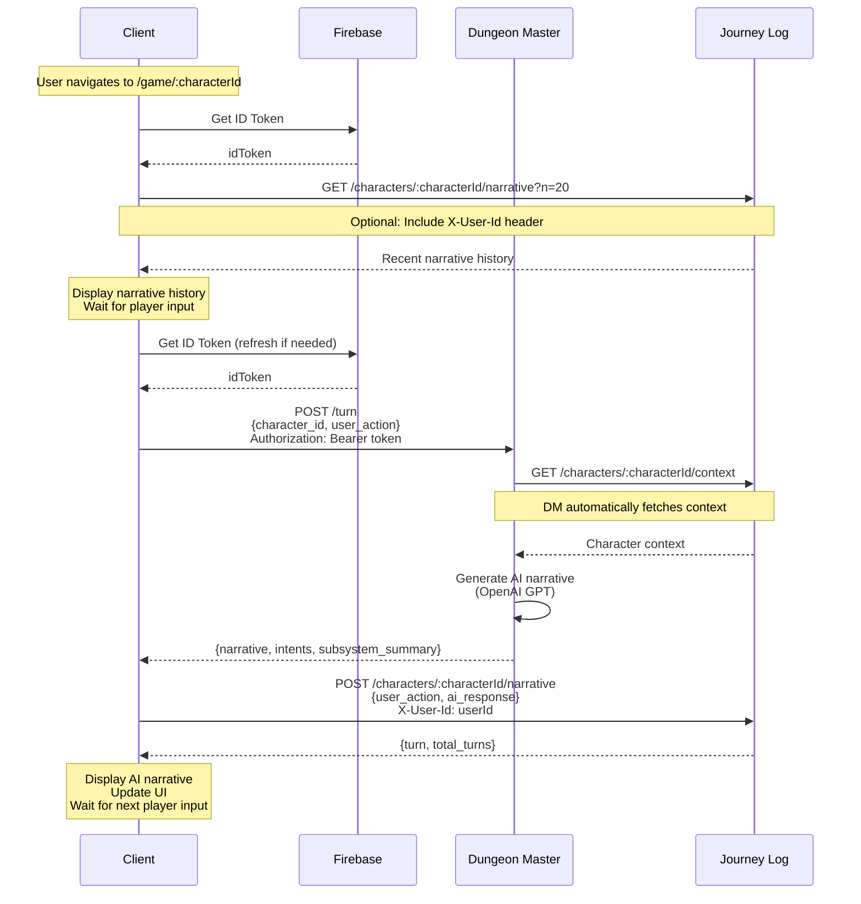
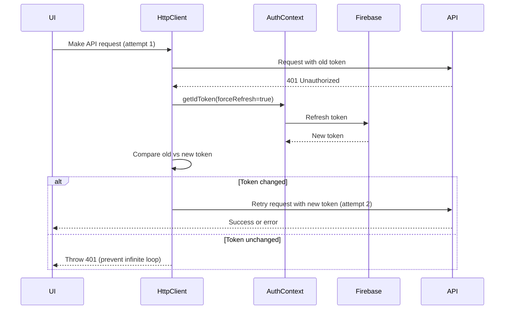

# Gameplay API Contracts

This document provides the exact API contracts for the Adventure Game gameplay loop, detailing how to advance turns using the dungeon-master service and how to persist/retrieve narrative history using the journey-log service.

## Table of Contents

- [Overview](#overview)
- [Authentication & Configuration](#authentication--configuration)
- [Dungeon Master API: Turn Processing](#dungeon-master-api-turn-processing)
- [Journey Log API: Narrative Management](#journey-log-api-narrative-management)
- [Journey Log API: Context Retrieval](#journey-log-api-context-retrieval)
- [Complete Gameplay Flow](#complete-gameplay-flow)
- [Error Handling](#error-handling)
- [Edge Cases](#edge-cases)

## Overview

The gameplay loop involves three main API interactions:

1. **Retrieve Context** (journey-log): Fetch character state and recent narrative history
2. **Process Turn** (dungeon-master): Submit player action and generate AI narrative response
3. **Persist Turn** (journey-log): Save the turn (user action + AI response) to the narrative history

The client application is responsible for orchestrating these calls in sequence.

## Authentication & Configuration

### Firebase Authentication

All API requests require Firebase authentication using Bearer tokens.

**Token Acquisition:**
```typescript
import { auth } from './lib/firebase';

// Get the current user's ID token
const idToken = await auth.currentUser?.getIdToken();

// Use in Authorization header
headers: {
  'Authorization': `Bearer ${idToken}`
}
```

**Token Lifecycle:**
- Firebase ID tokens expire after 1 hour
- The Firebase SDK automatically refreshes tokens when using `getIdToken()`
- Always call `getIdToken()` immediately before making API requests
- Handle 401 Unauthorized responses by re-authenticating the user

**Security Best Practices:**
- **Never log or expose tokens**: Do not log ID tokens in console, analytics, or error messages
- **Use HTTPS only**: All API requests must use HTTPS in production (tokens are bearer tokens)
- **Token storage**: The Firebase SDK handles secure token storage; do not manually store tokens in localStorage or cookies
- **Validate token freshness**: Always call `getIdToken()` before requests to ensure token is valid and not expired
- **Handle token refresh failures**: If `getIdToken()` fails, prompt user to re-authenticate immediately

### Required Headers

**dungeon-master API:**
- `Authorization: Bearer <firebase-id-token>` (required)
- `X-Dev-User-Id: <user-id>` (optional, for development/testing)

**journey-log API:**
- `X-User-Id: <user-id>` (required for write operations, optional for read operations)
  - **For POST/write operations**: Required; must match the character's `owner_user_id`
    - If missing: Returns 400 Bad Request
    - If empty/whitespace-only: Returns 400 Bad Request
    - If doesn't match character owner: Returns 403 Forbidden
  - **For GET/read operations**: Optional
    - If omitted entirely: Allows anonymous read access (no validation)
    - If provided but empty/whitespace-only: Returns 400 Bad Request
    - If provided and doesn't match character owner: Returns 403 Forbidden

**User ID Source:**
```typescript
// Get Firebase user ID for X-User-Id header
const userId = auth.currentUser?.uid;

// Validation: Ensure user ID is non-empty before sending
if (!userId || userId.trim().length === 0) {
  throw new Error('User ID is required for this operation');
}
```

### Environment Configuration

Base URLs are configured via environment variables (see `.env.example`):

```bash
# Dungeon Master API Base URL
VITE_DUNGEON_MASTER_API_BASE_URL=http://localhost:8001

# Journey Log API Base URL
VITE_JOURNEY_LOG_API_BASE_URL=http://localhost:8002
```

For production deployments, these should point to Cloud Run service URLs:
```bash
VITE_DUNGEON_MASTER_API_BASE_URL=https://dungeon-master-xxx.run.app
VITE_JOURNEY_LOG_API_BASE_URL=https://journey-log-xxx.run.app
```

## Dungeon Master API: Turn Processing

### Endpoint: POST /turn

**Purpose:** Process a player's turn action and generate an AI narrative response.

This is the core gameplay endpoint that:
1. Retrieves character context from journey-log (automatically)
2. Generates an AI narrative response using OpenAI GPT
3. Returns the narrative and optional structured intents

**⚠️ Important:** The dungeon-master service does NOT automatically persist turns to journey-log. The client must explicitly call the journey-log POST endpoint to save the turn.

### HTTP Method and Path

```
POST /turn
```

### Request Headers

| Header | Required | Description |
|--------|----------|-------------|
| `Authorization` | Yes | Bearer token format: `Bearer <firebase-id-token>` |
| `X-Dev-User-Id` | No | Development/testing user ID override (optional) |
| `Content-Type` | Yes | Must be `application/json` |

### Request Body

**Schema:** `TurnRequest`

```json
{
  "character_id": "550e8400-e29b-41d4-a716-446655440000",
  "user_action": "I search the room for treasure"
}
```

**Fields:**

| Field | Type | Required | Constraints | Description |
|-------|------|----------|-------------|-------------|
| `character_id` | string | Yes | UUID format | Character UUID identifier |
| `user_action` | string | Yes | 1-8000 characters | Player's action or input for this turn |

**Validation:**
- `character_id` must be a valid UUID format
- `user_action` must be between 1 and 8000 characters
- Character must exist in journey-log

### Response (200 OK)

**Schema:** `TurnResponse`

```json
{
  "narrative": "You search the dimly lit room and discover a glinting treasure chest hidden beneath a dusty tapestry. The chest appears to be locked, but you notice strange symbols carved into its surface.",
  "intents": {
    "quest_intent": {
      "action": "none"
    },
    "combat_intent": {
      "action": "none"
    },
    "poi_intent": {
      "action": "create",
      "name": "Locked Treasure Chest"
    }
  },
  "subsystem_summary": {
    "quest_action": "none",
    "combat_action": "none",
    "poi_action": "create_success"
  }
}
```

**Response Fields:**

| Field | Type | Required | Description |
|-------|------|----------|-------------|
| `narrative` | string | Yes | AI-generated narrative response (this is what you persist to journey-log) |
| `intents` | object \| null | No | Structured intents from LLM output (informational only, NOT persisted) |
| `subsystem_summary` | object \| null | No | Summary of subsystem changes made during this turn (informational only) |

**Key Points:**
- **Only `narrative` should be persisted to journey-log**
- `intents` and `subsystem_summary` are metadata for display/debugging purposes
- The narrative text contains the complete story response for the player

### Error Responses

| Status Code | Description | Scenario |
|-------------|-------------|----------|
| `400` | Bad Request | Malformed UUID, invalid request body |
| `401` | Unauthorized | Missing or invalid Firebase token |
| `404` | Not Found | Character does not exist in journey-log |
| `422` | Validation Error | Invalid field values (e.g., user_action too long) |
| `429` | Rate Limit Exceeded | Too many requests for this character (includes `Retry-After` header) |
| `500` | Internal Server Error | Server-side error (OpenAI API failure, etc.) |

**Rate Limit Response (429):**
```json
{
  "detail": {
    "error": "rate_limit_exceeded",
    "message": "Too many requests for this character. Please wait 0.5 seconds.",
    "retry_after_seconds": 0.5,
    "character_id": "550e8400-e29b-41d4-a716-446655440000"
  }
}
```

**Headers:**
- `Retry-After`: Seconds to wait before retrying

### Example Request

```typescript
const response = await fetch(`${DUNGEON_MASTER_BASE_URL}/turn`, {
  method: 'POST',
  headers: {
    'Authorization': `Bearer ${idToken}`,
    'Content-Type': 'application/json',
  },
  body: JSON.stringify({
    character_id: characterId,
    user_action: playerInput,
  }),
});

if (!response.ok) {
  if (response.status === 429) {
    const error = await response.json();
    const retryAfter = error.detail.retry_after_seconds;
    // Wait and retry...
  }
  throw new Error(`Turn processing failed: ${response.status}`);
}

const turnData = await response.json();
const aiNarrative = turnData.narrative; // This is what you persist
```

## Journey Log API: Narrative Management

### Endpoint: GET /characters/{character_id}/narrative

**Purpose:** Retrieve narrative turn history for a character.

Use this endpoint to:
- Fetch recent narrative history for display in the UI
- Load conversation context when resuming gameplay
- Display turn history to the player

### HTTP Method and Path

```
GET /characters/{character_id}/narrative
```

### Path Parameters

| Parameter | Type | Required | Description |
|-----------|------|----------|-------------|
| `character_id` | string | Yes | UUID-formatted character identifier |

### Request Headers

| Header | Required | Description |
|--------|----------|-------------|
| `X-User-Id` | No | User identifier for access control (if provided, must match character owner) |
| `Content-Type` | No | Not required for GET requests |

**Access Control:**
- If `X-User-Id` is **omitted**: Anonymous read access is allowed
- If `X-User-Id` is **provided but empty**: Returns 400 Bad Request
- If `X-User-Id` is **provided**: Must match character's `owner_user_id` or returns 403 Forbidden

### Query Parameters

| Parameter | Type | Default | Constraints | Description |
|-----------|------|---------|-------------|-------------|
| `n` | integer | 10 | 1-100 | Number of turns to retrieve |
| `since` | string | null | ISO 8601 timestamp | Filter turns strictly after this time (exclusive) |

**Query Parameter Notes:**
- Results are always ordered oldest-to-newest (chronological order)
- This ensures LLM context is built in the correct sequence
- The `since` filter is exclusive: `timestamp > since`

### Response (200 OK)

**Schema:** `GetNarrativeResponse`

```json
{
  "turns": [
    {
      "user_action": "I enter the tavern",
      "ai_response": "You push open the heavy wooden door...",
      "timestamp": "2024-01-20T10:30:00.000Z"
    },
    {
      "user_action": "I order an ale",
      "ai_response": "The bartender slides a frothing mug across the bar...",
      "timestamp": "2024-01-20T10:31:15.000Z"
    }
  ],
  "metadata": {
    "requested_n": 10,
    "returned_count": 2,
    "total_available": 2
  }
}
```

**Response Fields:**

| Field | Type | Description |
|-------|------|-------------|
| `turns` | array | List of NarrativeTurn objects, ordered oldest-to-newest |
| `metadata.requested_n` | integer | Number of turns requested via `n` parameter |
| `metadata.returned_count` | integer | Actual number of turns returned (may be less than requested) |
| `metadata.total_available` | integer | Total number of turns available for this character |

**NarrativeTurn Object:**

| Field | Type | Description |
|-------|------|-------------|
| `user_action` | string | Player's action (1-8000 characters) |
| `ai_response` | string | AI/GM response (1-32000 characters) |
| `timestamp` | string | ISO 8601 timestamp of when turn occurred |

### Error Responses

| Status Code | Description | Scenario |
|-------------|-------------|----------|
| `400` | Bad Request | Invalid query parameters (n out of range, invalid since timestamp, empty X-User-Id) |
| `403` | Forbidden | X-User-Id provided but does not match character owner |
| `404` | Not Found | Character not found |
| `422` | Unprocessable Entity | Invalid UUID format for character_id |
| `500` | Internal Server Error | Firestore transient errors |

### Example Request

```typescript
// Get last 20 turns
const response = await fetch(
  `${JOURNEY_LOG_BASE_URL}/characters/${characterId}/narrative?n=20`,
  {
    headers: {
      'X-User-Id': userId, // Optional for read
    },
  }
);

const data = await response.json();
const turns = data.turns; // Ordered oldest to newest
```

### Endpoint: POST /characters/{character_id}/narrative

**Purpose:** Append a new narrative turn to a character's history.

**⚠️ Client Responsibility:** The client MUST call this endpoint after receiving a response from the dungeon-master `/turn` endpoint to persist the turn. The dungeon-master does NOT automatically persist turns.

### HTTP Method and Path

```
POST /characters/{character_id}/narrative
```

### Path Parameters

| Parameter | Type | Required | Description |
|-----------|------|----------|-------------|
| `character_id` | string | Yes | UUID-formatted character identifier |

### Request Headers

| Header | Required | Description |
|--------|----------|-------------|
| `X-User-Id` | **Yes** | User identifier (must match character owner for write access) |
| `Content-Type` | Yes | Must be `application/json` |

**Access Control (Write Operations):**
- `X-User-Id` is **required** for POST requests
- If missing: Returns 400 Bad Request
- If empty/whitespace-only: Returns 400 Bad Request
- If doesn't match character owner: Returns 403 Forbidden

### Request Body

**Schema:** `AppendNarrativeRequest`

```json
{
  "user_action": "I search the room for treasure",
  "ai_response": "You search the dimly lit room and discover a glinting treasure chest...",
  "timestamp": "2024-01-20T10:35:42.123Z"
}
```

**Fields:**

| Field | Type | Required | Constraints | Description |
|-------|------|----------|-------------|-------------|
| `user_action` | string | Yes | 1-8000 characters | Player's action or input |
| `ai_response` | string | Yes | 1-32000 characters | Game master's/AI's response |
| `timestamp` | string | No | ISO 8601 format | When the turn occurred (defaults to server UTC now if omitted) |

**Validation:**
- `user_action`: max 8000 characters
- `ai_response`: max 32000 characters
- Combined length: max 40000 characters
- `timestamp`: Must be valid ISO 8601 format if provided

**Atomicity:**
The endpoint uses a Firestore transaction to atomically:
1. Add document to `characters/{character_id}/narrative_turns` subcollection
2. Update parent `character.updated_at` timestamp

### Response (201 Created)

**Schema:** `AppendNarrativeResponse`

```json
{
  "turn": {
    "user_action": "I search the room for treasure",
    "ai_response": "You search the dimly lit room and discover a glinting treasure chest...",
    "timestamp": "2024-01-20T10:35:42.123Z"
  },
  "total_turns": 15
}
```

**Response Fields:**

| Field | Type | Description |
|-------|------|-------------|
| `turn` | object | The stored NarrativeTurn (with server-generated timestamp if not provided) |
| `total_turns` | integer | Total number of narrative turns for this character (for confirmation) |

### Error Responses

| Status Code | Description | Scenario |
|-------------|-------------|----------|
| `400` | Bad Request | Missing or invalid X-User-Id header |
| `403` | Forbidden | X-User-Id does not match character owner |
| `404` | Not Found | Character not found |
| `413` | Payload Too Large | Combined payload > 40000 characters |
| `422` | Validation Error | Invalid field values, oversized fields, invalid timestamp format |
| `500` | Internal Server Error | Firestore transient errors |

### Example Request

```typescript
// After getting response from dungeon-master /turn
const turnResponse = await fetch(`${DUNGEON_MASTER_BASE_URL}/turn`, {
  method: 'POST',
  headers: {
    'Authorization': `Bearer ${idToken}`,
    'Content-Type': 'application/json',
  },
  body: JSON.stringify({
    character_id: characterId,
    user_action: playerInput,
  }),
});

const turnData = await turnResponse.json();

// Now persist to journey-log
const persistResponse = await fetch(
  `${JOURNEY_LOG_BASE_URL}/characters/${characterId}/narrative`,
  {
    method: 'POST',
    headers: {
      'X-User-Id': userId,
      'Content-Type': 'application/json',
    },
    body: JSON.stringify({
      user_action: playerInput,
      ai_response: turnData.narrative, // Only persist the narrative text
      timestamp: new Date().toISOString(), // Optional, server will use now() if omitted
    }),
  }
);

if (!persistResponse.ok) {
  // Handle persistence failure
  console.error('Failed to persist turn');
}
```

## Journey Log API: Context Retrieval

### Endpoint: GET /characters/{character_id}/context

**Purpose:** Get aggregated character context for AI-driven narrative generation.

This endpoint provides a comprehensive payload including:
- Player state (identity, status, level, equipment, location)
- Active quest (optional via `include_quest` parameter)
- Combat state (optional via `include_combat` parameter)
- Recent narrative turns (configurable window, optional via `include_narrative` parameter)
- World POIs sample (optional via `include_pois` parameter)

**Use Case:** The dungeon-master service automatically calls this endpoint when processing turns. The client typically does not need to call this directly unless implementing custom context display or debugging.

**Service-to-Service Authentication:**
When dungeon-master calls this endpoint during turn processing:
- The dungeon-master service uses its own backend service credentials (not the client's Firebase token)
- The client does NOT need to provide X-User-Id or any authentication headers in the `/turn` request for this internal call
- Service-to-service authentication is handled transparently by the backend services
- The client's responsibility is only to authenticate to dungeon-master via the `Authorization: Bearer <firebase-id-token>` header
- Dungeon-master independently authenticates to journey-log using backend service credentials configured on the server

### HTTP Method and Path

```
GET /characters/{character_id}/context
```

### Path Parameters

| Parameter | Type | Required | Description |
|-----------|------|----------|-------------|
| `character_id` | string | Yes | UUID-formatted character identifier |

### Request Headers

| Header | Required | Description |
|--------|----------|-------------|
| `X-User-Id` | No | User identifier for access control (if provided, must match character owner) |

### Query Parameters

| Parameter | Type | Default | Constraints | Description |
|-----------|------|---------|-------------|-------------|
| `recent_n` | integer | 20 | 1-100 | Number of recent narrative turns to include |
| `include_pois` | boolean | false | - | Whether to include POI sample in world state |
| `include_narrative` | boolean | true | - | Whether to include narrative turns in response |
| `include_combat` | boolean | true | - | Whether to include combat state in response |
| `include_quest` | boolean | true | - | Whether to include quest data in response |

**Component Toggles:**
- Component flags allow selective payload sizing for performance optimization
- When `include_narrative=false`: Narrative query is skipped, returns empty list
- When `include_combat=false`: Returns `{active: false, state: null}`
- When `include_quest=false`: Returns `quest=null`, `has_active_quest=false`
- Response structure remains stable regardless of flag values

### Response (200 OK)

**Schema:** `CharacterContextResponse`

```json
{
  "character_id": "550e8400-e29b-41d4-a716-446655440000",
  "player_state": {
    "name": "Aria Swiftblade",
    "race": "Elf",
    "class": "Ranger",
    "level": 5,
    "status": "Healthy",
    "location": "Ancient Temple",
    "equipment": {
      "weapon": "Longbow",
      "armor": "Leather Armor"
    }
  },
  "quest": {
    "title": "Recover the Lost Artifact",
    "description": "Find the ancient artifact hidden in the temple",
    "status": "in_progress"
  },
  "combat": {
    "active": false,
    "state": null
  },
  "narrative": {
    "recent_turns": [
      {
        "user_action": "I enter the temple",
        "ai_response": "You step into the shadowy temple...",
        "timestamp": "2024-01-20T10:30:00.000Z"
      }
    ],
    "requested_n": 20,
    "returned_n": 1,
    "max_n": 100
  },
  "world": {
    "pois_sample": [],
    "include_pois": false
  },
  "has_active_quest": true
}
```

**Response Fields:**

| Field | Type | Description |
|-------|------|-------------|
| `character_id` | string | Character UUID |
| `player_state` | object | Player identity, status, level, equipment, location |
| `quest` | object \| null | Active quest details (null if no active quest) |
| `combat.active` | boolean | Whether combat is currently active |
| `combat.state` | object \| null | Combat state details (null if not active) |
| `narrative.recent_turns` | array | Recent narrative turns (ordered oldest-to-newest) |
| `narrative.requested_n` | integer | Number of turns requested |
| `narrative.returned_n` | integer | Actual number of turns returned |
| `narrative.max_n` | integer | Server-configured maximum |
| `world.pois_sample` | array | Points of interest sample |
| `world.include_pois` | boolean | Whether POIs were requested |
| `has_active_quest` | boolean | Computed as `quest is not None` |

**Derived Fields:**
- `has_active_quest`: Computed from quest presence
- `combat.active`: Computed from enemy statuses
- `narrative.returned_n`: Actual count (may be less than requested)

### Error Responses

| Status Code | Description | Scenario |
|-------------|-------------|----------|
| `400` | Bad Request | Invalid query parameters (recent_n out of range) or empty X-User-Id |
| `403` | Forbidden | X-User-Id provided but does not match character owner |
| `404` | Not Found | Character not found |
| `422` | Unprocessable Entity | Invalid UUID format for character_id |
| `500` | Internal Server Error | Firestore transient errors |

### Example Request

```typescript
const response = await fetch(
  `${JOURNEY_LOG_BASE_URL}/characters/${characterId}/context?recent_n=20&include_pois=false`,
  {
    headers: {
      'X-User-Id': userId, // Optional
    },
  }
);

const context = await response.json();
```

## Complete Gameplay Flow

This section describes the step-by-step sequence for implementing the `/game/:characterId` gameplay loop.

### Sequence Diagram



### Implementation Steps

#### Step 1: Load Character and Narrative History

When the user navigates to `/game/:characterId`:

```typescript
async function loadGameState(characterId: string) {
  try {
    // Get Firebase ID token
    const idToken = await auth.currentUser?.getIdToken();
    const userId = auth.currentUser?.uid;
    
    if (!idToken || !userId) {
      throw new Error('User not authenticated');
    }
    
    // Fetch recent narrative history
    const response = await fetch(
      `${JOURNEY_LOG_BASE_URL}/characters/${characterId}/narrative?n=20`,
      {
        headers: {
          'X-User-Id': userId, // Optional but recommended
        },
      }
    );
    
    if (!response.ok) {
      if (response.status === 404) {
        throw new Error('Character not found');
      }
      if (response.status === 403) {
        throw new Error('Access denied: You do not own this character');
      }
      throw new Error(`Failed to load narrative: ${response.status}`);
    }
    
    const narrativeData = await response.json();
    
    // Handle empty narrative history (brand new character)
    if (narrativeData.turns.length === 0) {
      console.log('No narrative history for this character yet');
      // Display welcome message or character creation confirmation
    }
    
    return {
      characterId,
      narrativeHistory: narrativeData.turns,
      totalTurns: narrativeData.metadata.total_available,
    };
  } catch (error) {
    console.error('Failed to load game state:', error);
    throw error;
  }
}
```

**Edge Case Handling:**
- **Empty narrative history**: For brand-new characters, display a welcome message
- **403 Forbidden**: User doesn't own the character, redirect to dashboard
- **401 Unauthorized**: Token expired, re-authenticate user

#### Step 2: Process Player Turn

When the player submits an action:

```typescript
async function processTurn(characterId: string, userAction: string) {
  try {
    // Validate input
    if (!userAction || userAction.trim().length === 0) {
      throw new Error('Action cannot be empty');
    }
    if (userAction.length > 8000) {
      throw new Error('Action too long (max 8000 characters)');
    }
    
    // Get fresh Firebase ID token
    const idToken = await auth.currentUser?.getIdToken();
    if (!idToken) {
      throw new Error('User not authenticated');
    }
    
    // Call dungeon-master /turn endpoint
    const turnResponse = await fetch(`${DUNGEON_MASTER_BASE_URL}/turn`, {
      method: 'POST',
      headers: {
        'Authorization': `Bearer ${idToken}`,
        'Content-Type': 'application/json',
      },
      body: JSON.stringify({
        character_id: characterId,
        user_action: userAction.trim(),
      }),
    });
    
    if (!turnResponse.ok) {
      if (turnResponse.status === 429) {
        // Rate limit
        const error = await turnResponse.json();
        const retryAfter = error.detail.retry_after_seconds;
        throw new Error(`Rate limited. Retry after ${retryAfter} seconds`);
      }
      if (turnResponse.status === 404) {
        throw new Error('Character not found');
      }
      if (turnResponse.status === 401) {
        // Token expired, re-authenticate
        throw new Error('Authentication expired. Please sign in again.');
      }
      throw new Error(`Turn processing failed: ${turnResponse.status}`);
    }
    
    const turnData = await turnResponse.json();
    return {
      narrative: turnData.narrative,
      intents: turnData.intents,
      subsystemSummary: turnData.subsystem_summary,
    };
  } catch (error) {
    console.error('Failed to process turn:', error);
    throw error;
  }
}
```

**Rate Limit Handling:**
```typescript
async function processTurnWithRetry(characterId: string, userAction: string) {
  try {
    return await processTurn(characterId, userAction);
  } catch (error) {
    if (error.message.includes('Rate limited')) {
      // Extract retry delay and wait
      const match = error.message.match(/(\d+\.?\d*) seconds/);
      if (match) {
        const retryAfter = parseFloat(match[1]);
        await new Promise(resolve => setTimeout(resolve, retryAfter * 1000));
        return await processTurn(characterId, userAction);
      }
    }
    throw error;
  }
}
```

#### Step 3: Persist Turn to Journey Log

After receiving the narrative from dungeon-master:

```typescript
async function persistTurn(
  characterId: string,
  userAction: string,
  aiResponse: string
) {
  try {
    const userId = auth.currentUser?.uid;
    if (!userId) {
      throw new Error('User not authenticated');
    }
    
    // Persist to journey-log
    const response = await fetch(
      `${JOURNEY_LOG_BASE_URL}/characters/${characterId}/narrative`,
      {
        method: 'POST',
        headers: {
          'X-User-Id': userId,
          'Content-Type': 'application/json',
        },
        body: JSON.stringify({
          user_action: userAction,
          ai_response: aiResponse,
          // timestamp is optional, server will use now() if omitted
        }),
      }
    );
    
    if (!response.ok) {
      if (response.status === 403) {
        throw new Error('Access denied: You do not own this character');
      }
      if (response.status === 413) {
        throw new Error('Turn data too large');
      }
      throw new Error(`Failed to persist turn: ${response.status}`);
    }
    
    const result = await response.json();
    return result;
  } catch (error) {
    console.error('Failed to persist turn:', error);
    // Note: This is a critical error - the turn was processed but not saved
    // Consider implementing retry logic or notifying the user
    throw error;
  }
}
```

#### Step 4: Complete Turn Flow

Putting it all together:

```typescript
async function handlePlayerAction(characterId: string, userAction: string) {
  try {
    // Step 1: Process turn with dungeon-master
    const turnResult = await processTurnWithRetry(characterId, userAction);
    
    // Step 2: Persist turn to journey-log
    try {
      await persistTurn(characterId, userAction, turnResult.narrative);
    } catch (persistError) {
      // Handle persistence failure
      console.error('Critical: Turn processed but not persisted', persistError);
      // Could implement retry logic here
      // Could display warning to user
    }
    
    // Step 3: Update UI with narrative
    return {
      userAction,
      aiResponse: turnResult.narrative,
      intents: turnResult.intents,
      subsystemSummary: turnResult.subsystem_summary,
    };
  } catch (error) {
    console.error('Turn handling failed:', error);
    throw error;
  }
}
```

## Error Handling

### Authentication Errors (401 Unauthorized)

**Cause:** Expired or missing Firebase token

**Handling:**
```typescript
try {
  // API call
} catch (error) {
  if (error.status === 401) {
    // Force token refresh
    await auth.currentUser?.getIdToken(true);
    
    // Or redirect to login
    navigate('/login');
  }
}
```

### Access Control Errors (403 Forbidden)

**Cause:** User doesn't own the character

**Handling:**
```typescript
if (response.status === 403) {
  // Redirect to dashboard
  navigate('/dashboard');
  showError('You do not have access to this character');
}
```

### Rate Limiting (429 Too Many Requests)

**Cause:** Too many turn requests for a character

**Handling:**
```typescript
if (response.status === 429) {
  const error = await response.json();
  const retryAfter = error.detail.retry_after_seconds;
  
  // Show rate limit message to user
  showWarning(`Please wait ${retryAfter} seconds before submitting another action`);
  
  // Disable input for retryAfter seconds
  disableInput(retryAfter * 1000);
}
```

### Validation Errors (422 Unprocessable Entity)

**Cause:** Invalid field values

**Handling:**
```typescript
if (response.status === 422) {
  const error = await response.json();
  const validationErrors = error.detail;
  
  // Display validation errors to user
  validationErrors.forEach(err => {
    console.error(`${err.loc.join('.')}: ${err.msg}`);
  });
}
```

### Server Errors (500 Internal Server Error)

**Cause:** Backend service failure (OpenAI API, Firestore, etc.)

**Handling:**
```typescript
if (response.status === 500) {
  // Implement retry with exponential backoff
  await retryWithBackoff(async () => {
    return await processTurn(characterId, userAction);
  });
}
```

### Persistence Failure Handling

**Scenario:** Dungeon-master succeeds but journey-log persistence fails

**Critical Issue:** The turn was processed and narrative generated, but it wasn't saved to history.

**Recommended Approach:**
```typescript
async function handlePlayerAction(characterId: string, userAction: string) {
  let turnResult;
  
  try {
    // Step 1: Process turn
    turnResult = await processTurn(characterId, userAction);
  } catch (error) {
    // Turn processing failed - safe to retry
    throw error;
  }
  
  try {
    // Step 2: Persist turn
    await persistTurn(characterId, userAction, turnResult.narrative);
  } catch (persistError) {
    // Turn was processed but not persisted
    // Option 1: Retry persistence multiple times
    let retries = 3;
    while (retries > 0) {
      try {
        await new Promise(resolve => setTimeout(resolve, 1000));
        await persistTurn(characterId, userAction, turnResult.narrative);
        // On success, return the result immediately
        return turnResult;
      } catch (retryError) {
        retries--;
        if (retries === 0) {
          // All retries failed
          // Option 2: Store in local storage for later retry
          storeFailedPersistence(characterId, userAction, turnResult.narrative);
          
          // Option 3: Show warning to user
          showWarning('Your action was processed but may not be saved. Please check your connection.');
          
          // Finally, re-throw the original error to signal failure to the caller
          throw persistError;
        }
      }
    }
  }
  
  return turnResult;
}
```

## Edge Cases

### 1. Empty Narrative History (Brand New Character)

**Scenario:** Character has no narrative turns yet

**Detection:**
```typescript
const narrativeData = await fetch(/* ... */).then(r => r.json());
if (narrativeData.turns.length === 0) {
  // Handle empty history
}
```

**Handling:**
- Display welcome message or character sheet
- Show tutorial or game instructions
- First turn should establish the setting

### 2. Multiple Turn Endpoints in Spec

**Choice:** Use `POST /turn` (not admin endpoints)

**Rationale:**
- `POST /turn` is the player-facing endpoint for regular gameplay
- Admin endpoints (e.g., `/admin/characters/{character_id}/recent_turns`) are for administrative access
- Admin endpoints may require different authentication

**Why Not Admin Endpoints:**
- `/admin/turns/{turn_id}`: For fetching specific turn by ID (debugging)
- `/admin/characters/{character_id}/recent_turns`: For administrative queries
- These are read-only, inspection endpoints, not for gameplay

### 3. Missing Firebase Token

**Scenario:** User's session expired or they logged out

**Detection:**
```typescript
const user = auth.currentUser;
if (!user) {
  // Not authenticated
}

const token = await user.getIdToken();
if (!token) {
  // Token acquisition failed
}
```

**Handling:**
```typescript
// Redirect to login
navigate('/login', { 
  state: { 
    returnTo: `/game/${characterId}` 
  } 
});
```

### 4. Network Failures and Timeouts

**Scenario:** Request fails due to network issues

**Handling:**
```typescript
async function fetchWithTimeout(url, options, timeout = 30000) {
  const controller = new AbortController();
  const timeoutId = setTimeout(() => controller.abort(), timeout);
  
  try {
    const response = await fetch(url, {
      ...options,
      signal: controller.signal,
    });
    return response;
  } finally {
    clearTimeout(timeoutId);
  }
}
```

### 5. Character Not Found (404)

**Scenario:** Character was deleted or never existed

**Handling:**
```typescript
if (response.status === 404) {
  showError('Character not found. It may have been deleted.');
  navigate('/dashboard');
}
```

### 6. Context Query Failures

**Scenario:** Dungeon-master can't fetch context from journey-log

**Impact:** Dungeon-master returns 500 or 404 error

**Handling:**
- Same as server error handling (retry with backoff)
- Display user-friendly message: "Unable to process turn. Please try again."

### 7. Concurrent Turn Submissions

**Scenario:** User rapidly submits multiple turns

**Protection:** Backend rate limiting (429 responses)

**Client-Side Prevention:**
```typescript
let turnInProgress = false;

async function handlePlayerAction(characterId: string, userAction: string) {
  if (turnInProgress) {
    showWarning('Please wait for the current turn to complete');
    return;
  }
  
  turnInProgress = true;
  try {
    // The complete turn flow, including processing and persisting
    return await completeTurnFlow(characterId, userAction);
  } finally {
    turnInProgress = false;
  }
}

// Complete turn flow implementation from earlier in the doc
async function completeTurnFlow(characterId: string, userAction: string) {
  // Step 1: Process turn with dungeon-master
  const turnResult = await processTurnWithRetry(characterId, userAction);
  
  // Step 2: Persist turn to journey-log
  try {
    await persistTurn(characterId, userAction, turnResult.narrative);
  } catch (persistError) {
    console.error('Critical: Turn processed but not persisted', persistError);
    // Handle persistence failure (e.g., with retries, user notification)
    // Could implement the retry logic from "Persistence Failure Handling" section
  }
  
  return turnResult;
}
```

### 8. Partial Success (Turn Processed, Persistence Failed)

**Scenario:** Covered in "Persistence Failure Handling" section above

**Key Points:**
- This is the most critical edge case
- Requires retry logic and/or local storage backup
- User should be informed if persistence fails after multiple retries

### 9. Firestore Transient Errors

**Scenario:** Journey-log returns 500 due to Firestore issues

**Handling:**
- Implement exponential backoff retry
- Max retries: 3-5 attempts
- Display error message if all retries fail

### 10. Invalid Character Ownership

**Scenario:** User tries to access another user's character

**Detection:** 403 Forbidden response

**Handling:**
```typescript
if (response.status === 403) {
  showError('You do not have permission to access this character');
  navigate('/dashboard');
}
```

### Token Expiry Handling

**Overview:**
Firebase ID tokens expire after 1 hour. The application handles token expiry through automatic refresh and retry mechanisms.

**Automatic Refresh:**
- Firebase SDK automatically refreshes tokens when calling `getIdToken()`
- If token is <5 minutes from expiry, SDK refreshes it transparently
- No action required from application code for normal refresh

**Token Expiry Detection:**
- Backend services return 401 Unauthorized when token is expired or invalid
- HTTP client detects 401 response and triggers retry logic

**Retry Flow:**


**Implementation Details:**
1. **Single Retry Policy**: Only ONE retry attempt per request
2. **Force Refresh**: Uses `getIdToken(forceRefresh: true)` to bypass cache
3. **Token Comparison**: Prevents infinite loops by comparing old vs new token
4. **Deduplication**: Concurrent requests reuse in-flight refresh promises
5. **Failure Handling**: If refresh fails or token unchanged, user is logged out

**Forced Logout:**
If token refresh fails or produces same token, the user is redirected to `/login` with:
- Message: "Your session has expired. Please log in again."
- Location state preserving the "from" pathname for post-login redirect
- Error reason code for UI logic

**Testing Token Expiry (QA):**
See [docs/firebase-setup.md](docs/firebase-setup.md) for instructions on simulating expired tokens without compromising security.

### Distinguishing Dungeon Master vs Journey Log Errors

The application handles errors differently based on which service fails:

**Dungeon Master Service Errors:**

| Error | Cause | Impact | User Experience |
|-------|-------|--------|-----------------|
| **401** | Invalid/expired token | Blocks turn submission | Automatic retry with token refresh; logout if fails |
| **422** | Invalid action format | Blocks turn submission | Inline error: "Invalid action. Please try again." |
| **500** | LLM (OpenAI) failure | Blocks turn submission | Error: "AI service unavailable. Please retry." |
| **503** | Service unavailable | Blocks turn submission | Error: "Service temporarily unavailable." |

**Journey Log Service Errors:**

| Error | Cause | Impact | User Experience |
|-------|-------|--------|-----------------|
| **401** | Invalid/expired token | Blocks state access | Automatic retry with token refresh; logout if fails |
| **403** | User doesn't own character | Blocks access to character | Redirect to dashboard: "Access denied. You do not have permission to view this character." |
| **404** | Character not found | Blocks access | Error: "Character not found. It may have been deleted." |
| **500** | Firestore/backend error | Blocks persistence | Warning: "Failed to save turn. Your turn was generated but not saved to history. Retry?" |

**Key Distinctions:**

1. **Blocking vs Non-Blocking:**
   - Dungeon Master failure = No narrative generated = Can't continue gameplay
   - Journey Log failure (after DM success) = Narrative exists but not saved = Can display narrative with warning

2. **Retry Behavior:**
   - **401 errors**: Always automatic retry (both services)
   - **500 errors (DM)**: Manual retry (user clicks "Try Again")
   - **500 errors (JL persistence)**: Automatic retry with exponential backoff (3-5 attempts)

3. **Error Display:**
   - **Dungeon Master**: Inline error in game interface (blocks action input)
   - **Journey Log (load)**: Error notice in navigation bar with "Retry" button
   - **Journey Log (save)**: Warning badge on turn with "Retry Save" button

**Split Persistence Error:**

Most critical scenario is when dungeon-master succeeds but journey-log fails:

```typescript
try {
  // Step 1: Generate narrative (dungeon-master)
  const turnResult = await GameService.submitTurnTurnPost({
    requestBody: { character_id, user_action }
  });
  
  // Step 2: Persist to history (journey-log)
  try {
    await CharactersService.appendNarrativeTurnCharactersCharacterIdNarrativePost({
      characterId: character_id,
      xUserId: userId,
      requestBody: { user_action, narrative_response: turnResult.narrative }
    });
  } catch (persistError) {
    // Narrative generated but not saved
    console.error('Turn processed but not persisted:', persistError);
    
    // Show narrative with warning
    displayNarrative(turnResult.narrative, { 
      warning: 'Turn saved to dungeon-master, but failed to persist to history. Retry?',
      retryable: true 
    });
    
    // Don't block user from seeing the narrative
    return { ...turnResult, persistFailed: true };
  }
} catch (dmError) {
  // Narrative generation failed - safe to retry from scratch
  throw dmError;
}
```

**User Experience:**
- User submits action
- Spinner shows "Generating narrative..."
- Narrative appears with orange warning badge
- Warning text: "Turn saved to dungeon-master, but failed to persist to history"
- "Retry Save" button appears
- User can continue playing or retry save
- Next turn includes previous context even if persistence failed

### Retry Strategies by Error Type

**Automatic Retries (Handled by HTTP Client):**

| Error | Retry Count | Retry Strategy | Notes |
|-------|-------------|----------------|-------|
| **401 Unauthorized** | 1 retry | Immediate retry with token refresh | Only if token changes after refresh |

**Manual Retries (Handled by UI):**

| Error | UI Action | Recommended Pattern |
|-------|-----------|---------------------|
| **403 Forbidden** | No retry | Redirect to dashboard (permission denied) |
| **404 Not Found** | No retry | Show error message (resource doesn't exist) |
| **422 Validation** | No retry | Show validation errors (user must fix input) |
| **429 Rate Limit** | Delayed retry | Disable input for `retry_after_seconds` |
| **500 Server Error (DM)** | Manual retry | Show "Try Again" button |
| **500 Server Error (JL)** | Auto-retry 3-5x | Exponential backoff, then manual |
| **Network Error** | Manual retry | Show "Retry" button |

**Exponential Backoff Implementation (for Journey Log persistence):**

```typescript
async function persistWithRetry(
  characterId: string,
  userAction: string,
  narrative: string,
  maxRetries: number = 5
): Promise<void> {
  let attempt = 0;
  let delay = 1000; // Start with 1 second
  
  while (attempt < maxRetries) {
    try {
      await CharactersService.appendNarrativeTurnCharactersCharacterIdNarrativePost({
        characterId,
        xUserId: userId,
        requestBody: { user_action: userAction, narrative_response: narrative }
      });
      return; // Success!
    } catch (error) {
      attempt++;
      
      if (attempt >= maxRetries) {
        throw error; // All retries exhausted
      }
      
      // Only retry on transient errors (500, 502, 503, network errors)
      if (!isTransientError(error)) {
        throw error; // Don't retry permanent errors
      }
      
      // Wait before retry (exponential backoff)
      await new Promise(resolve => setTimeout(resolve, delay));
      delay *= 2; // Double the delay for next attempt
    }
  }
}
```

**Transient Error Detection:**

```typescript
function isTransientError(error: any): boolean {
  // Network errors
  if (error.name === 'TypeError' || error.name === 'NetworkError') {
    return true;
  }
  
  // HTTP status codes that are likely transient
  if (error.status) {
    return [500, 502, 503, 504].includes(error.status);
  }
  
  return false;
}
```

### Concurrent Request Handling

**Token Refresh Deduplication:**

The application prevents multiple concurrent token refresh operations:

```typescript
// In AuthContext
const tokenRefreshPromiseRef = useRef<Promise<string> | null>(null);

async function getIdToken(forceRefresh: boolean = false): Promise<string> {
  // If refresh already in progress, reuse the promise
  if (tokenRefreshPromiseRef.current) {
    return tokenRefreshPromiseRef.current;
  }
  
  // Start new refresh operation
  const refreshPromise = auth.currentUser!.getIdToken(forceRefresh);
  tokenRefreshPromiseRef.current = refreshPromise;
  
  try {
    const token = await refreshPromise;
    return token;
  } finally {
    // Clear promise after completion
    tokenRefreshPromiseRef.current = null;
  }
}
```

**Benefits:**
- Multiple simultaneous API calls share one token refresh
- Prevents Firebase SDK rate limiting
- Reduces server load and latency
- Maintains request order consistency

**Turn Submission Locking:**

To prevent duplicate turn submissions:

```typescript
let turnSubmissionInProgress = false;

async function submitTurn(characterId: string, userAction: string) {
  if (turnSubmissionInProgress) {
    console.warn('Turn submission already in progress');
    return;
  }
  
  turnSubmissionInProgress = true;
  try {
    return await processAndPersistTurn(characterId, userAction);
  } finally {
    turnSubmissionInProgress = false;
  }
}
```

**UI Considerations:**
- Disable submit button while turn is processing
- Show loading spinner
- Prevent keyboard shortcuts (Enter key) from double-submitting

### 403 Forbidden Special Handling

**Scenario:** User attempts to access another user's character (or own character with invalid token)

**Key Point:** 403 is a **permission error**, NOT an authentication failure.

**Critical Distinction:**
- **401 (Unauthorized)**: Auth token is invalid/expired → Retry with refresh → Logout if fails
- **403 (Forbidden)**: Auth token is valid, but user lacks permission → NO retry → NO logout

**Handling in GamePage:**

```typescript
try {
  const turns = await CharactersService.getNarrativeTurnsCharactersCharacterIdNarrativeGet({
    characterId,
    n: 20,
    xUserId: userId
  });
  setNarrativeHistory(turns);
} catch (error) {
  if (isApiError(error) && error.status === 403) {
    // User doesn't own this character
    navigate('/app', {
      replace: true, // Don't allow back button to retry
      state: {
        error: {
          message: 'Access denied. You do not have permission to view this character.',
          severity: 'error',
          reason: 'forbidden'
        }
      }
    });
    return; // Stop execution
  }
  // Handle other errors...
}
```

**Why `replace: true`:**
- Prevents user from using back button to re-trigger 403 error
- Clears URL history of forbidden character ID
- Cleaner user experience

**Error Notice Display:**
- Shows in navigation bar (from location state)
- Red background (error severity)
- Message: "Access denied. You do not have permission to view this character."
- Auto-dismisses after 5 seconds or manual dismiss

**Testing 403 Scenarios:**
1. Create character as User A
2. Copy character ID from URL
3. Log in as User B
4. Navigate to `/game/{character_id_from_user_a}`
5. Should redirect to `/app` with access denied message
6. User B remains logged in (no session termination)

## Summary

### Required Environment Variables

Ensure these are set in `.env.example` and your environment:

```bash
# API Base URLs
VITE_DUNGEON_MASTER_API_BASE_URL=http://localhost:8001
VITE_JOURNEY_LOG_API_BASE_URL=http://localhost:8002

# Firebase Configuration
VITE_FIREBASE_API_KEY=
VITE_FIREBASE_AUTH_DOMAIN=
VITE_FIREBASE_PROJECT_ID=
VITE_FIREBASE_APP_ID=
```

### Key Takeaways

1. **Client Orchestration:** The client must orchestrate all three calls (fetch history, process turn, persist turn)
2. **Authentication:** Use Firebase Bearer tokens for dungeon-master, X-User-Id header for journey-log
3. **Persistence Responsibility:** Client must explicitly persist turns to journey-log after dungeon-master response
4. **Error Handling:** Implement robust error handling, especially for persistence failures
5. **Rate Limiting:** Respect 429 responses and implement client-side request throttling
6. **Token Refresh:** Always get fresh tokens before API calls using `getIdToken()`
7. **Edge Cases:** Handle empty history, authentication expiry, and partial success scenarios

### Implementation Checklist

- [ ] Set up environment variables for both API base URLs
- [ ] Implement Firebase authentication and token management
- [ ] Create narrative history fetch on game load
- [ ] Implement turn processing with dungeon-master
- [ ] Implement turn persistence to journey-log
- [ ] Add error handling for all error codes
- [ ] Implement rate limit handling with retry
- [ ] Add client-side validation for input length
- [ ] Handle empty narrative history for new characters
- [ ] Test authentication expiry and refresh
- [ ] Test persistence failure scenarios
- [ ] Add loading states and user feedback for all operations
